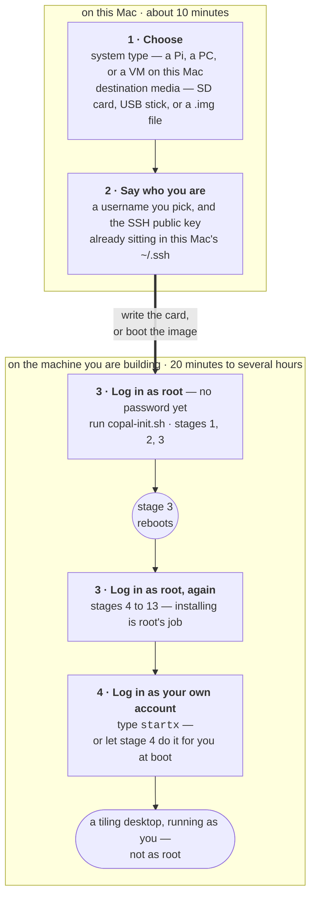
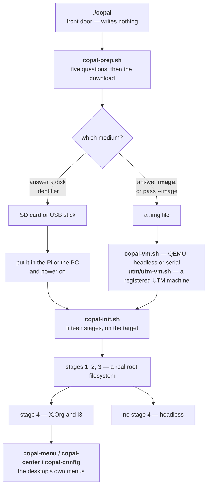
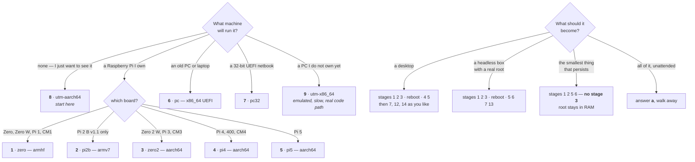
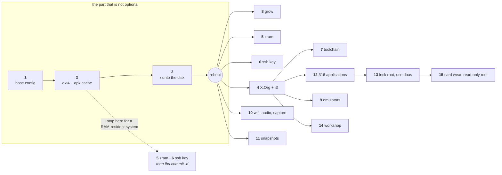
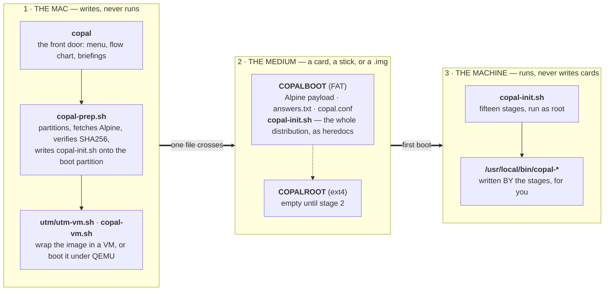

<!-- SPDX-License-Identifier: MIT -->
<!-- Copyright (c) 2026 paulr@sdf.org -- copal-alpine-linux -->
```
 ██████  ██████  ██████   █████  ██
██      ██    ██ ██   ██ ██   ██ ██
██      ██    ██ ██████  ███████ ██
██      ██    ██ ██      ██   ██ ██
 ██████  ██████  ██      ██   ██ ███████
```

# copal-alpine-linux

**One Alpine installer, many targets — an SD card for a Raspberry Pi, a UEFI
disk for a PC, or a virtual machine under UTM on an Apple Silicon Mac.**

This is [Copal Linux](docs/copal-handbook.md) — the Raspberry Pi Zero installer
— rebuilt as a *hybrid* installer. The same fifteen stages that turn a diskless
Alpine into a persistent ext4 system with a tiling desktop now run on whichever
of those three media you point them at, and the two UTM targets exist so that
the other three can be verified without a card, a Pi, or a reboot cycle.

**Copal** is tree resin caught halfway to amber — sap that has hardened, but is
not yet stone. That is this system's whole trick. Alpine boots *diskless*: the
root filesystem is a tmpfs that evaporates at power-off. Copal is what sets it,
without giving up any of the smallness that made it worth booting.

Copal is an *aggregation* of Alpine — it downloads stock Alpine and calls
Alpine's own tools — **not** a derivative work of it, and not a fork. It is not
affiliated with or endorsed by the Alpine project.

---

## What you actually do

Four things. Only the first two happen on this Mac, and only one of them is
typing.



**1 — the only choice that cannot be changed later.** The system type decides
the CPU and the bootloader; getting it wrong is not a degraded machine but one
that stops dead at boot, so `./copal` asks it explicitly and shows you the
consequences first. The media question has an escape hatch: answer `image`
instead of a disk identifier and nothing physical is touched at all.

**2 — the username is the login you will actually use.** It becomes the home
directory, the owner of the desktop configuration, the `doas` rule, and the
account the SSH key is authorised for. The key itself is not typed in — the
first of `~/.ssh/id_ed25519.pub`, `id_ecdsa.pub` or `id_rsa.pub` found on this
Mac travels on the card, and only ever the `.pub` half. No key on the Mac means
a password-only account, which is a warning rather than a failure.

**3 — root, twice, and that is not a mistake.** Stage 3 moves the root
filesystem onto the disk and reboots, so you log in as root before it and again
after it. Root installs the system; your own account runs the desktop. Those are
two jobs, and Copal keeps them apart — log in as yourself too early and
`copal-init.sh` will tell you it needs root.

**4 — `startx` from your own account, which is the part that usually does not
work elsewhere.** Three things have to be true before an ordinary user can start
X on a framebuffer with no seat manager: membership of the `video`, `input` and
`tty` groups; `allowed_users=console` in `/etc/X11/Xwrapper.config`; and
`needs_root_rights=yes` beside it, because Alpine ships no such file and the
default may drop root and then fail to open `/dev/fb0`. Miss any one and you get
an identical black screen. Stage 4 sets all three. If you type `startx` while
still root, `copal-startx` stops you and says why — a warning, not a lock, since
recovering a broken desktop from a root login is sometimes exactly the thing to
do.

Stage 4 also asks whether the desktop should start **by itself** at boot. Say
yes and `tty1` logs your account in and runs `startx`; the serial console keeps
its ordinary login prompt either way, so the answer never costs you a way in.
Deleting `/etc/copal/autostart-desktop` puts the console back at the next boot.

The rest of this file expands those four steps: **[From zero to a running
system](#from-zero-to-a-running-system)** is the step-by-step version, with the
menus as they actually appear.

---

## Quick start — x86_64 in UTM, on full automatic

The shortest route from nothing to a running desktop: no card, no Pi, and no
sitting and watching. One command on the Mac, three answers in the guest, and
then a few hours you do not have to be present for.

### 1 · On the Mac

```sh
make utm-x86            # or: bin/utm-x86.sh
```

That builds `build/copal-vmx86.img` if it is not already there, registers it
with UTM, and starts it. Running it again is safe — it creates a machine only
when there is not one, and never replaces one.

One thing to know, and one thing that can still go wrong:

- **UTM does not rescan its folder while it is running**, so a bundle written
  underneath it is a machine UTM has never heard of — `utmctl` answers
  `Virtual machine not found` for a directory sitting right there. Since UTM is
  nearly always already open when you create a VM, `create` and `start` now
  register the bundle themselves and wait for UTM to acknowledge it. You should
  never have to do anything about this. If it ever gives up, it prints the
  command it would have run.

- **The window takes no keystrokes** — switch to the serial console: the VM
  window's toolbar → **Displays → Serial 1**. On x86_64 that console is
  `ttyS0`, not `ttyAMA0`. It is a plain UART with a driver built into the
  kernel, so it works before anything has come out of modloop.

- **The display is accelerated on aarch64**, through `virtio-ramfb-gl`: VirGL
  drawing on the Mac's GPU via Metal, plus a plain framebuffer the firmware can
  draw on, so the UEFI menu and the boot messages are visible rather than the
  window sitting black until Linux binds a driver. In the guest, `copal-gpu`
  reports whether the acceleration actually took and names the first layer that
  did not. `GPU=plain utm/utm-vm.sh create ...` goes back to no acceleration.

### 2 · Log in as root — there is no password yet

At the login prompt type `root` and press **Enter** at the password prompt.
Leaving it blank is correct: nothing has set one yet, and setting one is part
of what you are about to run.

```sh
ls /media/                      # expect vda1
sh /media/vda1/copal-init.sh
```

On an image nobody has set up, the first question is whether Copal should do
the whole thing by itself. Answer **yes**. (Answer no and you get the ordinary
stage menu, where you pick each stage yourself — that is [Step
5](#step-5--the-stage-menu-on-the-target).)

### 3 · The four answers it needs, all near the start

Full automatic answers every question except these:

1. **Who you are** — a name and email for git commits. The Mac that wrote the
   image offers its own git identity as the default, so this is usually just
   Enter.
2. **What you came here to work on** — the repositories to check out into
   `~/code`. One URL per prompt, Enter on an empty one to finish, Enter on the
   first one to skip. Stage 7 clones them while the install still has a
   network. `make answers` can settle this in advance, in which case stage 1
   only shows the list. See `copal-guide code` on the machine. Copal itself is
   cloned to `~/code/copal` whatever you answer here — the repository the
   machine is built from, as a checkout you can edit and push.
3. **A root password.** `setup-alpine` asks for it, and there is no answer-file
   variable for a password — this is the one thing a full-automatic install
   cannot fill in for you.
4. **The same password, twice more.** Once to confirm it, then again for your
   own account. **Type the same thing all three times.**

Then walk away. It takes hours. It reboots itself once, part-way through stage
3, and resumes on its own without being asked; stage 4's "start the desktop at
boot?" question is answered **yes** for you, and it reboots a second and last
time when everything is done.

### 4 · When it has finished

It prints a summary, the per-stage timings, and then offers to reboot — ten
seconds, and **Ctrl-C** stays where you are. The reboot is not decoration: the
install replaced the kernel, moved the root filesystem, added zram and locked
the root account, and none of that is fully in effect until PID 1 starts again.

The machine comes back at the graphical console with the desktop already
running, logged in as the username chosen when the image was written — `user`
unless you said otherwise. On the serial console you get a login prompt as
before, which is how you reach a machine whose desktop did not come up.

To do it by hand instead — after declining the autostart question, or on a
machine reached over the serial line:

```sh
startx
```

Root installs the system; your own account runs it. Typing `startx` while still
root is stopped on purpose, with an explanation rather than a lock.

Turning the automatic desktop off later takes one file:

```sh
doas rm /etc/copal/autostart-desktop
```

The autologin on `tty1` stays; only the `startx` goes. `/etc/inittab.bak` is
the copy from before stage 4 touched it, if you want the login prompt back too.

### Stopping, resuming, and what it costs

The thing that makes an automatic install survive a reboot is a marker file on
the boot partition. Delete it and it stops resuming:

```sh
rm /media/vda1/copal-auto
```

To start one explicitly rather than answering the question: before stage 3 that
is `sh /media/vda1/copal-init.sh --auto`; after stage 3 the script has been
installed onto the root filesystem and it is just `copal --auto`.

**This route is emulated.** x86_64 on Apple Silicon runs under TCG, with no
hardware virtualisation, so expect it to be slow — take it when you want the
x86 image specifically. For a fast VM on this Mac, `make utm` registers the
aarch64 machine instead, and `make vm` boots that same image under QEMU with
the serial console on your terminal.

### Running both machines at once

The aarch64 and x86_64 machines are safe to install and run concurrently. They
share nothing that matters:

| | aarch64 | x86_64 |
|---|---|---|
| UTM machine | `Copal-aarch64` | `Copal-x86_64` |
| Image | `build/copal-vm.img` | `build/copal-vmx86.img` |
| Disk in the bundle | its own qcow2 | its own qcow2 |
| SSH forward | `localhost:2222` | `localhost:2223` |
| MAC address | random at create | random at create |
| Hostname | random per build | random per build |
| Acceleration | HVF, native | TCG, emulated |

Every generated filename carries the model — `copal-$(MODEL).img`,
`copal-$(MODEL)-check.log`, `copal-prep-auto-$(MODEL).log` — so two models
never write to one name and a log always says which machine produced it.

**One thing is genuinely shared, on purpose:** the folder both guests mount,
`~/Downloads/SharedVM`. That is what it is for. Two installs writing the *same
filename* there would race, so give one of them its own if that matters:

```sh
SHARE_DIR=~/Downloads/SharedVM-x86 utm/utm-vm.sh create --target x86_64 --image build/copal-vmx86.img
```

**Build one image at a time.** Running the two guests together is fine; running
two `copal-prep.sh` builds together is not, because every card and image labels
its boot partition `COPALBOOT` and both want `/Volumes/COPALBOOT`. macOS gives
the second one `/Volumes/COPALBOOT 1` without saying so. The script checks which
device is really behind that path and stops rather than write to the other
build's disk — but the fix is to let the first build finish.

---

## copal — the one command

`./copal` on its own is still the menu. With a verb it is the whole toolchain,
and every other surface — the make targets, `bin/`, `utm-vm.sh` — is an alias
that calls it.

```sh
copal build pi4                 # -> build/copal-pi4.img
copal build pc --out /tmp/x.img # anywhere you like
copal build zero2 --auto        # unattended: answers its own step gates
copal build all                 # every board, serially
copal card zero2                # a physical card (asks which disk, twice)

copal cache pi4                 # fetch and verify the payload, touch no disk
copal cache all                 # every architecture, so later builds are offline

copal vm create --target aarch64 --image build/copal-vm.img
copal vm start --target aarch64 # also stop, status, delete, refresh, ip

copal all                       # cache, build every board, register both VMs
copal targets | copal check | copal flow | copal help
```

**The images are raw MBR disks — dd them straight to a card:**

```sh
copal build pc
sudo dd if=build/copal-pc.img of=/dev/rdisk4 bs=4m
```

They are sparse: 64 GB apparent, about 430 MB actually on disk.

**Caching is per architecture, not per board.** `zero2`, `pi4` and `pi5` share
one download; the nine boards need six payloads and three bootloader ISOs, about
2.9 GB in total. `copal cache all` fetches the lot, verifying each published
SHA256, and writes to no disk — after which every build is offline.

**`copal all` and `copal build all` are serial, by necessity.** Every Copal disk
labels its boot partition `COPALBOOT`, so two builds cannot have theirs mounted
at once — `copal-prep.sh` refuses rather than writing into the other build's
disk. `make -j` cannot help here, and `make all` disables it rather than letting
you find out the hard way.

---

## The idea

The original Copal wrote SD cards from a Mac. That worked, but every change to
an 11,720-line installer cost a card write, a power cycle and a walk to the Pi,
and a mistake showed up as the firmware's rainbow test pattern with no
diagnosis attached. There is no debugger at that end of the wire.

A virtual machine removes all of that, but only if it runs *the same code*. So
the VM targets here are not a separate porting effort — they are the existing
targets, pointed at a different medium:

- **`utm-aarch64`** boots the same aarch64 Alpine payload, the same GRUB
  configuration and the same `copal-init.sh` that a **Pi Zero 2 W, Pi 3, 4 or 5**
  boots. Under HVF on Apple Silicon it runs at native speed.
- **`utm-x86_64`** does the same for the **PC / laptop / Intel Mac** path. On an
  Apple Silicon host this is QEMU TCG emulation rather than virtualisation, so
  it is slow — but it is the *real* x86_64 code path, and slow is a great deal
  faster than finding a spare PC.

What that buys is a regression test. Change the installer, boot both VMs
headless, and see whether they still reach a login prompt — in about a minute,
with a serial log to read when they do not.

## From zero to a running system

There are four menus, and they run on two different machines. Knowing which one
you are in tells you what your options are and which machine you are talking to:

| Menu | Runs on | What it decides | Destructive? |
|---|---|---|---|
| `./copal` | this Mac | which target, and whether to start at all | never — writes nothing |
| `copal-prep.sh` | this Mac | who the admin user is, and what medium gets written | one step, twice confirmed |
| `copal-init.sh` | the target | which of the fifteen stages run, and in what order | stage 3 reboots; the rest are re-runnable |
| `copal-menu`, `copal-center`, `copal-config` | the target's desktop | what is installed, and what to launch | no |



Everything left of `copal-init.sh` happens on the Mac and takes about ten
minutes. Everything right of it happens on the machine being built and takes
between twenty minutes and several hours, depending entirely on how many of
the fifteen stages you ask for. The split falls there because macOS cannot
create an ext4 filesystem.

### Step 0 — ask the Mac what it can do

Nothing here needs Homebrew. `curl`, `shasum`, `bsdtar`, `diskutil` and
`hdiutil` all ship with macOS; UTM is needed only for the `.utm` targets and
QEMU only if you want `copal-vm.sh` to boot an image directly.

```console
$ ./copal --check
WHAT THIS MAC CAN BUILD
────────────────────────────────────────────────────────────────────

  macOS                    26.5.2
  Architecture             arm64
  Model                    iMac21,1
  CPU                      8 cores
  RAM                      16 GB
  Free disk                423Gi

  [ok]   curl               required, present
  [ok]   shasum             required, present
  [ok]   bsdtar             required, present
  [ok]   diskutil           required, present
  [ok]   hdiutil            required, present
  [ok]   UTM                4.7.4
  [ok]   qemu               present -- copal-vm.sh can boot images directly

  Apple Silicon. The aarch64 VM target runs natively through
  HVF. The x86_64 VM target will be emulated, and slow.

  All card and PC targets can be built from any Mac -- the payload is
  copied, never executed, so the host architecture does not matter.

────────────────────────────────────────────────────────────────────
```

`make configure` asks the same question and answers it with a verdict rather
than a list — it hands the machine profile to `./copal --check`, adds the tools
only `make` needs (`script` for `make auto`, QEMU and its EDK2 firmware for
`make vm`, `utmctl` for the UTM path), and **exits non-zero if a required tool
is missing**. Every target that builds something depends on that check, so a
missing `curl` stops the build on line one instead of four hundred megabytes in.

Read the last paragraph rather than the checklist. On an M1 — or any Apple
Silicon Mac — an **aarch64** guest is virtualised through HVF and runs at
native speed, while an **x86_64** guest is translated instruction by
instruction by QEMU's TCG and is perhaps 5–20× slower. Both work. Only one is
pleasant, and that asymmetry is the single most useful thing to know before
choosing a target.

Card and PC targets do not care what this Mac is. The payload is copied, never
executed, so an M1 writes an x86_64 USB stick perfectly well.

### Step 1 — decide what you actually want

Two questions, and they are independent of each other. The first picks a
**target** (which decides the CPU and the bootloader, on the Mac). The second
picks a **set of stages** (which decides what the machine becomes, on the
target). Nothing about the first constrains the second.



**If you are new to this, choose 8.** It is the same aarch64 payload, the same
GRUB and the same `copal-init.sh` that a Pi Zero 2 W boots, so nothing you
learn there is wasted — and it costs no card, no reader, no macOS password and
nothing erased.

### Step 2 — the front door

`./copal` opens with the whole process on one screen. The left column is always
this Mac, the right column is always the machine being built:

```console
$ ./copal --flow
THE PROCESS, BEGINNING TO END
────────────────────────────────────────────────────────────────────

  ON THIS MAC                          ON THE MACHINE YOU ARE BUILDING
  (nothing is erased until step 3)      (Alpine, running from RAM at first)

  1 Choose a target ............ you are here
     board, PC or VM -- this decides the CPU and the bootloader
     |
  2 Download Alpine
     ~70-390 MB, SHA256 verified. A bad download is refused,
     never written.
     |
  3 Prepare the medium <- first destructive step
     MBR: FAT32 boot partition + a slot for the Linux root.
     A card is erased here. A disk image or VM costs nothing.
     |
  4 Copy the payload
     Copied as FILES, never written as a block image.
     |
  5 Write the installer
     copal-init.sh + your answers land on the boot partition.
     |
     +------------- boot the target -------------+
                                          |
                                       6 Stage 1  base config, password
                                          |
                                       7 Stage 2  ext4 filesystem
                                          |
                                       8 Stage 3  move / onto disk (reboots)
                                             until here the root is a tmpfs
                                             that evaporates at power-off
                                          |
                                       9 Stage 4  X.Org + i3 -- the desktop
                                          |
                                      10 Stages 5-15 all optional,
                                             all re-runnable: zram, SSH,
                                             toolchain, 316 apps, emulators

────────────────────────────────────────────────────────────────────
  Steps 1-5 are this script. Steps 6-10 run on the target itself,
  from a menu -- one at a time, or 'copal --auto' for all of them.
  macOS cannot create ext4, which is why the split falls here.
```

Press Enter and the target menu follows. The right-hand column is the use case,
not a feature list — it is there so the choice can be made on what you want the
machine *for* rather than on a part number:

```console
CHOOSE A TARGET
────────────────────────────────────────────────────────────────────
  The architecture is not a preference. Getting it wrong is not a
  degraded system -- it is a machine that stops dead at boot.

  Raspberry Pi -- SD card, booted by the GPU firmware
    1) Pi Zero / Zero W / Pi 1 / CM1  armhf    The original target. 512 MB, single core, no browser but BadWolf
    2) Pi 2 B v1.1                    armv7    The only 32-bit quad-core Pi. Rare; check /proc/cpuinfo first
    3) Pi Zero 2 W / Pi 3 / CM3       aarch64  64-bit in the same footprint. Firefox and Chromium both build
    4) Pi 4 / 400 / CM4               aarch64  Enough RAM to be a real desktop. The comfortable Pi
    5) Pi 5                           aarch64  Fastest Pi. NVMe over PCIe if you have the hat

  PC -- UEFI only. Legacy BIOS is not supported; see 'w' below
    6) PC / laptop / Intel Mac        x86_64   Any UEFI machine since roughly 2012. Revives old hardware
    7) PC, 32-bit UEFI                x86      Early-2010s Atom netbooks and some Bay Trail tablets

  Virtual machine -- UTM on this Mac, no hardware at all
    8) UTM on Apple Silicon           aarch64  A VM on THIS Mac at native speed. No card, no reboot cycle
    9) UTM x86_64 on Apple Silicon    x86_64   Emulated. Verifies the PC path without a spare PC

  f) Show the flow chart again
  r) What can this Mac build?  (requirements check -- writes nothing)
  w) Why UEFI only, and other things worth knowing first
  q) Quit

Choose [1-9, f, r, w, q]: 8
```

Choosing a number does not start anything. It prints a briefing first —
equipment, CPU, minimum requirements, expected use, and how long it takes:

```console

UTM ON APPLE SILICON   aarch64
────────────────────────────────────────────────────────────────────

  Equipment you need
    - This Mac. That is the entire list.
    - UTM (https://mac.getutm.app), or QEMU from Homebrew

  CPU
    Apple Silicon, virtualised through HVF -- so the guest runs
    aarch64 code natively, at full speed. Not emulation.

  Minimum requirements
    - A 64 GB image (the default). Sparse, so a fresh one costs
      ~550 MB on disk; a full install grows it to 15-25 GB.
      4 GB goes to the boot partition, ~60 GiB is the root.
    - 6 GB RAM allotted to the VM
    - No card, no reader, no password, nothing erased

  Expected use case
    This is the one to start with. It runs the identical code
    path a Pi Zero 2 W boots -- same aarch64 payload, same GRUB, same
    copal-init.sh -- so it is both a way to try the whole thing
    without hardware, and the regression test for every change to
    the installer. A boot that would cost a card write and a walk to
    the Pi costs about a minute here, with a serial log to read.

  Time  ~5 min to build, then boots in seconds

────────────────────────────────────────────────────────────────────

  Ready to begin.

  This hands over to:   MODEL=vm ./copal-prep.sh --image build/copal-vm.img

  An image file, not a disk. Nothing physical is touched, there is
  no disk to identify and no erase to confirm.
```

Only then does it offer to begin, and the offer names the exact command it is
about to run, so answering `n` and typing that command yourself is a supported
way to use this menu:

```
  Ready to begin.

  This hands over to:   MODEL=vm ./copal-prep.sh --image build/copal-vm.img

  An image file, not a disk. Nothing physical is touched, there is
  no disk to identify and no erase to confirm.

  Begin? [y/N]
```

The two VM targets hand over with `--image`, so they never reach the disk
prompt at all. Every other target hands over without one, and the offer says
so — along with the fact that answering `image` at that prompt gets you a file
instead of a card:

```
  This hands over to:   MODEL=zero2 ./copal-prep.sh

  That script asks its own questions, and stops before every
  destructive step. You can still back out.

  It asks which disk to write to. Answer image there instead and it
  writes to a file, leaving every disk on this Mac alone.
```

The other keys are worth knowing:

| Key | What it does |
|---|---|
| `1`–`9` | briefing for that target, then the offer to begin |
| `f` | the flow chart again |
| `r` | the requirements check — what *this* Mac can build |
| `w` | why UEFI only, why the root starts as RAM, and the rest of the caveats |
| `q` | quit. Nothing was written |

And the three non-interactive forms, for when you already know: `./copal --flow`,
`./copal --check`, `./copal --targets`.

### Step 3 — the questions `copal-prep.sh` asks

Six, in this order, and only the last two can destroy anything. Each one says
what the answer binds to, because most of them are hard to change afterwards:

| # | Question | What the answer becomes | How to skip it |
|---|---|---|---|
| 1 | *What is this card for?* | the architecture and the bootloader | `MODEL=vm`, `MODEL=zero2`, … |
| 2 | *Username* `[user]` | `USEROPTS`, `copal.conf`, the `doas` rule, `/home/<name>`, the account the SSH key is authorised for | `CFG_USER=alice` |
| 3 | *Git identity … offer that as the default?* `[Y/n]` | what stage 1 proposes on the target. Declining leaves it empty and the target asks | answer `n`, or have no git config |
| 4 | *Disk identifier … or `image` for a file* | the medium | `--image build/copal-vm.img` |
| 5 | *Type the disk identifier to confirm* | proves you read **which** disk | — image mode never asks |
| 6 | *Type ERASE to proceed* | proves intent | — image mode never asks |

Question 2 is asked immediately before the download — the last quiet moment
before the script either transfers several hundred megabytes or erases
something. Press Enter and it stays `user`.

Question 4 is the escape hatch. `copal-prep.sh` lists the external physical
disks first and then asks:

```
Disk identifier (e.g. disk4, NOT disk4s1), or 'image' for a file:
```

Answer `image` and nothing physical is touched: it builds a sparse `.img`
instead, questions 5 and 6 never happen, and you can boot the result under
QEMU or UTM. **This is the whole emulation path.** It is the same code, the
same payload and the same `copal-init.sh` — the only thing that changed is
where the bytes went.

Answer a disk identifier and the script stops, prints the layout it is about to
write, and demands two separate confirmations — the identifier itself, then the
word `ERASE`. Typing `ERASE` proves you read a prompt; typing `disk5` proves you
read *which disk*, and since macOS renumbers disks between sessions that is the
part worth confirming. It also re-reads the device afterwards, in case something
was plugged in while you were reading.

Skipping the front door entirely, which is what the Makefile and any scripted
caller does:

```sh
MODEL=vm    ./copal-prep.sh --image build/copal-vm.img   # aarch64 VM image
MODEL=vmx86 ./copal-prep.sh --image build/copal-x86.img  # x86_64 VM image
MODEL=zero2 ./copal-prep.sh                        # a card for a Pi Zero 2 W
MODEL=pc    ./copal-prep.sh                        # a USB stick for a UEFI laptop
CFG_USER=alice MODEL=pi4 ./copal-prep.sh           # no questions except the erase
```

| Flag or variable | What it does |
|---|---|
| `--image [PATH]` | write a disk image instead of a disk. Nothing physical is touched |
| `--fresh` | delete the image first and build it from nothing. **Use this after changing the installer** |
| `--refresh` | rewrite only the generated files on an existing card — no partitioning, no erase, no re-download |
| `/path/to/payload` | use an already-extracted Alpine payload and skip the download |
| `IMAGE_SIZE=12g` | smaller image. The default 64g is a sparse ceiling, not an allocation — see [Sizing](#sizing) |
| `BUILDDIR=` / `CACHEDIR=` | where output and the download cache go. Default `./build` and `./build/cache` |
| `MODEL=` / `ARCH=` | choose the board, or the architecture directly |

### Step 4 — boot it

**A disk image, under QEMU.** The serial console lands in the terminal you ran
it from, which is the one that works from the very first frame:

```sh
./copal-vm.sh                    # boot build/copal-vm.img, serial console here
./copal-vm.sh --graphical        # a window instead, to watch i3 come up
./copal-vm.sh --snapshot         # discard every write on exit
./copal-vm.sh --check            # headless: boot, grep, verdict, non-zero on failure
MEM=4096 CPUS=4 ./copal-vm.sh    # override the defaults
```

`Ctrl-A X` quits a serial session; `Ctrl-A C` reaches the QEMU monitor. The
Makefile wraps the common cases:

```sh
make              # the full list of targets
make configure    # what this Mac has and what it is missing. Ends in a verdict
make menu         # ./copal, the front door
make flow         # the flow chart alone
make targets      # the target list, one per line  (make boards is the same)

make fresh        # delete the image and build it again — after changing copal-prep.sh
make auto         # fresh, and unattended
make vm           # boot it under QEMU, serial here
make graphical    # boot it in a window
make check        # boot headless and report a verdict
make utm          # register the aarch64 machine with UTM and start it
make utm-x86      # the same for x86_64 — the only way to boot that image
make sd-zero2     # write a physical card for a Pi Zero 2 W
make img-pc       # write build/copal-pc.img instead of a card

make lint         # sh -n both scripts, including the generated copal-init.sh
make space        # what is taking up room, and which target removes it
make clean        # images, logs, and the config that carries your identity
make distclean    # clean, and the verified Alpine downloads as well
```

The first five are the front door under different names: `make menu` runs
`./copal` and nothing else. There is one target list, in one place, and `make`
asks the script for it rather than keeping a second copy to get wrong.

`make vm` never rebuilds an existing image. An interrupted install leaves a
resume marker on the boot partition, so a half-finished image boots into the
middle of stage 1 and skips what came before — use `make fresh` whenever the
result is meant to mean something.

**A disk image, as a real UTM machine.** This is the one to use when you want to
*use* the system rather than test it: a window, a NAT'd network you can SSH
into, and a folder shared with the Mac.

```sh
utm/utm-vm.sh create  --target aarch64 --image build/copal-vm.img
utm/utm-vm.sh start   --target aarch64
utm/utm-vm.sh ip      --target aarch64      # -> 192.168.64.7
utm/utm-vm.sh status  --target aarch64
utm/utm-vm.sh log     --target aarch64
utm/utm-vm.sh stop    --target aarch64
utm/utm-vm.sh refresh --target aarch64 --image build/copal-vm.img
```

`make utm` and `make utm-x86` wrap the create-and-start pair, building the
image first if it is absent. They create a machine only when there is not one
already and never replace one, so running either twice is safe:

```sh
make utm          # build/copal-vm.img    -> the Copal-aarch64 machine
make utm-x86      # build/copal-vmx86.img -> the Copal-x86_64 machine
```

**`copal-prep.sh` will not create a UTM machine for you, and that is deliberate.**
A UTM machine is not a file in this repository — it is a bundle registered
inside another application's sandbox container, and it survives `make clean`,
`make distclean` and deleting this checkout entirely. A script whose job is
*write a disk image* should not quietly leave one behind. It prints the two
commands instead, and these targets are the same step with a name.

For the x86_64 image that step is not optional: `copal-vm.sh` runs
`qemu-system-aarch64`, so UTM is the only way to boot it.

Leave `--net` alone unless you need a forwarded port: the default `shared` gives
the guest a real DHCP lease that the host can reach directly, and `ip` resolves
it by matching the MAC against `/var/db/dhcpd_leases`. See
[Networking](#networking) for why `emulated` is the only mode where port
forwarding works at all.

In the VM window, the serial console is at **toolbar → Displays → Serial 1**,
and it is the more reliable of the two consoles — see [Consoles](#consoles).

**A card, or a USB stick.** Put it in the machine and power on. Log in as `root`
with no password. On a Pi, the console is HDMI plus a USB keyboard, or a
USB-serial adapter on the GPIO header — `enable_uart=1` is already set for you.
On a PC, press whatever key that firmware uses for its boot menu (usually F12,
F2, Esc, or Option on an Intel Mac) and choose the removable device.

### Step 5 — the stage menu, on the target

There is one command, and where it lives changes exactly once:

```sh
sh /media/mmcblk0p1/copal-init.sh    # before stage 3 — on a Pi
sh /media/vda1/copal-init.sh         # before stage 3 — in a VM ('ls /media' if unsure)
sh /boot/copal-init.sh               # after stage 3, and from then on
copal                                # a copy on PATH, installed by stage 3
```

After the reboot in the middle of stage 3 the boot partition is mounted at
`/boot` and `/media/mmcblk0p1` stops existing. The script finds the partition
itself either way; the paths above are for when you are typing it.

**Log in as `root`, not as your own account.** Stages 4 to 13 install software,
and installing is root's job. There are two accounts with two different jobs:
root builds the system, your account runs the desktop once stage 4 has finished.
If you did log in as yourself, put `doas` in front rather than logging out.

Every run begins by printing the current state, and that report is the part
worth reading — it is how you find out what a stage actually did:

```
Current state
  hostname        : …          root filesystem : tmpfs (diskless, RAM-resident)
  kernel flavor   : …          root fs size    : … total, …% used
  memory          : … MB total, … MB available
  p2 filesystem   : none (unformatted — macOS could not make ext4)
  p2 unallocated  : … MB after p2 — stage 8 can reclaim it
  apk cache       : none — packages will not survive a reboot
  saved config    : none committed yet
  cmdline root=   : (none — boots the RAM-resident system)
  X.Org           : not installed      zram swap    : not active
  admin user      : user — password set, in wheel
  home directory  : /home/user (user)
  root account    : password login enabled (stage 13 locks it)
  ssh key         : on the card, not yet installed for user
  dev toolchain   : not installed
  network         : eth0: 192.168.64.7/24
```

Then the menu itself:

```
    1) Base configuration      setup-alpine from answers.txt, then lbu commit
    2) Persistent packages     ext4 on p2, apk cache on it   (keeps the
                               RAM-resident root -- gentlest on the card,
                               enough for a TUI)
    3) Full root filesystem    move / onto p2 with setup-disk -m sys
                               (needed for a desktop; writes to the card)
    4) Graphical desktop       X.Org on the framebuffer, i3, terminal, file
                               manager, task manager. Asks whether to start
                               the desktop at boot   (needs 3 done first)
    5) Compressed RAM swap     zram -- the biggest win available on 512 MB
    6) Authorise the SSH key   the Mac's public key for 'user'
    7) Development environment gcc/make/gdb, nvim configured for building and
                               breakpoints, python, geany, AVR, TUI tooling
    8) Grow COPALROOT          extend p2 into the unallocated space after it.
                               Non-destructive; works on a mounted root
    9) Retro emulators         Mini vMac (Mac Plus, fast) and VICE (C64,
                               from a package now), both with disk images
                               and launchers set up under your home
   10) Peripherals and media   wifi, bluetooth, HDMI audio, tcpdump/tshark,
                               hex editors, HFS and disk-image tools
   11) Snapshots               rsync snapshots on a third partition, and
                               Timeshift if you want it (edge/testing only)
    a) Full automatic install  every stage, unattended, resuming across the
                               reboot. Only stops for the root password,
                               and reboots again when it is done
   12) Applications           316 small programs -- browser, mail, audio,
                               editors, viewers, games, gopher/gemini, disc
                               tools. What the menu installs from too
   13) Hand over root         lock the root account and log in as 'user'
                               with doas instead. Checks first; run it last
   14) The workshop           CAD and 3D printing for the Ender 3, KiCad and
                               gerbers, ngspice, LaTeX and maths, trackers
                               and SID. Each bundle says what this port lacks
   15) SD card and logs       what actually wears a card and what does not;
                               log policy, and a genuinely read-only root
    r) Reboot
    v) Verify and show state
    q) Quit

    Suggested next: 1
```

That last line is not decoration. The menu works out the next thing from the
state it just printed, so following it is a complete strategy on its own:

| What it found | Suggested next |
|---|---|
| no saved configuration | `1` |
| p2 is not ext4 | `2` |
| no system installed on p2 | `3` |
| stage 3 done, but `/` is still the tmpfs | `r` — reboot |
| no X.Org | `4` |
| no zram | `5` |
| a key on the card, not yet installed | `6` |
| no toolchain | `7` |
| unallocated space after p2 | `8` |
| nothing outstanding | `v` — verify |

Stages are optional, re-runnable and may be run in any order the prerequisites
allow. Nothing is a point of no return except stage 3, which reboots, and which
says so first.

### Getting what you want out of it — four recipes



Stage 4 is the fork in the road. Everything above it is the system; everything
that depends on it is the desktop. Skipping it is a supported choice, not a
degraded one — it is the single largest install in the whole sequence, and
nothing but the graphical software needs it.

**A — everything, unattended.** Answer `a` at the menu, or run `copal --auto`.
The order comes from a manifest inside the installer, so the run order and the
progress checklist can never disagree:

```
1 2 3 · reboot · 8 5 6 4 7 10 12 14 9 13
```

Stage 3's reboot is survived by a marker file on the boot partition plus a
resume block in the new root's `/root/.profile`, so logging back in as root
picks the install up where it stopped. The run ends with a second reboot, asked
for with a ten-second window to refuse it. It stops exactly once, in the first
minute, for the things `setup-alpine` has no answer-file variable for: the
**root password**, the **git identity** (offered from this Mac's config, so
Enter accepts) and the **repositories to check out into `~/code`**, which
stage 7 clones. `make answers` settles all but the password in advance. After
that you can walk away. It takes hours.

A stage that fails warns and the run carries on, so one bad package cannot cost
you the other ten stages — which is why the summary at the end matters more than
it looks. Anything that says *not installed* is a stage that did not finish, and
re-running it from the menu is safe.

Stage 11 is excluded on purpose: its snapshot support offers to shrink the root
partition and add a third one, and *yes to everything* is the wrong policy for
repartitioning a disk you are running from.

While it runs you get a progress screen — white on blue, one bar per phase, one
per task, and a pane tailing the real `apk` and `make` output. It degrades to
plain line-by-line output on a serial console, on any terminal under 70×20, or
with `COPAL_TUI=0`, because a serial console on the GPIO header is a supported
way to run this.

**B — a desktop, chosen by hand.**

```
1 · 2 · 3 · reboot · 4 · 5      then 7, 12, 9 and 14 as you like
```

That is the shortest path to something you can sit in front of. Stage 5 is in
the minimum rather than the extras because zram is the difference between slow
and unusable on 512 MB, and it costs nothing to add.

**C — headless, with a real root filesystem.**

```
1 · 2 · 3 · reboot · 5 · 6 · 7 · 13
```

SSH is already running before you start: stage 1's `setup-alpine` installs
`openssh`, so once the machine has a DHCP lease you can leave the console behind
and drive the rest of the stages over a real terminal with real scrollback.
Stage 6 authorises the key `copal-prep.sh` copied from this Mac. Run stage 13
last — it locks the root account and hands administration to your account
through `doas`, and it checks that you can actually get in before it does.

**D — the smallest thing that persists.**

```
1 · 2 · 5 · 6        and no stage 3 at all
```

Alpine's diskless boot puts `/` in a tmpfs sized at about half of RAM — roughly
200 MB on a 512 MB Zero. That is too small for a desktop, and entirely adequate
for a TUI. Stage 2 puts the apk cache and the package list on ext4 so installed
packages survive a reboot while `/` stays in RAM. This is the gentlest
configuration on an SD card by a wide margin: the card is not written except
when you ask.

**The catch is the whole catch.** On a RAM-resident root, nothing you change
persists unless you commit it:

```sh
lbu commit -d
```

Stages 1 and 2 commit for you. Nothing after them does. Anything you edit,
install or configure after stage 2 — including what stages 5 and 6 wrote —
is gone at the next power-off unless you run that command.

**What each recipe needs.**

| Recipe | RAM to be sensible | Medium | Where it grows |
|---|---|---|---|
| D — RAM-resident root | 512 MB | 8 GB card | nowhere; the card is barely written |
| C — headless, real root | 512 MB with zram, 1 GB comfortably | 8 GB card | the toolchain, 2–3 GB |
| B — desktop | 1 GB to boot, 2 GB to be comfortable | 16 GB card, or the default 64g image | X.Org and a browser |
| A — everything | 2 GB and up | the default 64g image; 16 GB is **not** enough | 15–25 GB after a full run |

A 16 GB image does not fail — it quietly produces a system missing half the
catalogue, because the big installs are gated on `df` and skip themselves rather
than filling the disk. That silence is why the default is 64g. See
[Sizing](#sizing).

### Step 6 — the menus inside the desktop

i3 has no start menu and no desktop icons. That is the design, not an omission,
and there are four ways in:

| Keys | What it opens |
|---|---|
| `Super`+`space`, or `Super`+`d` | **dmenu** — everything on `PATH`. Type a few letters, Enter runs it |
| `Super`+`z` | **copal-menu** — a clickable menu, rebuilt from what is actually installed each time it runs, with an *Install software* branch listing the rest of the catalogue |
| `Super`+`Shift`+`c` | **copal-center** — one window listing the whole catalogue, installed or not, with a button that either runs it or fetches it |
| `Super`+`,` | **copal-config** — users and groups, hostname, services, SSH, boot options. Asks `doas` for the root it needs |
| `Super`+`/`, or `Super`+`F1` | the key list, floating. Shown once at login, because a tiling WM with no menus is unusable until you know the bindings |
| `Super`+`Shift`+`g` | the other guides |
| `Super`+`Return` / `Super`+`e` / `Super`+`t` | terminal / file manager / `htop` |

#### Copy and paste, on the same keys everywhere

`Super`+`c`, `Super`+`x`, `Super`+`v`, and `Super`+`Ctrl`+`v` for the history.
This is [Omarchy's universal clipboard](https://manuals.omamix.org/2/the-basics/universal-clipboard),
adopted here more or less unchanged, and it is the change most likely to be
noticed on the first day.

The problem it solves: a terminal needs `Ctrl`+`Shift`+`C` because `Ctrl`+`C`
has meant *interrupt* since before X existed and is not being given back — and
every other program needs `Ctrl`+`C`. So before you can copy anything you have
to know which kind of window you are in. `copal-clip` asks the window manager
what has focus and sends whichever chord that window actually wants, so the
same four keys work in all of them.

There is a reason it lands harder here than it does on Omarchy. **Caps Lock is
already a second Super on this system** — it has to be, because under UTM the
Mac eats the real Super chords. So the unified clipboard is `CapsLock`+`C` and
`CapsLock`+`V`, under the left little finger, which is about as close to `Cmd`+`C`
and `Cmd`+`V` as a PC keyboard is going to get.

Two things to know. The history is recorded by `copal-clip watch`, started by
the session — one `xclip` call a second into `~/.cache/copal/clipboard`, capped
at a hundred entries. Where `cliphist` is installed (aarch64 only; Alpine has no
armhf build, which is why the fallback exists at all) it hands over to that
instead. And *cut* in a terminal copies rather than deletes, because the text on
the screen is not the clipboard's to remove — Omarchy documents the same
exception.

Two bindings moved to make room: `copal-center` is now `Super`+`Shift`+`c`, and
"split downwards" is `Super`+`Shift`+`v`.

`copal-menu` and `copal-center` exist for the one thing a flat launcher can
never do: show you what you could install but have not. Software you do not have
is not discoverable by definition, so both are built from the catalogue rather
than from `PATH`, and the entries you do not have hand off to `copal-install`.

> **In a UTM window, press Caps Lock instead of Super.**
> The Mac's Command key arrives in the guest as Super, which is i3's modifier
> for every one of its bindings — so the host wins every race, and three of
> those races end the session: `Cmd`+`W` stops the machine mid-write, `Cmd`+`Q`
> quits UTM entirely, `Cmd`+`Shift`+`Q` logs out of macOS. Nothing inside the
> guest can defend against that; the host takes the key first. So `.xinitrc`
> maps **Caps Lock to a second Super**, with not one binding moved. Where Super
> is eaten by macOS anyway — Spotlight, the app switcher, the screenshot keys —
> there is a second binding on `Ctrl`+`Alt`. One rule: *where Super is eaten,
> press Ctrl+Alt.* The launcher, reached most often, also answers to
> `Alt`+`Space` — Option is beside Command and macOS reserves nothing on it —
> and to a right-click on the desktop.

### When it does not come up

The order to try things in, cheapest first:

1. **Read the serial console, not the graphical one.** It is a plain UART whose
   driver is built into the kernel, so it works from the first frame; the
   graphical console's USB keyboard needs three modules out of modloop before
   it types anything. In UTM: toolbar → Displays → Serial 1.
2. **`./copal-vm.sh --check`** — boots headless, captures the serial output,
   greps it for a login prompt or a known failure, prints a verdict and exits
   non-zero. About a minute, and it is the thing to run after changing the
   installer.
3. **`utm/utm-vm.sh log --target aarch64`** for a running UTM machine, and
   `progress` for where an unattended install has got to.
4. **`v` at the stage menu** prints the state report on its own, without running
   anything.
5. **Re-run the stage that warned.** Every stage is safe to run again, and the
   summary after an automatic install names the ones that did not finish.
6. **The log.** Everything printed is appended to `copal.log` on the boot
   partition; the first boot's copy is `firstrun.log`, which macOS can read once
   the image is attached again:
   ```sh
   hdiutil attach -imagekey diskimage-class=CRawDiskImage build/copal-vm.img
   ```
7. **No network before stage 1 is expected**, not a fault — Alpine's diskless
   boot leaves `eth0` down and `setup-alpine` is what configures it. To test
   connectivity before then, see [Networking](#networking).
8. **A rebuild that means something starts from nothing.** An interrupted
   install leaves a resume marker, so `make vm` on a half-finished image boots
   into the middle of stage 1. `make fresh` deletes the image and starts again.
9. **The desktop starts by itself and you want the console.** Stage 4's
   autostart gives you five seconds and a **Ctrl-C** at the `tty1` prompt, and
   the serial console is never touched — so there is always a way back in. To
   stop it for good, `doas rm /etc/copal/autostart-desktop`. If X fails while
   autostart is on you land at a shell on `tty1` rather than a black screen:
   the block runs `startx` and lets it fail, and `/var/log/Xorg.0.log` says why.
10. **Start the desktop with `copal-session`, not with `start-hyprland`.** Both
    are on `PATH` and both tab-complete from `start`, which is how people find
    the wrong one. `copal-session` reads `/etc/copal/session` and does two
    things upstream's launcher does not: it wraps the compositor in
    `dbus-run-session`, so `mako`, the portal and the polkit agent can find each
    other, and it creates `XDG_RUNTIME_DIR`.

    That second one used to be the difference between a session and this:

    ```
    ERR from start-hyprland ]: failed to obtain hyprland version string (bad json)
    CRIT ]: Critical error thrown: XDG_RUNTIME_DIR is not set!
    ```

    Both lines are the same root cause. On a systemd or elogind machine,
    `logind` creates `/run/user/<uid>` at login and exports that variable;
    Copal carries **seatd**, which brokers the DRM and input devices — the
    other half of what `logind` does — and not this half. So nothing set it,
    and `hyprctl` could not find the compositor's socket under
    `$XDG_RUNTIME_DIR/hypr` either, which it reported as bad JSON.

    It is now set for **every login shell** in
    `/etc/profile.d/copal-xdg-runtime.sh`, which fixes `start-hyprland`, bare
    `Hyprland`, `wl-copy` / `wl-paste` (and therefore the unified clipboard),
    `wofi` and `hyprctl` in one place. The directory is `/tmp/xdg-runtime-<uid>`,
    created 0700, and its ownership is *checked* rather than assumed — `/tmp` is
    world-writable and that path is predictable, so a directory you do not own is
    refused rather than used. `copal-session` keeps its own copy of the same
    ceremony, because `profile.d` is only read by login shells.

    `copal-session` is still the front door, for the `dbus-run-session` half.


### Cleaning up — disk space, and the files that carry your name

Everything generated lands under **`build/`**, so the repository root holds only
files that are tracked. Inside it are two things with two different lifetimes,
and the clean targets treat them differently:

```
build/
  copal-vm.img              images, and the EFI variable stores beside them
  copal-prep-auto.log       build transcripts
  cache/                    checksum-verified Alpine payloads, GRUB ISOs
```

| | Costs | Removed by |
|---|---|---|
| **`build/`**, minus the cache | CPU and time — rebuild it | `make clean` |
| **`build/cache/`** | bandwidth — re-download it, ~800 MB per architecture | `make distclean` |

Both are created on demand, `build/` is one line in `.gitignore`, and
`copal-prep.sh` takes `BUILDDIR` and `CACHEDIR` if you want either elsewhere.
`WORKDIR` still works — it is the old name for `CACHEDIR`.

The distinction matters more than the tidiness. `make clean` should be cheap
enough to run without thinking, and it is not if it throws away 1.8 GB of
verified downloads every time. So clean removes *everything in `build/` except
`cache/`* — and note the shape of that rule: it is an exclusion of one name,
not a list of things to remove. Anything a future target drops into `build/` is
cleaned by default, without anyone remembering to add it. The glob list this
replaced was the opposite, opt-in, which is how transcripts quoting a real name
and address survived several rounds of cleaning.

Nesting also settled an older bug: one variable used to serve both lifetimes,
and `attach_image` defaulted a disk image *into the download cache*, so a rule
that emptied the cache could have taken a finished two-hour install with it.

Three levels, and what separates them is the cost of undoing them.

```sh
make space        # removes nothing. Says what is here and which target takes it
make clean        # empties build/, keeping build/cache. Costs a rebuild
make distclean    # clean, and the cache with it. Costs a re-download too
```

`make space` is the one to run first, because the numbers are not what `ls`
says:

```console
$ make space

WHAT IS IN THIS FOLDER

  Measured with du -- what is on disk, not what ls claims. The images
  are sparse: 64 GB apparent, and only what has been written to them.

  build/ -- images, EFI, logs             1.0G   make clean
  build/cache/ -- Alpine downloads        1.8G   make distclean
  Left loose by older builds                --   nothing here
  Generated config -- identity              --   nothing here
  macOS metadata                           12K   make clean
  minivmac/ -- emulator working set         --   nothing here

  Everything above                        2.8G   make distclean

  Registered UTM machines live in UTM's own container, not here, and
  no make target touches them: utm/utm-vm.sh delete --target aarch64

  minivmac/ is left alone on purpose. fetch-minivmac.sh --rom copies in a
  ROM dumped from a Macintosh Plus, and that is not re-downloadable. Remove
  it by hand if you mean to.
```

**The images are sparse.** A 64g image reports 64 GB to `ls -lh` and occupies
only what has actually been written to it — about 550 MB fresh, 15–25 GB after
a full fifteen-stage run. Every size above is `du`, the real one. Reporting the
ceiling would make each of those numbers wrong by two orders of magnitude, and
`ls -lh build/copal-vm.img` is why people think this repository eats their disk.

**`make clean` removes more than build output, on purpose.** Alongside the
images and the EFI variable stores it removes the small generated files that
carry an identity — and the transcripts that quote it back:

| Removed | What is in it |
|---|---|
| `copal.conf`, `answers.txt`, `usercfg.txt` | the admin username and the chosen hostname |
| `copal-git` | the git name and email read from **this Mac's** git config |
| `authorized_keys` | your SSH **public** key. The private half never leaves the Mac |
| `copal-prep-auto*.log`, `copal-vm-check.log`, `firstrun.log` | all three, quoted verbatim — `Git identity offered: …` and `Authorised key: …` |
| `copal-auto`, `copal-timings` | which stages an interrupted install had attempted |
| `.DS_Store`, `._*` | Finder droppings |

None of it is a password, and nothing authenticates with any of it. It is still
a real name and a real address belonging to whoever wrote the card, sitting in a
working copy of a public repository. `.gitignore` already refuses to commit
these — see the block at the end of that file, which lists them for exactly this
reason — so the point of removing them here is different: a file nobody deleted
is a file that gets copied somewhere else eventually, into a tarball, an issue
attachment, or a `cp -r` of the folder onto a shared disk.

`make clean` reports what it freed, and says what it deliberately left alone:

```console
$ make clean
==> Purged build/ -- images, EFI variable stores and
    transcripts -- along with any generated config that carried the
    identity. 1.0G reclaimed.
    build/cache/ kept -- verified payloads, and a download to replace.
    make distclean takes it too.
    UTM machines kept -- utm/utm-vm.sh delete --target aarch64
```

**What it does not touch**, and says so rather than leaving you to find out.
Registered UTM machines live in UTM's own sandbox container rather than in this
folder, and no make target deletes one — use
`utm/utm-vm.sh delete --target aarch64`.

The *Left loose by older builds* row exists because a working copy made before
`build/` did will still have images and transcripts in the root and a top-level
`work/`. `make clean` removes those too, so there is never a half-cleaned folder
holding one layout's leftovers.

`minivmac/` is the one generated directory no target removes, and that is
deliberate: `fetch-minivmac.sh --rom` copies in a ROM dumped from a Macintosh
Plus you own, and there is nowhere to re-download that from. It is reported so
you know it is there, and left for you to delete by hand.

---

## The anatomy — three machines, one file, fifteen stages

Copal is named for tree resin caught halfway to amber: hardened, but not yet
stone. The design follows the metaphor more closely than the name suggests.
Alpine is the sap — small, generic, still runny. What this repository does is
*distil* it: hold it in a shape long enough to set, without turning it into
something that can never be reworked. Every decision below follows from that,
and the shape it sets into is one file.

### Three machines, and only one of them is yours to keep



The asymmetry is deliberate. The Mac has the network, the disk space and the
tooling, and does everything that needs them. The target has 512 MB and an SD
card, and does nothing it does not have to. **Nothing travels between them but
one shell script** — which is what makes `copal -U` a single fetch rather than
a package manager.

### What each script is for

Everything on the Mac. None of it runs on the target.

| Script | Runs where | Purpose |
|---|---|---|
| `copal` | Mac | The front door. A flow chart, a target menu, and a briefing per board — equipment, CPU, minimum requirements — shown *before* anything is erased. Writes nothing. |
| `copal-prep.sh` | Mac | The whole distribution. Partitions the medium, fetches and SHA256-verifies the Alpine payload, lays down firmware and bootloader, and writes `copal-init.sh`. 15,186 lines, of which 12,833 are the heredoc. |
| `copal-vm.sh` | Mac | Boots an image under plain QEMU. `--check` boots headless, greps the serial log for a login prompt, exits non-zero if it never came up — the thing to run after changing the installer. |
| `utm/utm-vm.sh` | Mac | Wraps an image in a registered UTM machine: NAT, SSH, a serial console, and the shared folder. |
| `fetch-minivmac.sh` | Mac | Assembles the Mini vMac working set on demand, so no binaries are vendored. |
| `Makefile` · `bin/*.sh` | Mac | One command per intention. `bin/` shortcuts are two lines each and hand straight to `make`, so they cannot disagree with it. |

And the one that crosses:

| Script | Runs where | Purpose |
|---|---|---|
| `copal-init.sh` | Target, as root | **Generated, never edited.** It exists only as a heredoc inside `copal-prep.sh` until a medium is written. Fifteen stages, run in any order, each idempotent enough to re-run. |

That "generated, never edited" is why `make lint` extracts it and runs `sh -n`
on the file it *becomes*: a syntax error inside a heredoc is invisible to every
check that reads the generator, and would land on the hardware instead.

### The fifteen stages

Roughly: 1–3 make it a computer, 4–6 make it usable, 7–15 make it yours.

| | Stage | What it settles |
|---|---|---|
| 1 | base config | `setup-alpine` from answers; the admin account, `doas`, shells, the shared folder, the power button |
| 2 | ext4 + apk cache | packages survive a reboot on a RAM-resident root |
| 3 | full root filesystem | `/` moves onto the disk — **reboots**, and is the point of no return for the diskless model |
| 4 | X.Org and i3 | the desktop, its key bindings, and every `copal-*` helper it needs |
| 5 | zram | compressed swap in RAM — the single biggest win on 512 MB |
| 6 | SSH key | the Mac's public key, authorised for the admin account |
| 7 | development | gcc/make/gdb, Neovim configured for building and breakpoints |
| 8 | grow root | extend p2 into free space, non-destructively, while mounted |
| 9 | emulators | Mini vMac and VICE, with disk images and launchers |
| 10 | peripherals | wifi, bluetooth, audio, capture, hex editors, disk tools |
| 11 | snapshots | rsync snapshots on a third partition |
| 12 | applications | the catalogue — 316 small programs |
| 13 | hand over root | lock root, log in as yourself with `doas`. **Checks first, run it last** |
| 14 | the workshop | CAD, KiCad, ngspice, LaTeX, trackers |
| 15 | SD card care | what actually wears a card; log policy; a genuinely read-only root |

### What the machine gains

Every one of these is written *by* a stage and lives on the target. They are
the distinction between an installer and a distribution: the installer stops,
these stay.

| Command | Purpose |
|---|---|
| `copal` | The front door on the machine itself: the stage menu, `-U` to update, `--version` |
| `copal-halt` | End the session and the machine in one step — shell, menu, or `Super+Shift+P` |
| `copal-startx` | Start the desktop as the account that should own it, and record the session |
| `copal-menu` · `copal-center` | The app menu and the control panel, both rebuilt from what is installed |
| `copal-config` | Users, hostname, timezone, services, SSH, boot options |
| `copal-install` · `copal-guide` | Fetch one catalogue entry; read the plain-text guides |
| `copal-logs` · `copal-debug` | The log collection, and the switch that is off by default |
| `copal-ssh` · `copal-logflush` · `copal-splash` | SSH policy; RAM logs down to the card; the key bindings on the wallpaper |
| `copal-code` | The checkouts in `~/code` — the list, and cloning or pulling from it. `~/code/copal` is always there, listed or not |
| `snapshot` · `mountdsk` | rsync snapshots; mount a disk image |

### Why one file, and not packages

The obvious design is an apk repository and a metapackage. This is not that,
and the reason is the failure mode rather than the happy path. A package
manager is another network service to be down, another signing key to expire,
another index to be stale — on a board whose most common problem is *no network
yet*. One shell script on a FAT partition can be read by the Mac that wrote it,
edited with `vi` over a serial console, checked with `sh -n` before it is
trusted, and replaced by copying one file over another.

It is also what makes the whole system inspectable. There is no state hidden in
a database: what the machine will do is a file you can read, and what it has
done is a transcript beside it.

---

## The editor

Neovim, configured as an IDE, with no plugin manager and no plugins — and
arranged to feel like [Omarchy's editor](https://manuals.omamix.org/2/the-applications/neovim),
which is LazyVim.

Those two sentences look like they contradict each other. They do not, and the
distinction is the whole design: **the keys are copied and the machinery is
not.** LazyVim is a set of conventions about which key does what, wrapped around
a set of plugins that make those things possible. On this hardware the
conventions are free and the plugins are not, so the conventions are taken and
the plugins are replaced with the built-ins they were written to paper over.

Why actual LazyVim is not viable here, in order of how decisive it is:

1. **Treesitter.** LazyVim compiles a parser per language, with `gcc`, the first
   time you open a file of that language. On one ARMv6 core that is most of an
   hour, and it then wants more memory than a Pi Zero has. This one is not
   negotiable and nothing else on the list matters next to it.
2. **`nvim-lspconfig` and `nvim-cmp` are solving a problem the editor no longer
   has.** They existed because Neovim had no built-in LSP client configuration
   and no built-in completion. Since 0.11 it has both; Alpine v3.24 ships 0.12.

So what is actually installed:

| Omarchy / LazyVim has | Copal uses instead |
|---|---|
| `which-key` — `Space` opens a menu of what `Space` can do | a floating window and a table, in `~/.config/nvim/keys.lua`. Neovim's own `timeoutlen` does the "press and wait" part, which is all which-key's visible behaviour is |
| `telescope` / `fzf-lua` — the file, buffer and grep pickers | `fzf` in a floating terminal — the same `fzf` the shell already has — with `ripgrep` behind the grep, into the quickfix list |
| `neo-tree` — the sidebar | `netrw`, with neo-tree's five letters (`a` `A` `d` `r` `m`) bound onto it, so a LazyVim key list is true here too |
| `lazygit.nvim` | `lazygit` in a floating terminal, which is all the plugin does either |
| `nvim-lspconfig`, `mason`, `nvim-cmp` | `vim.lsp.config`, `vim.lsp.enable` and `vim.lsp.completion` — built in since 0.11 |
| `omarchy-theme-hotreload.lua` | `~/.config/nvim/theme.lua` — same job, same size, see below |
| `:LazyExtras` to add a language | one row in `lsp_catalogue()` in `copal-prep.sh`, which is also where Kate's and Emacs's copies of the same table come from |

The leader is **Space**, which is LazyVim's, and that is the point of it: every
LazyVim key list anyone has ever published is also a key list for this editor.
`<leader><Space>` finds a file, `<leader>e` is the sidebar, `<leader>sg` greps
the project, `<leader>gg` is lazygit, `<leader>ca` is a code action,
`Shift`+`H` / `Shift`+`L` walk the buffers. Press `Space` and wait half a second
for the menu, or run `:Keys`. `:Lsp` says which language servers are actually
attached, which is the first question when `gd` does nothing.

Two things Copal has that LazyVim does not ship by default, both because they
are the navigation people miss most when they leave a graphical IDE:
`<leader>ci` and `<leader>co` — the LSP **call hierarchy**, *what calls this
function* and *what does this function call*.

`~/.vimrc` is the half `vim` also gets — options, `:make`, Termdebug, buffers,
netrw. `~/.config/nvim/` holds the three Lua files on top of it: `theme.lua`,
`keys.lua`, `lsp.lua`, loaded in that order. Any of them can be deleted; you
lose that layer and nothing else.

### Themes, and the editor following the desktop

Omarchy keeps its editor in lockstep with the rest of the desktop with a
symlink, a setup script and a watcher plugin. None of that needs LazyVim, so all
three are here:

```
~/.config/copal/current/theme  ->  /usr/local/share/copal/themes/<name>/
                                        └── neovim.lua
```

`copal-theme` lists the themes and moves the symlink. A running Neovim notices
within about three seconds and repaints — nothing is restarted, and adding a
theme is adding a directory with a `neovim.lua` in it.

The two shipped themes are the two looks Copal actually has: **tokyo-night**,
which is stage 4's palette — the same six hex values already in the i3 config,
the `Xresources` and the status bar — and **antiquity**, which is Linux
Antiquity's *helios* palette, the light half that stage 16's `kitty.conf` paints
the terminal with. Stage 16 moves the symlink when it installs that desktop, so
the editor changes with the desktop and not separately.

The watcher **polls** — one `stat` every three seconds, only while an editor is
open. That is deliberate and the comment in the file says so: switching theme
does not modify a file, it replaces a *symlink*, and `inotify` on a link path
watches whatever that link resolved to when the watch was set. The old theme's
file never changes, so the event never comes. `fs_poll` stats through the link
and sees a different inode.

Colour depth is asked for rather than assumed: 24-bit highlights where
`COLORTERM` says the terminal can do it, a 256-colour fallback where it cannot,
because on a Zero the console and `urxvt` are not `kitty`.

---

## Wayland, X.Org, and what happens in November 2026

Copal ships **two** desktops on purpose, and the reason is a transition that has
a date on it.

- **Stage 4** — X.Org and i3. Runs on everything, including a Pi Zero, because
  it renders on the CPU into the framebuffer via `fbdev` and asks nothing of the
  GPU.
- **Stage 16** — Hyprland and the Linux Antiquity theme, on Wayland. `aarch64`
  and `x86_64` only: Alpine packages no Hyprland for `armhf` or `armv7`, and a
  Zero's VideoCore has no GLES driver worth the name regardless.

> **The bar is waybar, not quickshell.** Linux Antiquity's bar, radial taskbar,
> widgets and launcher are 99 QML files for **quickshell**, which is packaged in
> no Alpine repository — not community, not testing, not edge. Without a stand-in
> the desktop is the wallpaper and your windows: no clock, no workspace
> indicator, no list of what is open. So **waybar** draws it instead — the same
> bar Omarchy uses, with `hyprland/workspaces`, `hyprland/window`, `wlr/taskbar`
> (a real clickable window list), clock, cpu, memory, disk, network, volume and
> the tray, styled in the theme's own *helios* palette read out of its
> `Config.qml`. The theme's 18px half-width QML bar is **not** imitated in CSS;
> faking it would be a bad tribute, so the palette and the iconless, typographic
> character carry over and the layout is an honest waybar.
> `copal-bar` decides which shell runs and prefers quickshell, so the day Alpine
> packages it the real shell returns with nothing edited.

That split is not a hedge, but the ground under it is moving:

| When | What |
|---|---|
| July 2025 | Wayback announced — an X11-compatibility layer that runs a rootless Xwayland session on a Wayland compositor, so X11 window managers keep working with no X server underneath. Stated goal: production-ready "next year" |
| January 2026 | Wayback 0.3 preview, in the Alpine stable repositories |
| May 2026 | Alpine 3.24 — Wayback available, not the default |
| **November 2026** | target for **Alpine 3.25 to ship Wayback as the default X11 replacement** |

Worth being precise about what that is and is not. It is **not** a removal of
X.Org from the repositories on that date. It is Wayback becoming the *default*
session, with X.Org remaining installable as a fallback through a transition
period of some length. And it is not a rewrite of i3 either — Wayback's entire
point is that an X11 window manager runs unmodified on top of it.

What it means for this project, concretely:

- **Nothing changes on a Pi Zero, and that is the important half.** Wayback is a
  Wayland compositor with Xwayland on top, so it needs what Wayland needs.
  On hardware with no usable GLES driver, `xf86-video-fbdev` and a real X server
  remain the only thing that works. Stage 4 is the desktop for that hardware
  today and it will still be the desktop for it after 3.25.
- **On `aarch64` the choice gets simpler, not harder.** Today stage 4 and stage
  16 are two different desktops with two different themes. Under Wayback the
  same i3 configuration could run on the Wayland stack, which would make stage 4
  a *session choice* rather than a fork in the road.
- **The risk to watch is the packages around X, not X itself.** A distribution
  that stops treating X.Org as the default eventually stops testing the things
  that only matter under it — `xf86-video-fbdev`, `setxkbmap`, `xmodmap`,
  `xclip`, `xdotool`. Four of those five are load-bearing here, and two of them
  are the unified clipboard. Every one is installed with `add_optional` and
  guarded at runtime, which is why: the day one of them stops being built for
  `armhf`, the desktop comes up with one feature missing and a sentence saying
  which, rather than not at all.

No action is being taken on this yet, deliberately. Alpine 3.25 is not released,
Wayback is not the default anywhere, and pre-emptively porting to a stack that
does not run on half this project's target hardware would be trading something
that works for something that might. The plan is to re-test stage 4 under
Wayback when 3.25 ships and add it as a third session if it holds up — not to
replace anything.

---

## Targets

A target is the pair *(what medium it is written to, what loads the kernel)*.
That second half is the only real difference between a Pi and everything else:
on a Pi the GPU firmware **is** the bootloader and reads the kernel off a FAT
partition unaided, so writing a card is genuinely just a file copy. Everywhere
else something has to load the kernel, which here means GRUB on an EFI system
partition.

| Target | Arch | Medium | Loads the kernel | Role |
|---|---|---|---|---|
| `rpi-zero` | armhf | SD card | GPU firmware | Pi Zero 1, Zero W, Pi 1, CM1 |
| `rpi-zero2` | aarch64 | SD card | GPU firmware | Pi Zero 2 W, Pi 3, CM3 |
| `rpi-pi4`, `rpi-pi5` | aarch64 | SD card | GPU firmware | Pi 4, 400, CM4, Pi 5 |
| `rpi-pi2b` | armv7 | SD card | GPU firmware | Pi 2 B v1.1 |
| `pc` | x86_64 | card, USB or `.img` | GRUB + UEFI | Any PC since ~2012, Intel Mac |
| `pc32` | x86 | card, USB or `.img` | GRUB + UEFI | 32-bit UEFI machines |
| **`utm-aarch64`** | aarch64 | `.utm` bundle | GRUB + edk2 | **Verifies the ARM path** |
| **`utm-x86_64`** | x86_64 | `.utm` bundle | GRUB + OVMF | **Verifies the PC path** |

Getting the architecture wrong is not a degraded system, it is a machine that
stops dead — so the target is chosen explicitly and the installer refuses a
payload whose kernel config disagrees with it.

**UEFI only, on everything that is not a Pi.** This is a limit of the writing
machine, not a preference: a legacy-BIOS boot needs `syslinux` or
`grub-install` to write a boot sector, and both are Linux tools that do not
exist on macOS. UEFI needs no installer at all — the firmware reads a FAT
partition and executes `\EFI\BOOT\BOOTX64.EFI`, which is a file copy. So Copal
supports UEFI and says so plainly rather than writing a card that will not boot.

## Networking

Every target gets NAT. On a Pi that is whatever the network hands out. Under
UTM there are two NATs to choose between, and the difference matters more than
the names suggest — established by reading the QEMU command line UTM actually
builds, not from its documentation:

| `--net` | UTM `Mode` | QEMU backend | Guest address | Reachable from host | ICMP |
|---|---|---|---|---|---|
| `shared` *(default)* | `Shared` | `vmnet-shared` | `192.168.64.x` by DHCP | **directly, at its own IP** | yes |
| `emulated` | `Emulated` | `user` (slirp) | private to the guest | only via a forwarded port | dropped |

`vmnet-shared` is Apple's own framework. The guest gets a real DHCP lease that
macOS records in `/var/db/dhcpd_leases`, and the host reaches it directly — so
there is nothing to forward. `ping` works, which makes it a usable connectivity
test. It is also considerably faster than slirp.

**Host port forwarding only works in `Emulated` mode.** UTM accepts a
`PortForward` entry in `Shared` mode and silently ignores it — no `hostfwd`
appears on the command line — so a config that sets one there is lying about
what it does. `utm-vm.sh` therefore emits `PortForward` only for
`--net emulated`, and provides `utm-vm.sh ip`, which resolves the guest's real
address by matching its MAC against the lease file:

```sh
utm/utm-vm.sh ip --target aarch64     # -> 192.168.64.7
ssh root@192.168.64.7
```

Either way the point is the same: once the guest is on the network, the fifteen
stages can be driven over SSH with real output and real scrollback instead of
through a VM console window.

**The guest has no address until stage 1.** Alpine's diskless boot leaves
`eth0` down; `setup-alpine` is what configures it. That is expected, not a
fault. To test connectivity before stage 1, from the guest console:

```sh
ip link set eth0 up && udhcpc -i eth0 && ping -c3 dl-cdn.alpinelinux.org
```

## Who the machine is for

`copal-prep.sh` asks for the admin username immediately before the download —
the last quiet moment before it either transfers several hundred megabytes or
erases something. It is a question rather than a default because the answer
lands in `USEROPTS`, `copal.conf`, the `doas` rule, the home directory path and
the SSH policy, and changing it afterwards means re-running stage 1 on the
target.

- Press Enter and it stays **`user`**, exactly as before.
- `CFG_USER=alice` in the environment skips the question — which is what the
  Makefile's unattended targets and any scripted caller should use.
- Non-interactive runs never block; the prompt is guarded on a tty.

The git identity is offered the same way. It is read from *this Mac's* git
config and proposed as the default the target will suggest in stage 1 — but it
is now shown and confirmed rather than baked in silently, and declining leaves
it empty so the target asks instead. Whoever writes the card is usually, but
not always, whoever will commit from the machine it boots.

## Consoles

Every UTM target gets **both** a graphical display and a serial console, on
purpose. The graphical one is for watching i3 come up; the serial one is for
when it cannot, and it is the more reliable of the two:

```
the VM window's toolbar  ->  Displays  ->  Serial 1
```

The serial port is a plain UART whose driver is built into the kernel, so it
works from the first frame. The graphical console's keyboard may not be, and on
x86 that distinction bit us. UTM attaches a `usb-kbd`, and with
`PS2Controller: false` it also passes `i8042=off`, leaving USB as the only
keyboard — but Alpine builds USB HID as *modules* and PS/2 into the kernel:

```
CONFIG_USB_HID=m   CONFIG_HID_GENERIC=m   CONFIG_USB_XHCI_HCD=m
CONFIG_KEYBOARD_ATKBD=y   CONFIG_SERIO_I8042=y
```

So the USB keyboard needs three modules out of modloop before it types
anything, while the PS/2 one needs none. `utm-vm.sh` now sets
`PS2Controller: true` for `utm-x86_64`. It stays `false` for `utm-aarch64`,
where there is no i8042 to enable — the i8042 is an x86 device, so ARM guests
depend on USB HID either way.

## Logging and debug mode

**Logging is off by default.** On a 512 MB board writing to an SD card, logging
everything is spending write cycles and space on evidence for a problem most
machines never have. What stays on unconditionally is exactly one thing — the
last desktop session, a few kilobytes, written by `copal-startx`. That is not a
log collection; it is the minimum that makes the *first* failure diagnosable
instead of requiring you to break the machine a second time to look at it.

Debug mode turns that into a real collection, gathered into **one directory** so
it can be read over the network:

```
/var/log/copal/
  sysinfo.txt    kernel, consoles, graphics, input devices, gettys, services
  dmesg.log      the ring buffer at collection time
  install.log -> the install transcript on the boot partition
  xsession.log-> the newest desktop session
  xorg.log    -> Xorg's own log, if it got far enough to write one
  messages    -> the system log
```

The arrows are **symlinks to live files**, never copies — a copy is stale the
moment it is made and doubles what the card holds. A *broken* link is
information, not a fault: `xorg.log` pointing nowhere means X never started,
which is usually the thing being investigated.

### Three ways to turn it on

**On the machine**, at any time — no reinstall, no stage re-run:

```sh
doas copal-debug on 1d      # and switch itself off after a day
doas copal-debug on         # no deadline
doas copal-debug off
```

Prefer the deadline. Debugging that has to be *remembered* to be switched off is
debugging that stays on for a year. The expiry is written into the flag file as
well as scheduled in cron, so a cron job that never ran cannot leave a machine
collecting for ever.

**From the host, when the card is written** — because a card written for
someone else, or for a board with no keyboard attached yet, is a card whose
*first* boot is the interesting one, and "log in and turn logging on" is advice
that arrives too late:

```sh
./copal-prep.sh --debug          # on from first boot
./copal-prep.sh --debug=1d       # on for a day from first boot
```

That writes `copal-debug` to the FAT boot partition. Stage 1 picks it up. The
file is left on the card afterwards, deliberately: pulling the card and deleting
one file turns logging off without logging in at all, which is worth having for
the machine this is aimed at — the one that will not boot far enough to run
anything.

**For a single command**, changing nothing about the machine:

```sh
COPAL_DEBUG=1 copal-startx       # this run only
COPAL_DEBUG=0 copal-startx       # force it off, whatever the flag says
```

### Getting the logs off

```sh
doas copal-debug bundle          # one tar.gz in /tmp, symlinks dereferenced
```

It prints the `scp` line to run from the other machine. Dereferencing matters:
a tar of links to files that are not in the tar is a tar of nothing.

### Reading it remotely

```sh
ssh user@machine 'cat /var/log/copal/sysinfo.txt'
ssh user@machine 'tail -40 /var/log/copal/xsession.log'
ssh user@machine 'copal-logs errors'
```

`/var/log/copal` is mode 0755 on purpose — the point is inspection over SSH, and
a debug collection only root can read defeats itself.

### Housekeeping

```
copal-logs            what exists, and what it costs
copal-logs clean      old sessions and stale .bak files, named before removal
copal-debug purge     delete the collection entirely
```

`clean` never touches the install transcript without `--all`, and rotates rather
than deletes even then. An installer's record of what it did is not garbage; on
a machine being rebuilt it is the only history there is.

## Status

This is a migration in progress, and the table says where it actually stands
rather than where it is going.

| Piece | State |
|---|---|
| Pi targets (`armhf`, `armv7`, `aarch64`) | **Working** — inherited unchanged from Copal |
| PC targets (`x86_64`, `x86`) | **Working** — inherited unchanged from Copal |
| `MODEL=vm` aarch64 image for QEMU/UTM | **Working** — inherited; boots under `copal-vm.sh` |
| `utm-aarch64` as a registered UTM VM | **Working** — `utm/utm-vm.sh` builds, registers and starts it; NAT, VirtFS share and UEFI boot all verified on UTM 4.7.4 |
| `utm-x86_64` as a target at all | **Working** — `MODEL=vmx86` sets `ARCH=x86_64` with `VM=1`, and the VM serial console now follows the architecture (`ttyAMA0` on ARM, `ttyS0` on x86) instead of being hardcoded |
| Desktop (stage 4) under virtio-gpu | Stage 4 completes; whether X starts is still being confirmed. It installs `xf86-video-fbdev`, chosen for the Pi's VideoCore |
| SSH key lockout in stages 6 + 13 | **Fixed** — see below |
| Split of `copal-prep.sh` into `lib/` + a real `guest/copal-init.sh` | Not yet done |

### The lockout, and why it happened

A full automatic run produced a machine that refused every SSH login by every
method, reachable only from its console:

```
login: can't change directory to '/home/user': Permission denied
```

Three things had to line up, and they did. Stage 3 moves `/` onto ext4 and the
admin user's home does not survive intact. `ensure_user_home` is meant to repair
that, and its ownership check read

```sh
_now=$(stat -c '%u' "$_pfx$_uh" 2>/dev/null || echo "$_uid")
[ "$_now" = "$_uid" ] && return 0
```

— which reports the ownership as *already correct* whenever `stat` cannot
answer, and returns having repaired nothing. It failed open, in the direction
that leaves an account unable to enter its own home. It also never looked at
`/home` itself, so a correctly-owned home under an untraversable parent passed
every check it made.

Then stage 6 asked `ssh_has_key()` whether a key was installed. That function
runs as **root**, and root can read anything — so it answers *"is the file
there"*, not *"will sshd accept it"*. It said yes, and the policy disabled
password authentication on the strength of it. Stage 13 then locked root, as
designed. Every route in was now closed.

The fix is in three places: `ensure_user_home` no longer treats an unreadable
`stat` as success and now makes the parent chain traversable; a new
`ssh_key_usable()` applies sshd's own StrictModes rules *and* asks the OS
directly, via `su`, whether the account can reach its own key; and stage 6 gates
the password-disabling decision on that instead of on mere existence.

The guard was always there in intent — the code says *"NOT disabling password
login -- that would lock you out entirely."* It just asked the wrong question.

### The umask leak — the cause behind both failures

The lockout above had a cause one line long, two stages upstream of where it
showed up. `admin_sync_password` sets `umask 077` before writing a temporary
`/etc/shadow`, which is correct, and never restores it — which is not.

`umask` is a property of the shell, and `copal-init.sh` runs every stage in
**one** shell. So from the middle of stage 1 onward, every directory the
installer created was `0700`. Stage 3 is what turned that into a broken system:
`setup-disk` populates the new root with `apk add --root /mnt`, so `/mnt/etc`
and `/mnt/home` were created `0700`, and after the reboot onto that root:

```
login: can't change directory to '/home/user': Permission denied
id: unknown ID 1000
```

A system that boots, looks perfectly healthy to root, and is unusable as anybody
else — because `/etc/passwd`, `/etc/group` and `/etc/resolv.conf` are read by
every name lookup and every DNS query any account makes.

Two changes. The mask is now set, used for the one file that needs it, and put
back immediately. And `fix_system_dir_modes` checks `/etc`, `/home`, `/usr`,
`/var` and the rest for world-traversability — on the new root while it is still
mounted at `/mnt`, and again on the running system in stage 1 — so a machine
built by a version that had the leak repairs itself instead of staying broken.

### Still to do

Today `copal-init.sh` is a 9,600-line quoted heredoc inside `copal-prep.sh`.
Making it a real file is the single most valuable structural change available —
it becomes editable, `shellcheck`-able and testable — but it is a refactor of
working code, so it happens *after* the two VMs can prove a refactor did not
break anything.

## Sizing

`IMAGE_SIZE` defaults to **64g**, which yields a 4 GB FAT boot partition and
**~60 GiB of root**. The image is sparse — a fresh one is about 550 MB on disk
and grows only as it is written, reaching 15–25 GB after a full fifteen-stage
run. The number is a ceiling, not an allocation.

It used to default to 16g, and that was too small for what this builds: minus
the boot partition it leaves ~12 GiB, and `texlive-full` (~4 GB), KiCad (~2 GB),
the toolchain (~2–3 GB) and the catalogue (~3–5 GB) do not fit. The big installs
are gated on `df` and skip themselves rather than filling the disk, so a 16 GB
image did not break — it quietly produced a system missing half the catalogue,
which is a worse failure for being silent.

Lower it freely for a test image that will never run past stage 4:

```sh
IMAGE_SIZE=12g MODEL=vm ./copal-prep.sh --fresh --image build/test.img
```

The full account of what those stages do — the catalogue, the desktop, the key
bindings, the account model, the SD-card wear analysis — is in
**[the handbook](docs/copal-handbook.md)**.

## What is where

| Path | What it is |
|---|---|
| `copal` | **Start here.** The front door: flow chart, target menu, per-target briefing. Writes nothing |
| `copal-prep.sh` | Runs on the **Mac**. Downloads and verifies Alpine, prepares the medium, generates everything the target needs |
| `copal-vm.sh` | Boots a prepared image under QEMU. `--check` boots headless and reports a verdict — **the automated verification path** |
| `utm/utm-vm.sh` | Wraps a prepared image in a UTM VM: NAT, shared folder, UEFI boot — **the interactive path** |
| `Makefile` | Names the combinations worth having a name for, and verifies the host. `make configure`, `make fresh`, `make vm`, `make check`, `make space`, `make clean` |
| `build/` | Everything generated: images, EFI variable stores, transcripts. Created on demand, ignored by git, emptied by `make clean` |
| `build/cache/` | The download cache: checksum-verified Alpine payloads and GRUB ISOs. Survives `make clean`, removed by `make distclean` |
| `fetch-minivmac.sh` | Assembles the Mini vMac working set on demand — nothing binary is tracked here |
| `tools/minivmac/` | Mini vMac launcher scripts |
| `docs/copal-handbook.md` | The original Copal handbook. Alpine, the card, the stages, the desktop, reference |
| `docs/lab-report.md` | Bring-up record for the Pi Zero 1 and Zero 2 W, IEEE format |
| `docs/development-report.md` | Architecture, verification method and results, known defects |

## Repository policy

**No binaries are tracked, ever.** The Alpine payload is downloaded and
SHA256-verified by `copal-prep.sh`; GRUB is extracted from a verified
`alpine-virt-*.iso`; the Mini vMac ROM and disk images are fetched by
`fetch-minivmac.sh` or by stage 9 on the target.

The original repository vendored all of it deliberately, so that a card could be
written with no network at all. That arrangement could not be published:
`macOS755.dsk.zip` was 894 MB — past GitHub's 100 MB per-file limit — and the
Macintosh Plus ROM and Mac OS disk images beside it are copyrighted Apple
material that is not redistributable. So `copal-alpine-linux` starts fresh, with
no history and no blobs. The archive, binaries and history intact, stays at
`~/code/arm-pi-zero` and is not published.

## License

MIT — see [`LICENSE`](LICENSE). The scope matters here: third-party material
that the installer *downloads* is not covered by it, and some of it is not
redistributable at all.
