# The Copal Application Gallery: Every Program That Opened a Window, at a Glance

<!-- SPDX-License-Identifier: MIT -->
<!-- generated by tools/copal-app-gallery.py from ~/copal-apps/log.txt and docs/img/gallery -->
Copyright (c) 2026 paulr@sdf.org. MIT licensed — see `LICENSE`.

---

Every picture is the bench's whole screen on workspace 2 at a quarter of its
size, with every window the program opened moved there first, saved as a
hard-compressed JPEG. Terminal programs run inside `foot`. The verdict line
is the launch probe's (`tools/copal-app-probe.sh --gallery`). The bench is
an aarch64 Copal guest under UTM with software OpenGL and a virtio sound
card but no sound server — so anything that wants PulseAudio or JACK was
refused, and anything that plays sound was silent.

**192 programs pictured, 1.2 MB of pictures.**

## Audio (6)

| | | |
|---|---|---|
| 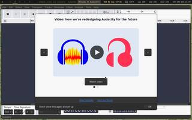 **Audacity (audio editor)** `audacity` · graphical · WIZARD 1s (2 windows) | 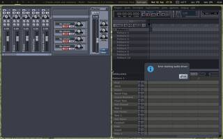 **Hydrogen (drum machine)** `hydrogen` · graphical · ok 3s (3 windows) | 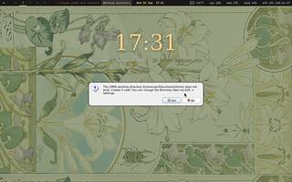 **LMMS (DAW - tracker lineage)** `lmms` · graphical · ok 2s (1 window) |
| 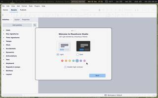 **MuseScore (music notation)** `mscore` · graphical · WIZARD 2s (2 windows) | 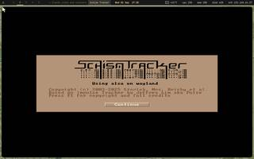 **Schism Tracker (Impulse Tracker style)** `schismtracker` · graphical · ok 1s (1 window) | 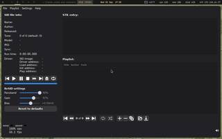 **VICE vsid (Commodore 64 SID player)** `vsid` · graphical · ok 2s (1 window) |

## Control (3)

| | | |
|---|---|---|
| 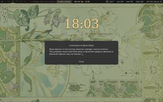 **Bluetooth manager** `blueman-manager` · graphical · ok 2s (1 window) | 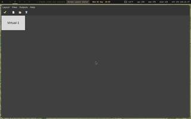 **Display layout** `arandr` · graphical · ok 1s (1 window) | 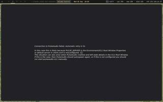 **Volume control (PulseAudio)** `pavucontrol` · graphical · ok 1s (1 window) |

## Design (8)

| | | |
|---|---|---|
| 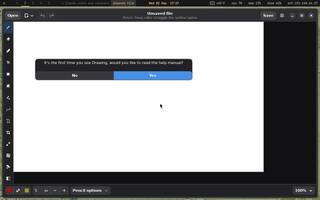 **Drawing (simple paint)** `drawing` · graphical · ok 1s (2 windows), acted | 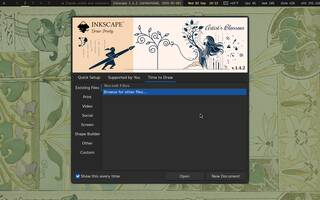 **Inkscape (vector drawing)** `inkscape` · graphical · ok 2s (1 window) | 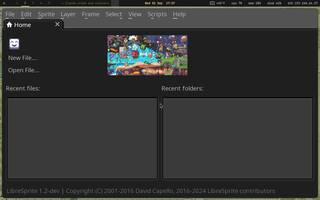 **LibreSprite (pixel art + animation)** `libresprite` · graphical · ok 1s (1 window), acted |
| 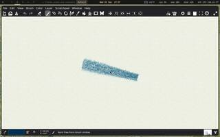 **MyPaint (natural media painting)** `mypaint` · graphical · ok 1s (1 window), acted | 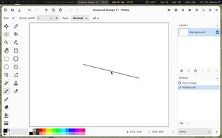 **Pinta (Paint.NET-like)** `pinta` · graphical · ok 1s (1 window), acted | 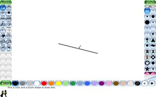 **Tux Paint (for children)** `tuxpaint` · graphical · ok 2s (1 window), acted |
| 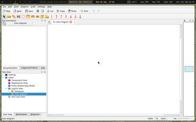 **Umbrello (UML diagram editor)** `umbrello6` · graphical · ok 1s (1 window) | 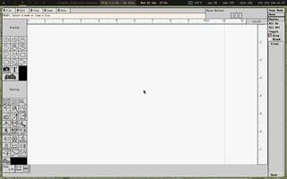 **Xfig (vector drawing - classic)** `xfig` · graphical · ok 1s (1 window) |  |

## Devtools (6)

| | | |
|---|---|---|
| 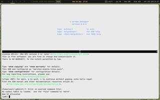 **cgdb (GDB with a source window)** `cgdb` · terminal · ok 1s (1 window), acted | 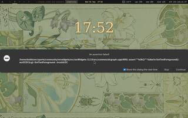 **Code::Blocks (IDE - GDB breakpoints)** `codeblocks` · graphical · ok 1s (1 window) | 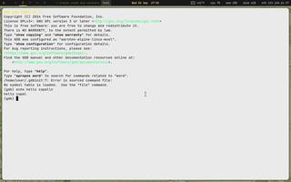 **GDB (the debugger everything uses)** `gdb` · terminal · ok 1s (1 window), acted |
| 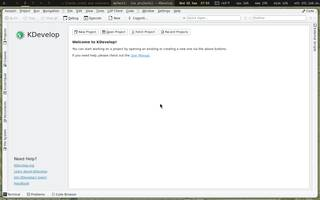 **KDevelop (IDE - GDB breakpoints)** `kdevelop` · graphical · ok 1s (1 window) | 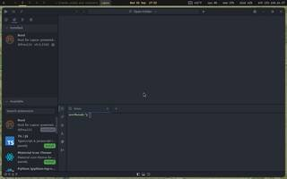 **Lapce (modern GUI editor, Rust)** `lapce` · graphical · ok 1s (1 window), detached | 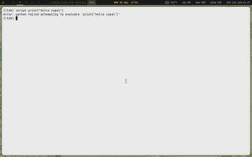 **LLDB (the Clang debugger)** `lldb` · terminal · ok 1s (1 window), acted |

## Discs (2)

| | | |
|---|---|---|
| 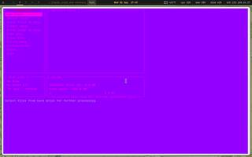 **cdw (CD/DVD burner - terminal)** `cdw` · terminal · ok 1s (1 window) | 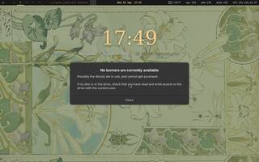 **Xfburn (CD/DVD burner)** `xfburn` · graphical · ok 1s (1 window) |  |

## Documents (9)

| | | |
|---|---|---|
| 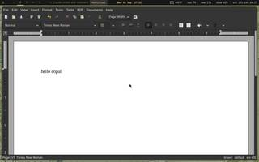 **AbiWord (word processor)** `abiword` · graphical · ok 1s (1 window), acted | 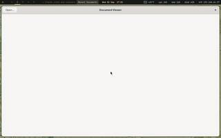 **Evince (PDF - full featured)** `evince` · graphical · ok 1s (1 window) | 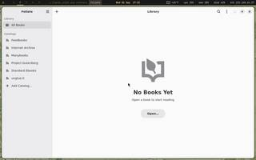 **Foliate (ebook reader)** `foliate` · graphical · ok 2s (1 window) |
| 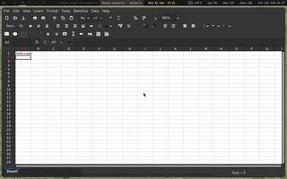 **Gnumeric (spreadsheet)** `gnumeric` · graphical · ok 2s (1 window), acted | 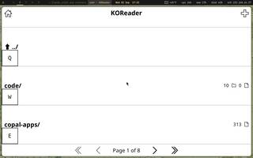 **KOReader (ebook reader)** `koreader` · graphical · ok 1s (1 window) | 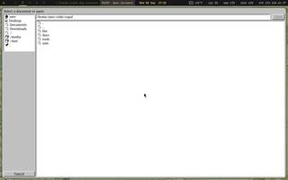 **MuPDF (PDF - fastest)** `mupdf` · graphical · ok 1s (1 window) |
| 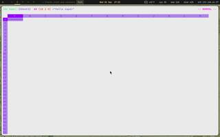 **sc-im (spreadsheet - terminal)** `sc-im` · terminal · ok 1s (1 window), acted | 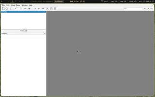 **xpdf (PDF)** `xpdf` · graphical · ok 1s (1 window) | 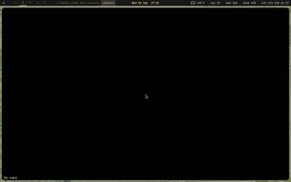 **Zathura (PDF)** `zathura` · graphical · ok 1s (1 window) |

## Editors (9)

| | | |
|---|---|---|
| 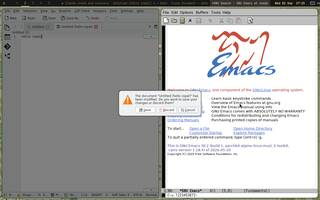 **Emacs (Eglot LSP built in; -nw for terminal)** `emacs` · graphical · ok 1s (1 window), acted | 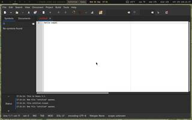 **Geany (programmer's editor)** `geany` · graphical · ok 1s (1 window), acted | 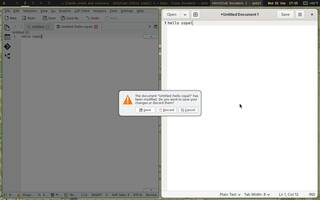 **gedit (GNOME editor)** `gedit` · graphical · ok 1s (1 window), acted |
| 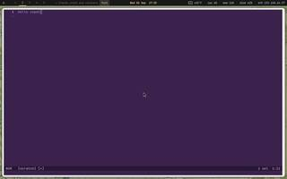 **Helix (terminal - modal, batteries in)** `hx` · terminal · ok 1s (1 window), acted | 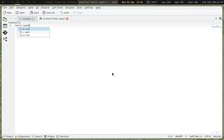 **Kate (KDE - LSP client built in)** `kate` · graphical · ok 2s (1 window), detached, acted | 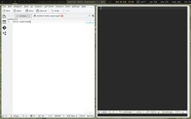 **micro (terminal - modeless)** `micro` · terminal · ok 1s (1 window), acted |
| 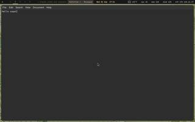 **Mousepad (small GUI editor)** `mousepad` · graphical · ok 1s (1 window), acted | 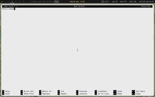 **nano (terminal - simplest)** `nano` · terminal · ok 1s (1 window), acted | 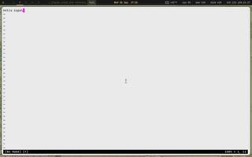 **vis (terminal - vi keys)** `vis` · terminal · ok 1s (1 window), acted |

## Engineering (3)

| | | |
|---|---|---|
| 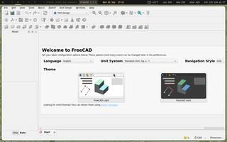 **FreeCAD (parametric 3D CAD - heavy)** `FreeCAD` · graphical · ok 4s (1 window) | 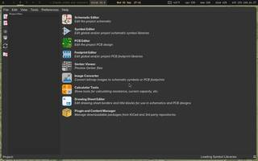 **KiCad (schematic + PCB + gerbers)** `kicad` · graphical · ok 2s (1 window) | 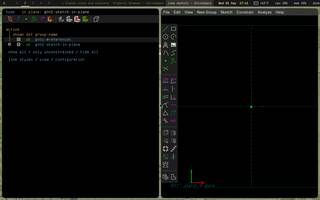 **SolveSpace (parametric CAD, exports STL)** `solvespace` · graphical · ok 1s (2 windows) |

## Files (8)

| | | |
|---|---|---|
| 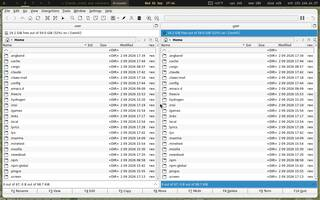 **Krusader (two-pane - powerful)** `krusader` · graphical · ok 1s (1 window) | 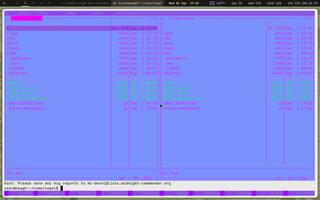 **Midnight Commander** `mc` · terminal · ok 1s (1 window) | 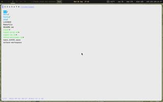 **nnn (terminal file manager)** `nnn` · terminal · ok 1s (1 window) |
| 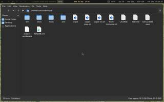 **PCManFM (file manager)** `pcmanfm` · graphical · ok 1s (1 window) |  **ranger (terminal file manager)** `ranger` · terminal · ok 1s (1 window) |  **Thunar (file manager)** `thunar` · graphical · ok 1s (1 window) |
|  **Xarchiver (zip/tar/7z)** `xarchiver` · graphical · ok 1s (1 window) |  **Xfe (two-pane file manager)** `xfe` · graphical · ok 1s (1 window) |  |

## Games (28)

| | | |
|---|---|---|
|  **Air Traffic Control** `atc` · terminal · ok 1s (1 window) |  **Angband (roguelike)** `angband` · terminal · ok 1s (2 windows) |  **Asciiquarium** `asciiquarium` · terminal · ok 1s (1 window) |
|  **Brogue (roguelike)** `brogue` · terminal · ok 1s (2 windows) |  **Cataclysm DDA (survival roguelike)** `cataclysm-tiles` · graphical · ok 1s (1 window) |  **Chess (XBoard + GNU Chess)** `xboard` · graphical · ok 1s (1 window) |
|  **Chocolate Doom (faithful Doom, with Freedoom)** `chocolate-doom` · graphical · ok 1s (1 window) |  **cmatrix** `cmatrix` · terminal · ok 1s (1 window) |  **Colossal Cave Adventure** `adventure` · terminal · ok 1s (1 window), acted |
|  **Endless Sky (built from source)** `endless-sky` · graphical · ok 1s (1 window) |  **Freeciv (SDL client - slow)** `freeciv-sdl2` · graphical · ok 1s (1 window) |  **GZDoom (Doom engine, with Freedoom)** `gzdoom` · graphical · ok 2s (1 window) |
|  **Hangman** `hangman` · terminal · ok 1s (1 window) |  **Klondike (cards)** `klondike` · terminal · ok 1s (1 window) |  **Luanti (Minetest - voxel sandbox)** `luanti` · graphical · ok 1s (1 window) |
|  **Minesweeper** `gnome-mines` · graphical · ok 1s (1 window), acted |  **NetHack (roguelike)** `nethack` · terminal · ok 1s (1 window), acted |  **OpenMW (Morrowind engine - needs the game's data)** `openmw-launcher` · graphical · WIZARD 1s (1 window) |
|  **OpenTTD (transport sim)** `openttd` · graphical · ok 1s (1 window) |  **Robots** `robots` · terminal · ok 1s (1 window) |  **Snake** `snake` · terminal · ok 1s (1 window) |
|  **Solitaire** `sol` · graphical · ok 2s (1 window) |  **Sudoku** `gnome-sudoku` · graphical · ok 1s (1 window) |  **SuperTux (platformer - needs a GPU)** `supertux2` · graphical · ok 1s (1 window) |
|  **TTY Solitaire** `ttysolitaire` · terminal · ok 1s (1 window) |  **Wesnoth (heavy - turn-based strategy)** `wesnoth` · graphical · ok 1s (1 window) |  **Widelands (settlers-like)** `widelands` · graphical · ok 1s (1 window) |
|  **ZAngband (roguelike)** `zangband` · terminal · ok 1s (1 window) |  |  |

## Graphics (4)

| | | |
|---|---|---|
|  **GPicView (image viewer)** `gpicview` · graphical · ok 1s (1 window) |  **gThumb (browse and tag photos)** `gthumb` · graphical · ok 1s (1 window) |  **Ristretto (image viewer)** `ristretto` · graphical · ok 1s (1 window) |
|  **Simple Scan (scanner)** `simple-scan` · graphical · ok 2s (1 window) |  |  |

## Instruments (5)

| | | |
|---|---|---|
|  **GHex (hex and binary editor)** `ghex` · graphical · ok 1s (1 window) |  **GTKWave (view digital waveforms)** `gtkwave` · graphical · ok 1s (1 window) |  **PulseView (oscilloscope + logic analyser)** `pulseview` · graphical · ok 1s (1 window) |
|  **QSpectrumAnalyzer (spectrum from an SDR)** `qspectrumanalyzer` · graphical · ok 1s (1 window) |  **SpeedCrunch (calculator - bin/oct/hex)** `speedcrunch` · graphical · ok 1s (1 window), acted |  |

## Internet (10)

| | | |
|---|---|---|
|  **Brave (Flatpak)** `brave` · graphical · ok 2s (1 window), acted |  **ELinks (text web + gopher)** `elinks` · terminal · ok 1s (1 window) |  **Firefox ESR (full browser)** `firefox-esr` · graphical · ok 1s (1 window), acted |
|  **lftp (FTP - terminal)** `lftp` · terminal · ok 1s (1 window), acted |  **Links (text/graphics web)** `links` · terminal · ok 1s (1 window) |  **Lynx (text web + gopher)** `lynx` · terminal · ok 1s (1 window) |
|  **qBittorrent (torrents)** `qbittorrent` · graphical · ok 1s (1 window) |  **retawq (tiny text browser)** `retawq` · terminal · ok 1s (1 window) |  **Transmission (torrents)** `transmission-gtk` · graphical · ok 1s (1 window) |
|  **w3m (text web)** `w3m` · terminal · ok 1s (1 window) |  |  |

## Languages (9)

| | | |
|---|---|---|
|  **CHICKEN (Scheme to C)** `csi` · terminal · ok 1s (1 window), acted |  **Elixir** `elixir` · terminal · ok 1s (1 window), acted |  **Guile (Scheme)** `guile` · terminal · ok 1s (1 window), acted |
|  **Lua 5.4 + LuaJIT** `lua5.4` · terminal · ok 2s (1 window), acted |  **OCaml** `ocaml` · terminal · ok 1s (1 window), acted |  **Racket** `racket` · terminal · ok 1s (1 window), acted |
|  **RetroForth (the Forth family)** `retro` · terminal · ok 1s (1 window), acted |  **Ruby** `ruby` · terminal · ok 1s (1 window), acted |  **SBCL (Common Lisp)** `sbcl` · terminal · ok 1s (1 window), acted |

## Learn (3)

| | | |
|---|---|---|
|  **GNU Typist (touch typing course)** `gtypist` · terminal · ok 1s (1 window) |  **KTouch (typing tutor with a keyboard map)** `ktouch` · graphical · ok 1s (1 window) |  **Minuet (music theory and ear training)** `minuet` · graphical · ok 1s (1 window) |

## Mail (8)

| | | |
|---|---|---|
|  **aerc (terminal)** `aerc` · terminal · ok 1s (1 window) |  **Alpine (pine - terminal)** `alpine` · terminal · ok 1s (1 window) |  **Claws Mail (GUI - Sylpheed lineage)** `claws-mail` · graphical · WIZARD 1s (1 window) |
|  **irssi (IRC)** `irssi` · terminal · ok 1s (1 window), acted |  **KMail (KDE mail - heavy, pulls in Akonadi)** `kmail` · graphical · ok 2s (1 window) |  **Mutt (terminal)** `mutt` · terminal · ok 1s (1 window) |
|  **Profanity (XMPP)** `profanity` · terminal · ok 1s (1 window) |  **WeeChat (IRC)** `weechat` · terminal · ok 1s (1 window), acted |  |

## Media (6)

| | | |
|---|---|---|
|  **Audacious (playlists - XMMS fork)** `audacious` · graphical · ok 1s (1 window) |  **cmus (audio - terminal)** `cmus` · terminal · ok 1s (1 window) |  **DeaDBeeF (audio player)** `deadbeef` · graphical · ok 1s (1 window) |
|  **MPD + ncmpcpp (daemon + client)** `ncmpcpp` · terminal · ok 1s (1 window) |  **Volume control** `alsamixer` · terminal · ok 1s (1 window) |  **ytq download queue** `ytq` · graphical · ok 1s (1 window) |

## News (4)

| | | |
|---|---|---|
|  **Liferea (RSS - window)** `liferea` · graphical · ok 1s (1 window) |  **Newsboat (RSS/Atom - terminal)** `newsboat` · terminal · ok 1s (1 window) |  **Newsraft (RSS - terminal, fast)** `newsraft` · terminal · ok 1s (1 window) |
|  **Ticker (stock prices - terminal)** `ticker` · terminal · ok 1s (1 window) |  |  |

## Notes (5)

| | | |
|---|---|---|
|  **CherryTree (hierarchical notebook)** `cherrytree` · graphical · ok 1s (2 windows) |  **Ghostwriter (distraction-free Markdown)** `ghostwriter` · graphical · ok 1s (1 window), acted |  **Gnote (sticky wiki notes)** `gnote` · graphical · ok 1s (1 window) |
|  **Vim + spell check** `vim` · terminal · ok 1s (1 window), acted |  **Zim (wiki-style notebook)** `zim` · graphical · ok 1s (1 window), acted |  |

## Radio (4)

| | | |
|---|---|---|
|  **GNU Radio (build your own SDR, in blocks)** `gnuradio-companion` · graphical · ok 2s (1 window) |  **Gqrx (SDR receiver with a waterfall)** `gqrx` · graphical · ok 1s (1 window) |  **QSSTV (slow-scan television)** `qsstv` · graphical · ok 2s (1 window) |
|  **welle.io (DAB+ radio)** `welle-io` · graphical · ok 1s (1 window) |  |  |

## Retro (6)

| | | |
|---|---|---|
|  **DOSBox Staging (DOS)** `dosbox` · graphical · ok 1s (1 window) |  **FS-UAE (Amiga)** `fs-uae` · graphical · ok 1s (1 window) |  **RetroArch (many consoles)** `retroarch` · graphical · ok 1s (1 window) |
|  **ScummVM (point-and-click adventures)** `scummvm` · graphical · ok 1s (1 window) |  **UR FINKEL (Plus/4, make run in xplus4)** `urfinkel` · graphical · ok 1s (1 window), acted |  **VICE (Commodore 64 - see stage 9)** `x64sc` · graphical · ok 2s (1 window) |

## Science (8)

| | | |
|---|---|---|
|  **LyX (LaTeX with a document view)** `lyx` · graphical · ok 1s (1 window), acted |  **Maxima (computer algebra, solves systems)** `maxima` · terminal · ok 1s (1 window), acted |  **Octave (MATLAB-compatible maths)** `octave` · terminal · ok 1s (1 window), acted |
|  **PARI/GP (number theory)** `gp` · terminal · ok 2s (1 window), acted |  **Qalculate (unit-aware calculator)** `qalculate-gtk` · graphical · ok 1s (1 window), acted |  **R (statistics)** `R` · terminal · ok 1s (1 window), acted |
|  **Singular (polynomial algebra)** `Singular` · terminal · ok 1s (1 window), acted |  **wxMaxima (built from source)** `wxmaxima` · graphical · ok 2s (2 windows), acted |  |

## Security (2)

| | | |
|---|---|---|
|  **Termshark (Wireshark-like TUI)** `termshark` · terminal · ok 1s (1 window) |  **Wireshark (packet capture - window)** `wireshark` · graphical · ok 1s (1 window) |  |

## Smallweb (5)

| | | |
|---|---|---|
|  **Amfora (gemini browser)** `amfora` · terminal · ok 1s (1 window) |  **Bombadillo (gopher + gemini + finger)** `bombadillo` · terminal · ok 1s (1 window) |  **gmnlm (gemini line mode)** `gmnlm` · terminal · ok 1s (1 window) |
|  **Lagrange (gemini - terminal)** `clagrange` · terminal · ok 1s (1 window) |  **Lagrange (gemini - window)** `lagrange` · graphical · ok 1s (1 window) |  |

## System (9)

| | | |
|---|---|---|
|  **Disk usage (Baobab)** `baobab` · graphical · ok 1s (1 window) |  **Disk utility (format, image, SMART)** `gnome-disks` · graphical · ok 1s (1 window) |  **git-gui + gitk** `gitk` · graphical · ok 1s (1 window) |
|  **gitui (git TUI)** `gitui` · terminal · ok 1s (1 window) |  **htop (process viewer)** `htop` · terminal · ok 2s (1 window) |  **lazygit (git TUI)** `lazygit` · terminal · ok 1s (1 window) |
|  **Meld (compare files and folders)** `meld` · graphical · ok 2s (1 window) |  **Task manager (Xfce)** `xfce4-taskmanager` · graphical · ok 2s (1 window) |  **tig (git history TUI)** `tig` · terminal · ok 1s (1 window) |

## Terminals (15)

| | | |
|---|---|---|
|  **Alacritty (GPU - fast, needs OpenGL)** `alacritty` · graphical · ok 1s (1 window), acted |  **Byobu (tmux with a status line set up)** `byobu` · terminal · ok 1s (1 window), acted |  **Cool Retro Term (a CRT, convincingly)** `cool-retro-term` · graphical · ok 1s (1 window), acted |
|  **dvtm (tiling in a terminal)** `dvtm` · terminal · ok 1s (1 window), acted |  **GNU screen (multiplexer - the classic)** `screen` · terminal · ok 1s (1 window), acted |  **LXTerminal (light GTK, tabs)** `lxterminal` · graphical · ok 1s (1 window), acted |
|  **QTerminal (Qt, drop-down mode)** `qterminal` · graphical · ok 1s (1 window), acted |  **rxvt-unicode (light, the Copal default)** `urxvt` · graphical · ok 1s (1 window), acted |  **Sakura (small GTK, tabs)** `sakura` · graphical · ok 1s (1 window), acted |
|  **st (suckless - smallest and quickest)** `st` · graphical · ok 1s (1 window), acted |  **Terminator (split panes in a grid)** `terminator` · graphical · ok 1s (1 window), acted |  **Tilda (drop-down, F1 - light)** `tilda` · graphical · ok 1s (2 windows), acted |
|  **Xfce Terminal (featureful GTK)** `xfce4-terminal` · graphical · ok 1s (1 window), acted |  **xterm (the original, always works)** `xterm` · graphical · ok 1s (1 window), acted |  **Zellij (multiplexer, discoverable keys)** `zellij` · terminal · ok 1s (1 window), acted |

## Tools (5)

| | | |
|---|---|---|
|  **Galculator** `galculator` · graphical · ok 1s (1 window), acted |  **SQLite browser** `sqlitebrowser` · graphical · ok 1s (1 window) |  **Sticky notes** `xpad` · graphical · ok 1s (1 window), acted |
|  **tmux (terminal multiplexer)** `tmux` · terminal · ok 1s (1 window), acted |  **x11vnc (share this screen)** `x11vnc` · terminal · ok 1s (1 window) |  |

## Windows (2)

| | | |
|---|---|---|
|  **Notepad++ in a Wine box** `winebox-notepad++` · graphical · ok 2s (1 window), acted |  **winecfg** `winecfg` · graphical · ok 1s (1 window) |  |

## No window on this bench (17)

| Program | Command | Verdict |
|---|---|---|
| Cura (slicer for the Ender 3) | `cura` | NO WINDOW in 30s, process no (exit 1) |
| feh (image viewer) | `feh` | NO WINDOW in 30s, process no (exit 1) |
| Guake (drop-down, F12 - GNOME) | `guake` | NO WINDOW in 30s, process yes |
| kitty (GPU - featureful, needs OpenGL) | `kitty` | NO WINDOW in 30s, process no (exit 1) |
| LBreakout2 (breakout) | `lbreakout2` | NO WINDOW in 30s, process no (exit 133) |
| MilkyTracker (Fasttracker II style) | `milkytracker` | NO WINDOW in 30s, process no (exit 134) |
| mpv (audio and video) | `mpv` | NO WINDOW in 30s, process no (exit 0) |
| Network applet | `nm-applet` | NO WINDOW in 30s, process yes |
| nsxiv (image viewer) | `nsxiv` | NO WINDOW in 30s, process no (exit 1) |
| Partition editor (GParted) | `gparted` | NO WINDOW in 30s, process no (exit 127) |
| Pingus (Lemmings-like) | `pingus` | NO WINDOW in 30s, process no (exit 139) |
| Screen lock and savers | `xscreensaver` | NO WINDOW in 30s, process yes |
| streamripper (built from source) | `streamripper` | NO WINDOW in 30s, process no (exit 0) |
| VLC (audio and video) | `vlc` | NO WINDOW in 30s, process no (exit 0) |
| WezTerm (GPU - multiplexer built in) | `wezterm` | NO WINDOW in 30s, process yes |
| Yakuake (drop-down, F12 - KDE) | `yakuake` | NO WINDOW in 30s, process no (exit 139) |
| Zutty (X11-native, very fast) | `zutty` | NO WINDOW in 30s, process no (exit 139) |

*Generated 2026-09-02 18:14.*
