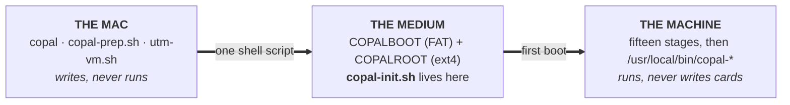

<!-- SPDX-License-Identifier: MIT -->
<!-- Copyright (c) 2026 paulr@sdf.org -- Copal Linux -->
```
 ██████  ██████  ██████   █████  ██
██      ██    ██ ██   ██ ██   ██ ██
██      ██    ██ ██████  ███████ ██
██      ██    ██ ██      ██   ██ ██
 ██████  ██████  ██      ██   ██ ███████
```

# The Copal Handbook

**The damn tasty Raspberry Pi Zero distro. Full installer.**

> **This is the original Copal Linux handbook**, carried forward from the
> `arm-pi-zero` repository when Copal was merged into
> **copal-alpine-linux**. Everything below about Alpine, the card layout, the
> fifteen stages, the catalogue and the desktop still holds — it is the same
> installer. What it does *not* yet describe is the UTM side of the merged
> project: the `utm-aarch64` and `utm-x86_64` targets that verify the ARM and
> PC code paths on an Apple Silicon Mac without a card or a Pi. For that, and
> for the multi-target model generally, see the [top-level
> README](../README.md).

An SD-card formatter and install script that puts Alpine Linux on a Raspberry Pi
Zero, a Zero 2 W, or a PC. Copal is an *aggregation* of Alpine — it downloads
stock Alpine and calls Alpine's own tools — **not** a derivative work of it, and
not a fork. See [License](#license) for why that distinction is drawn carefully.

Copal is tree resin caught halfway to amber — hardened, but not yet stone.
That is this system's whole trick.

Alpine on a Raspberry Pi boots *diskless*: the root filesystem is a tmpfs that
evaporates at power-off. Copal is what turns that into something permanent on
the card, without giving up any of the smallness that made it worth booting in
the first place.

Copal installs stock Alpine from sd-card in an embedded fashion 
from Alpine's own mirrors and then walks you through fifteen optional,
re-runnable stages — from a RAM-resident shell to a full ext4 root with a
tiling desktop, 316 curated applications, emulators and a multi-language IDE. On a
1 GHz single core with 512 MB of RAM, shared with the framebuffer.

Built for the Pi Zero 1 / Zero W and prepared from macOS. It also builds for the
Zero 2 W, Pi 2, 3, 4 and 5 — pass `MODEL=` to pick the board, because the
architecture is not the same and the wrong one will not boot.

It also builds for an **ordinary PC, laptop or Intel Mac**, 64-bit or 32-bit,
via UEFI. Same installer, same fifteen stages, same catalogue — a different
bootloader and a different payload. See
[Part II — PCs: x86 and x86_64](#pcs-x86-and-x86_64) for what changes, and for
the one thing that is *not* supported (legacy BIOS) and why.

> Copal is not a fork of Alpine Linux and is not affiliated with or endorsed by
> the Alpine project. *(The resemblance to the name of Alpine's founder,
> Natanael **Copa**, is a genuine accident — noticed after the fact and kept
> because it was too good to throw away.)*

---

## Quick start

**On the Mac:**

```sh
./copal-prep.sh                 # asks which board, if you do not say
MODEL=zero  ./copal-prep.sh     # Pi Zero 1 / Zero W / Pi 1
MODEL=zero2 ./copal-prep.sh     # Pi Zero 2 W  (also pi2b, pi3, pi4, pi5)
MODEL=pc    ./copal-prep.sh     # PC / laptop / Intel Mac, 64-bit UEFI
MODEL=pc32  ./copal-prep.sh     # PC, 32-bit UEFI
```

Downloads Alpine, verifies its SHA256, erases the card you choose, and writes a
bootable system. It pauses before every step and asks twice before erasing
anything.

**On the machine** — boot the card and log in as `root` (no password):

```sh
sh /media/mmcblk0p1/copal-init.sh     # the path it prints; on a PC it differs
```

The first thing it asks is whether you want a **full automatic install**. Say
yes and it shows a checklist of every phase, then runs the lot behind a
full-screen progress display — four nested bars, a phase checklist and a
scrolling pane of the real `apk` output. It resumes by itself across the reboot
in the middle and stops once, at the start, for a git identity and a root
password. Say no and you get a menu and choose your own stages.

**Stay as `root` for stages 1–13.** Installing is root's job; the *desktop*
runs as the `user` account. The installer says so at every handover, and
`copal-startx` refuses to start X as root — see
[Accounts and remote access](#accounts-and-remote-access).

---

## What is where

| File | What it is |
|---|---|
| `copal-prep.sh` | Runs on the **Mac**. Downloads Alpine, verifies it, prepares the card, and generates everything below |
| `COPALBOOT/copal-init.sh` | Runs on the **Pi**. The installer: a re-runnable menu, or a fully automatic run |
| `COPALBOOT/copal.log` | Transcript of every run. FAT, so it is readable from the Mac **even if the Pi will not boot** |
| `COPALBOOT/copal-auto` | Present only during an automatic install. Records progress; delete it to stop resuming |
| `COPALBOOT/copal-git` | The name and email for git commits, asked in stage 1 and applied by stage 7. Plain `key=value`; editable from the Mac |
| `lab-report.md` | The lab report (IEEE format) — procedure, results, findings |
| `interface-report.md` | The design position (IEEE format) — simplifying the interface for capable users, and the twelve rules the desktop is built to |
| `work/` | Scratch directory the script downloads and extracts into |

The split matters: macOS cannot create ext4, so the card can only be taken so
far from the Mac. `copal-prep.sh` writes a bootable card and carries the
remaining instructions onto it as `copal-init.sh`, rather than leaving them to
be retyped at the Pi's console.

### Commands on the Pi

| Command | What it does |
|---|---|
| `copal` | The installer. Fifteen stages, all optional, all re-runnable |
| `copal --auto` | Run every stage unattended, resuming across the reboot |
| `copal-desk` | Lay the workspaces out the same way every time (**Super+Shift+D**) |
| `copal-menu` | The menu, built from what is installed: applications on the left, categories/settings/session on the right (**Super+Space**, or **Super+Z** for the right side) |
| `copal-center` | One window listing all 316 programs — run or install (**Super+C**) |
| `copal-guide` | Plain-text guides — eleven of them, on the machine, no network (**Super+Shift+G**) |
| `copal-startx` | Starts the desktop, and refuses to do it as root |
| `copal-morse` | Send, drill or print morse code (Alpine packages none) |
| `copal-install` | `apk add` with the window kept open so you can read the result |
| `copal-splash` | Paints the key bindings onto the desktop wallpaper |

Licensed **MIT**. See `LICENSE` for the scope, which matters here — third-party
material is stored alongside and is *not* covered.

## The shape of the system

Three machines, and only one file crosses between them.



The Mac has the network, the disk and the tooling, and does everything needing
them: partitioning, downloading, verifying checksums, laying down firmware. The
target has 512 MB and an SD card and does nothing it does not have to.

`copal-init.sh` is **generated, never edited**. It exists only as a heredoc
inside `copal-prep.sh` until a medium is written, which is why `make lint`
extracts it and syntax-checks the file it *becomes* — an error inside a heredoc
is invisible to any check that reads the generator, and would land on hardware
instead.

That single file is also the entire update mechanism. Every stage, guide,
helper and the whole catalogue live inside it, so `copal -U` is one fetch and
one `sh -n` rather than a package manager, an index and a signing key — none of
which help on a board whose commonest problem is having no network yet.

**And the same mechanism runs backwards, from a checkout on the machine
itself.** `copal -U --from ~/code/copal` extracts `copal-init.sh` out of the
`copal-prep.sh` in a working tree instead of fetching one over HTTPS — same
`sh -n` gate, same `copal-init.sh.bak` — and `copal --stage 16 --auto` re-runs
named stages without the menu. In the checkout, `make redeploy STAGES=16` is
those two commands with the lint in front of them. That is the edit-and-see-it
loop for anyone changing a stage: no image to rebuild, no commit to push, and
the machine you are testing on is the machine you are typing on. `make
redeploy` refuses to run anywhere that has no `answers.txt` on a boot
partition, which is how it tells the Mac apart from the guest.

It reports which branch the checkout is on and whether it is dirty — "I
redeployed and my change was not in it" is nearly always one of those two —
and if the branch is behind its remote it *asks* before pulling. It never
pulls unasked: the reason to run this target is usually an edit that is not
committed yet. `PULL=1` answers yes, `PULL=0` skips the question, no terminal
means no. After a pull it stops rather than continuing, because make had
already read the pre-pull Makefile.

The name is the design. Copal is tree resin caught halfway to amber: hardened,
but not yet stone. Alpine is the sap — small, generic, still runny. This
repository distils it: holds it in a shape long enough to set, without turning
it into something that can never be reworked. Nothing here is compiled, minified
or hidden in a database. What the machine will do is a file you can read; what
it has done is a transcript beside it.

## Repository contents

**This repository tracks no binaries at all.** That is a change from the
original Copal repository, which vendored the Alpine payload and the Mini vMac
working set on purpose so a card could be written with no network. The old
arrangement could never be published: `minivmac/macOS755.dsk.zip` was 894 MB —
past GitHub's 100 MB per-file limit — and the Macintosh Plus ROM and the Mac OS
disk images beside it are copyrighted Apple material that is not
redistributable.

Nothing is lost by leaving them out, because none of it was ever required:

| What | Where it comes from now |
|---|---|
| Alpine payload (`alpine-rpi-*`, `alpine-netboot-*`) | `copal-prep.sh` downloads it and checks the published SHA256 |
| GRUB, for the UEFI targets | extracted from `alpine-virt-*.iso`, likewise verified |
| Mini vMac source, ROM and disk images | `fetch-minivmac.sh`, or stage 9 on the target |
| PianoBooster | stage 14 on the target |

Everything downloaded lands in `work/`, which is gitignored, as are `cache/`,
`*.img`, `*.qcow2`, `*.iso`, `*.ROM`, `*.dsk` and every other shape those files
arrive in. The archived original repository, binaries and all, remains at
`~/code/arm-pi-zero` on the machine this was migrated from.

---

# Part I — Alpine Linux

Copal is an installer for Alpine, not a distribution in its own right, so it is
worth understanding what it is installing and why that choice constrains
everything else in this repository.

## What Alpine is

Alpine Linux is an **independent** distribution — not a derivative of Debian,
Red Hat or Arch. It was first released in **August 2005**, built on Gentoo and
inspired by GNAP and the Bering-uClibc branch of the LEAF Project, a lineage
that traces back to the Linux Router Project. It was designed from the start
for routers, firewalls and appliances: machines with little memory, little
storage, and no tolerance for a general-purpose distribution's assumptions.

It was founded by **Natanael Copa** and is now maintained by the Alpine Linux
Development Team.

Most people meet Alpine as a Docker base image. That is a side effect of the
same design goals, not the point of them.

## Four substitutions

Alpine is small because it replaces four things almost every other Linux keeps.
Each replacement buys size and costs compatibility, and every one of them shows
up somewhere in this project.

| Component | Alpine uses | Instead of | What it costs you |
|---|---|---|---|
| C library | **musl** | glibc | Binaries built against glibc do not run. Closed-source software often will not work at all |
| Core utilities | **BusyBox** | GNU coreutils | The flags are POSIX, not GNU. `head -n -5`, `sed -i` without an argument, `grep -P` — none of them exist |
| Init | **OpenRC** | systemd | No journal, no units, no `systemctl`. Plain shell scripts in `/etc/init.d` |
| Packages | **apk** | dpkg/rpm | Fast and tiny. Fewer packages than Debian, and far fewer for 32-bit ARM |

The BusyBox one bites hardest when writing scripts. Everything in Copal that
runs on the Pi is POSIX shell tested under `dash`, because a GNU-ism that works
fine on the Mac will fail on the board — and it will fail there, hours into an
install, where it is most expensive to discover.

Alpine also compiles all user-space binaries as position-independent
executables with stack-smashing protection, which is unusual for a distribution
this size.

## The numbers

Measured from the payload this project actually downloads:

| | |
|---|---|
| `alpine-rpi-3.24.1-armhf.tar.gz` | **66 MB** compressed |
| Extracted | **73 MB** |
| Packages in the boot repository | **96** `.apk` files |
| Base system installed | roughly **35 MB** |
| Packages available for armhf (v3.24) | **25,133** — 5,922 in `main`, 19,211 in `community` |
| Same for aarch64 / armv7 | **28,540** / **27,099** — the gap is almost all Rust, Go and GPU software |

That 35 MB base, with a very small resident footprint, is the entire reason for
choosing Alpine on this board. The Pi Zero has 512 MB of RAM, reduced further
by the GPU memory split. Whatever the base system does not take is available to
the windowing layer, and Alpine was the smallest of the distributions surveyed.

## Releases and repositories

Alpine branches a new stable release from `edge` **each May and November**.

| Repository | What is in it | Support |
|---|---|---|
| `main` | The core system and the packages Alpine commits to | ~2 years from release |
| `community` | Everything else that has been accepted | Until the next stable release |
| `testing` | `edge` only — not present on a stable branch | None |

The branch this project targets:

| Version | Released | End of support |
|---|---|---|
| **v3.24** | 2026-06-09 | 2028-06-01 |

Two practical consequences run through this repository:

- **Most interesting software is in `community`, not `main`.** Of Copal's 316
  catalogued applications, the overwhelming majority come from `community`.
  That is fine, but it is supported only until the next release rather than for
  two years.
- **`testing` does not exist on a stable branch.** Several things you might
  reasonably want — `visidata`, `sacc`, `castor`, `geomyidae`, `nsnake` — are
  in `edge/testing` and cannot be installed without pointing `apk` at a
  different branch. Copal's guides give the exact command where it is relevant,
  but does not do it for you: mixing branches can pull in a newer musl than the
  rest of the system expects.

## Diskless mode, and why this project exists

This is the part that surprises people, and it is the single most important
thing to understand about running Alpine on a Pi.

The `alpine-rpi` image is **diskless**. It unpacks into a RAM filesystem at
every boot and never writes to the card on its own. That is excellent for flash
media — an SD card that is never written to is an SD card that does not wear
out — and it is why Alpine is popular on routers and appliances.

It also means:

> **Nothing you change survives a reboot until you run `lbu commit -d`.**
> Not the root password, not the network configuration, not installed packages.

Configuration is saved as a compressed overlay, `<hostname>.apkovl.tar.gz`,
which is reloaded at the next boot. `lbu` — Alpine's *local backup utility* —
is what writes it.

And there is a ceiling. The tmpfs root is sized at roughly **half of RAM**,
about 200 MB on a 512 MB Zero. A TUI fits in that comfortably. A desktop does
not: `apk add` fails with `No space left on device` while the SD card is still
99 % empty, **because the limit is RAM, not storage**. That failure is
confusing the first time you hit it, and it is the reason Copal has a stage 3
at all.

The apk cache is the other half of the story. `apk add` unpacks into the tmpfs
root, which is gone at the next boot; `lbu commit` saves the *list* of
packages, not the packages themselves. With a cache on real storage, that list
is reinstalled from the card at boot, before the network is up — so a
RAM-resident system can still have persistent software.

**Copal's three system stages map exactly onto this:**

1. **Stage 1** configures Alpine and commits the overlay, so the machine
   remembers itself.
2. **Stage 2** formats `COPALROOT` as ext4 and puts the apk cache on it. The
   root stays in RAM — gentlest on the card, and enough for a TUI.
3. **Stage 3** moves `/` onto the card entirely, removing the RAM ceiling. This
   is what makes a desktop possible, and it is the point at which Copal stops
   being *diskless Alpine* and becomes an installed system.

You can stop after stage 2 and keep the low-write design. Stage 3 is a
deliberate trade: SD card writes in exchange for a machine that can install X.

## Choosing the port for your board

**This is the one setting that must be right before you write a card.** Get it
wrong and the Pi does not boot degraded — it stops dead at the firmware rainbow
with no output at all.

| Board | Chip / core | `MODEL=` | Alpine port |
|---|---|---|---|
| Pi Zero, Zero W, Pi 1, CM1 | BCM2835 · ARM1176JZF-S (ARMv6) | `zero` *(default)* | `armhf` |
| Pi 2B **v1.1** | BCM2836 · Cortex-A7 (ARMv7) | `pi2b` | `armv7` |
| **Pi Zero 2 W** | BCM2710 · Cortex-A53 | `zero2` | `aarch64` |
| Pi 2B v1.2, Pi 3 / 3B+, CM3 | BCM2837 · Cortex-A53 | `pi3` | `aarch64` |
| Pi 4, 400, CM4 | BCM2711 · Cortex-A72 | `pi4` | `aarch64` |
| Pi 5 | BCM2712 · Cortex-A76 | `pi5` | `aarch64` |
| PC, laptop, Intel Mac (64-bit) | x86-64 · UEFI | `pc` | `x86_64` |
| PC (32-bit) | i686 · UEFI | `pc32` | `x86` |

```sh
MODEL=zero2 ./copal-prep.sh
MODEL=pc    ./copal-prep.sh
```

Run it with no `MODEL` and it asks, listing all seven. The PC entries are UEFI
only — see [PCs: x86 and x86_64](#pcs-x86-and-x86_64).

Pi 2B is the awkward one: v1.1 shipped a BCM2836 and is 32-bit only, then the
board was quietly respun as v1.2 with a BCM2837. If `cat /proc/cpuinfo` on the
running board says `Cortex-A7` use `MODEL=pi2b`; if it says `Cortex-A53` use
`MODEL=pi2b-v12`.

### Why one image cannot serve every board

Earlier versions of this project claimed a single `armhf` card served both the
Zero 1 and the Zero 2 W, on the reasoning that the `armhf` tarball ships
`bcm2710-rpi-zero-2-w.dtb` and that ARMv6 user-space runs fine on a Cortex-A53.
Both of those facts are true. The conclusion was wrong, and it costs a card and
a boot attempt to discover.

The kernel is the problem, not the userland and not the device tree. Alpine's
`armhf` `rpi` kernel is configured `CONFIG_ARCH_MULTI_V6` / `CONFIG_CPU_V6K` /
`CONFIG_ARCH_BCM2835`, with no `CONFIG_CPU_V7` — you can read this yourself in
`boot/config-*-rpi` inside the tarball.

A 32-bit ARM kernel carries a `proc_info_list` table holding the MMU, cache and
errata setup routines for each CPU family compiled into it. The very first thing
`head.S` does — before the MMU is enabled and long before any console exists — is
`__lookup_processor_type`: read `MIDR`, walk the table, find a match.

| Board | MIDR | Result |
|---|---|---|
| Zero 1 (ARM1176JZF-S) | `0x410fb767` | matches the V6 entry → boots |
| Zero 2 W (Cortex-A53) | `0x410fd034` | no V7 entry compiled in → no match |

On no match the kernel branches to `__error_p` and spins. It cannot print why,
because the console is not up yet. The firmware's colour-test pattern stays on
screen forever, and the correct `.dtb` sitting next to it is never read.

`copal-prep.sh` guards this twice: `MODEL=` picks the right download, and before
anything is written the script inspects the payload's own kernel config and
refuses a card whose kernel does not match the target.

### What each port does not have

Less varies across ports than you might expect. Every package in Copal's
catalogue exists on both `armhf` and `aarch64`; on `armv7` exactly one (`abcde`)
is missing, and the installer degrades to a warning rather than failing.

- **No Chromium and no Firefox on `armhf`.** Neither is built for ARMv6. Dillo
  and NetSurf are not the budget option on a Zero 1 — they are the entire field,
  and both are genuinely usable. On `armv7` and `aarch64` both browsers exist.
  Stage 4 asks `apk --print-arch` and offers only what that port actually has:
  Firefox ESR, Chromium and BadWolf on `armv7`/`aarch64`, BadWolf alone on
  `armhf`. **BadWolf is the modern browser that works everywhere** — a minimal
  front end over WebKitGTK, so a current engine and current TLS on a board that
  cannot run either of the big two. It is what the automatic install picks.
- **The catalogue is filtered per port.** Every row carries an architecture
  gate, and `write_catalogue` drops the ones this board cannot install before
  the menu, the Center or stage 12 ever see them — 316 entries on `aarch64` and
  `x86_64`, 294 on `armv7`, 286 on `x86`, 272 on `armhf`. Nothing offered will
  fail with "no such package". `!v6` entries (Firefox, Krita, FreeCAD, LMMS,
  MuseScore, mGBA, Krusader, Foliate) exist everywhere but ARMv6; `64` entries
  (Blender, KiCad, OpenMW, GZDoom, Calibre, KOReader, Cura, Cataclysm DDA,
  Ghostwriter, GHC, Zig, OpenJDK, VSCodium) need a 64-bit port; and a row can
  carry more than one exclusion — Chromium is `!v6,!x32`.
- **A few things come from `edge/testing`,** written `name@testing` in the
  catalogue. That is apk's own syntax for taking one package from a tagged
  repository, so the rest of the system stays on stable — unlike adding the
  edge URL outright, where the next `apk upgrade` drags musl forward and
  breaks the machine. VICE, MilkyTracker, Schism Tracker, Maxima, Cura,
  CherryTree, Lynis, Angband, Chocolate Doom and Ticker are in that group.
- **Genuinely not packaged for any of these ports**, so no amount of looking
  will help: Endless Sky, 0 A.D., Teeworlds, Hedgewars, Frozen Bubble, OpenRA,
  ADOM, ToME4, Fuse, PrusaSlicer, Slic3r, OpenSCAD, LibreCAD, QCAD, MeshLab,
  Fritzing, gEDA, gerbv, Qucs, Joplin, Obsidian, `hfsutils`, and kdegames.
- **No usable OpenGL on a Zero.** X here renders on the CPU through `fbdev`, so
  anything expecting a GPU falls back to a software rasteriser. Xonotic,
  SuperTux and SuperTuxKart are packaged for every port here and unplayable on a
  Zero. On a Pi 4 or 5 they become reasonable.
- **A long tail of missing packages, on every port.** `mtpaint`, `hfsutils`,
  `xmms`, `sylpheed`, `leafpad`, `elm`, `rox-filer`, `dosbox`, `fuse` and
  `neverball` are absent from every repository, stable and edge, for `armhf`,
  `armv7` and `aarch64` alike. Moving to 64-bit does not bring them back. Copal's
  catalogue lists the living descendant where one exists and says so in a
  comment where one does not.

None of this is a defect in Alpine. It is what ARM Linux looks like in 2026, and
it is better to know it before you go searching.

---

# Part II — Preparing the card

## Requirements

- macOS with an SD card reader
- An SD card, 2 GB or larger (it will be **completely erased**)
- Internet access
- `curl`, `shasum`, `diskutil`, `tar` — all preinstalled on macOS
- An admin password (one step calls `sudo fdisk`)

## Getting the right download

Everything is published at **<https://alpinelinux.org>**, with downloads at
**<https://alpinelinux.org/downloads/>**. For a Zero 1 this project uses:

```
https://dl-cdn.alpinelinux.org/alpine/v3.24/releases/armhf/alpine-rpi-3.24.1-armhf.tar.gz
```

Two choices in that URL matter, and both are easy to get wrong. The architecture
is the one that decides whether the board boots at all — swap `armhf` for
`aarch64` (twice) for a Zero 2 W or anything newer, or just let `MODEL=` build
the URL for you. See the board table above. The other choice:

### Get the `alpine-rpi` tarball, not the `alpine-standard` ISO

The Raspberry Pi has no conventional bootloader. Its VideoCore GPU starts first
and looks for `bootcode.bin`, `start.elf`, `config.txt`, a kernel, and device
trees **as files on a FAT partition**.

- `alpine-rpi-*.tar.gz` — a directory tree you **copy** onto FAT. Correct.
- `alpine-standard-*.iso` — an installer image for machines with a normal
  bootloader. Writing it with a block imager (including Raspberry Pi Imager)
  produces a card the firmware cannot boot: the board sits at the colour-test
  pattern, the **"boot rainbow"**, forever.

That failure is what motivated this script. See `lab-report.md` § IV-A.

## Running it

```sh
./copal-prep.sh
```

That is the whole thing. With no arguments it targets a **Pi Zero 1**, downloads
the release, verifies it, and walks you through preparing the card.

For any other board, name it — this is the one argument worth getting right:

```sh
MODEL=zero2 ./copal-prep.sh          # Pi Zero 2 W
MODEL=pi4   ./copal-prep.sh          # Pi 4 / 400 / CM4
```

To use a tarball you have already extracted, skip the download:

```sh
MODEL=zero2 ./copal-prep.sh ~/Downloads/alpine-rpi-3.24.1-aarch64
```

The script reads the kernel config inside whatever payload it is given and stops
before touching the card if it does not match the target board, so a stale
directory from a previous build cannot quietly produce an unbootable card.

To target a different release, architecture, or mirror:

```sh
ALPINE_VER=3.24.1 ARCH=aarch64 ./copal-prep.sh
MIRROR=https://mirrors.ocf.berkeley.edu/alpine ./copal-prep.sh
```

`ARCH` set on its own is honoured as-is. Set together with `MODEL` it must
agree, or the script stops — a board and an architecture that contradict each
other is exactly the mistake that produces a rainbow-screen hang.

### Updating a card without erasing it

```sh
./copal-prep.sh --refresh
```

Rewrites **only** the generated files — `answers.txt`, `usercfg.txt`,
`copal.conf`, `authorized_keys`, `copal-init.sh` — on a card that is already
written. No partitioning, no erase, no payload copy, and `COPALROOT` is not
touched, so a Pi that is already set up keeps everything.

This is how changes to `copal-init.sh` reach a running system. **You do not need
to start over to pick up script changes.**

### Configuration

Set these in the environment to override the defaults baked into `answers.txt`:

| Variable | Default | What it sets |
|---|---|---|
| `CFG_HOSTNAME` | a random ocean, sea, lake or river | Hostname |
| `CFG_USER` | `user` | Non-root account, and who gets the SSH key |
| `CFG_TIMEZONE` | `US/Pacific` | Timezone |
| `CFG_KEYMAP` | `us us` | Console keymap |
| `CFG_IFACE` | `eth0` | Interface to bring up with DHCP |
| `CFG_SSHKEY` | first of `~/.ssh/id_ed25519.pub`, `id_ecdsa.pub`, `id_rsa.pub` | Public key to authorise. Set to `""` to skip |
| `CFG_GIT_NAME` | this Mac's `git config --global user.name` | Name offered for git commits in stage 1 |
| `CFG_GIT_EMAIL` | this Mac's `git config --global user.email` | Email offered for git commits in stage 1 |

Only the **public** half of the key is ever copied. The private key never
leaves the Mac.

#### The git identity

The two git values are a *proposal*, not a setting. They go onto the card in
`copal.conf`, stage 1 offers them at the prompt where Enter accepts, and the
answer is written to `COPALBOOT/copal-git` — which is the file stage 7 reads.
Set either to `""` to leave the prompt empty. A `"`, `` ` ``, `\` or `$` is
stripped on the way in, because `copal.conf` is sourced as shell on the Pi;
a name containing one can be typed at the prompt instead.

Re-running with `--refresh` rewrites the proposal and leaves an answer already
given on the Pi alone.

#### The hostname

Left unset, each card gets a hostname drawn at random from 300 oceans, seas,
lakes and rivers — `tanganyika`, `okhotsk`, `xingu`, `zuiderzee`. Every name is
lowercase ASCII, 5 to 15 characters, and a valid DNS label as it stands, so it
needs no cleaning up before it goes into `answers.txt` and it works as-is with
mDNS: `ssh user@tanganyika.local`.

A fixed default is fine right up until the second Pi, at which point two boards
answer to the same name on the same network and you get whichever one replied
first. The pool covers all 26 letters, 10 to 13 names each. To pin one:

```sh
CFG_HOSTNAME=mypi ./copal-prep.sh
```

The name the card was given is printed in the summary before anything is
written, and again by `copal` on the Pi.

### What it does, step by step

The script **pauses before every step**, prints what it is about to do, and
waits for you to press Enter. Ctrl-C aborts.

| Step | Action | Destructive |
|---|---|---|
| 1 | Download the tarball and verify its published SHA256 | No — writes only to `work/` |
| 2 | List external disks; you choose the card | No |
| 3 | **Erase the card**, write an MBR table, create FAT32 `COPALBOOT` + `COPALROOT` | **Yes — no undo** |
| 4 | Mark partition 1 bootable (`sudo fdisk`) | Prompts for your password |
| 5 | Copy the Alpine payload onto `COPALBOOT` | Writes to the card |
| 6 | Write `answers.txt`, `usercfg.txt`, `copal.conf`, `authorized_keys`, `copal-init.sh` | Writes to the card |
| 7 | Verify every required file, check `gpu_mem` against the firmware blobs, flush, eject | No |

Steps 1 and 2 touch no disks at all, so aborting there is completely clean.
After step 3 there is no undo; aborting leaves the card unbootable until you
re-run the script. `--refresh` runs only steps 2, 6 and 7.

**There is no automatic mode here, deliberately.** Card preparation is the one
step that erases a disk you picked from a list, and macOS renumbers disks
between sessions. Automation belongs on the Pi, where the worst outcome is a
wasted afternoon rather than a wiped drive.

### Safety

Choosing the wrong disk identifier destroys the wrong drive. **macOS renumbers
disks between sessions** — a card that was `disk4` yesterday can be `disk5`
today, with an external SSD taking `disk4` — so the identifier alone is never
sufficient evidence.

**Refused outright:** internal disks, virtual disks, non-whole disks, anything
reporting `Ejectable: No`, and anything under 1 GB.

**Flagged as suspicious**, each adding to a score: a protocol other than
Secure Digital or USB, `Removable Media` not `Removable`, a capacity over
512 GB, and `OS Can Be Installed: Yes`. At a score of 2 or more the script
stops and makes you type `not a card` before it will continue. A 2 TB USB SSD
scores 3.

None of those are hard rules on their own, deliberately: a USB card reader can
legitimately report `Removable Media: Fixed`, and a built-in SD slot reports a
different protocol than a reader does. It is the combination that is telling.

**Two confirmations, then a re-check:**

1. Type the **disk identifier** back (`disk5`). Typing `ERASE` proves you read
   a prompt; typing the identifier proves you read *which disk*.
2. Type `ERASE`.
3. The script then re-reads the device and compares media name, byte count and
   UUID against what it inspected before you confirmed. If anything was
   plugged in or removed in the meantime and the numbering shifted, it aborts
   without writing.

It also prints the media name and the names of any mounted volumes — usually
the fastest way to notice you have the wrong device — verifies the payload is
a real `alpine-rpi` tree before starting, and verifies every boot file landed
afterwards.

**Read the media name and size before confirming.** External SSDs and backup
drives are listed alongside the card.

### The two partitions

| Partition | Label | Size | State after the script |
|---|---|---|---|
| p1 | `COPALBOOT` | 4 GB FAT32 | Written and ready — bootloader, kernel, initramfs, modloop |
| p2 | `COPALROOT` | rest of the card | **Empty.** Format it on the target with `mkfs.ext4` |

On a Pi those are `mmcblk0p1` and `mmcblk0p2`. On a PC the same card is `sda1`/
`sda2`, or `nvme0n1p1`/`nvme0n1p2` — the installer discovers them rather than
assuming. On a PC, p1 is additionally marked type `0xEF` (EFI System).

Both are overridable — `BOOT_SIZE=2G ROOT_SIZE=16G ./copal-prep.sh`.

`COPALBOOT` holds roughly 110 MB of firmware, kernel, initramfs, modloop and
device trees, so 4 GB is headroom for extra kernels and a rescue image rather
than a requirement. 2 GB is equally workable.

`COPALROOT` takes the remainder deliberately. An earlier version fixed it at
16 GB and left the rest unallocated, which stranded most of a large card — and
that space cannot be reached afterwards without repartitioning. If you are
holding a card in that state, **stage 8 reclaims it in place**, with no
reformat.

`COPALROOT` is empty because macOS cannot create ext4 filesystems — the script
reserves the space, and you format it on the Pi. It is created here rather than
on the target because the kernel will not re-read the partition table of a disk
it is running from: the boot partition is mounted and the running system is
loop-mounted out of `modloop-rpi` on it, so partitioning on the Pi needs a
reboot to take effect.

---

## PCs: x86 and x86_64

Copal writes a bootable card for an ordinary PC, laptop or Intel Mac, 64-bit or
32-bit. Everything above the bootloader is shared with the Pi — Alpine's diskless
model is architecture-independent, so the same fifteen stages, the same
catalogue and the same desktop all apply.

```sh
MODEL=pc   ./copal-prep.sh    # 64-bit UEFI
MODEL=pc32 ./copal-prep.sh    # 32-bit UEFI
```

### UEFI only, and why

**Legacy BIOS is not supported, and that is a limitation of the machine doing
the writing rather than a preference.** A BIOS boot needs `syslinux` or
`grub-install` to write a boot sector and patch a stage-1.5 loader onto the
filesystem. Both are Linux tools; neither exists on macOS, and there is no
honest way to fake it. UEFI needs no installer at all — the firmware reads a FAT
partition and executes `\EFI\BOOT\BOOTX64.EFI`, which is a file copy.

That covers every PC since roughly 2012 and every Intel Mac. If your machine is
BIOS-only, `dd` one of Alpine's own ISOs instead; you lose Copal's automation but
the machine boots.

If the firmware has a "CSM" or "Legacy boot" option, turn it **off**, and turn
Secure Boot off too — the GRUB Copal places is unsigned.

### What differs from a Pi

| | Raspberry Pi | PC |
|---|---|---|
| Who loads the kernel | The GPU firmware, from FAT | GRUB, from the ESP |
| Payload | `alpine-rpi-*.tar.gz` | `alpine-netboot-*.tar.gz` |
| Bootloader source | In the tarball (`bootcode.bin`, `start.elf`) | Extracted from `alpine-virt-*.iso` |
| Boot config | `config.txt` + `cmdline.txt` | `/boot/grub/grub.cfg` |
| Partition 1 type | FAT32 (`0x0B`) | **EFI System (`0xEF`)** |
| Device tree | `.dtb` per board | None — ACPI |

There is no `alpine-pc` tarball because there is nothing to publish: the netboot
tarball has the identical `boot/` layout (`vmlinuz-*`, `initramfs-*`,
`modloop-*`) and simply carries no bootloader. So Copal supplies one.

**The bootloader is Alpine's own GRUB**, taken from `efi/boot/bootx64.efi` inside
`alpine-virt-*.iso` — the smallest ISO Alpine publishes, of which exactly one
850 kB file is used. It is verified against the published SHA256, then checked to
be a real PE binary before it is written.

> Why not boot the kernel directly? Alpine's kernel *is* a valid EFI application
> — `CONFIG_EFI_STUB=y`, and the file really does begin with `MZ`. But a kernel
> started through the firmware's fallback path receives no load options, which
> means no command line and no initramfs, and Alpine cannot boot without its
> initramfs. Supplying those without a bootloader means building a unified kernel
> image, which needs `objcopy` on PE files. GRUB reads a text file instead — and
> a text file is something this script can write.

`grub.cfg` gets three entries: **lts** (the full driver set, for real hardware),
**virt** (trimmed, for virtual machines — both kernels are already in the
tarball), and lts with a serial console on `ttyS0`. There is deliberately no
`quiet`: the first boot of a machine nobody has booted before is exactly when
the messages are worth having.

### Nothing is named `mmcblk0` any more

The same card in a PC arrives as `/dev/sda1`, or `/dev/nvme0n1p1`, or `/dev/vda1`
in a VM — and the partition-naming rule differs (`sda` → `sda1`, but `nvme0n1` →
`nvme0n1p1`; the `p` appears only when the disk name already ends in a digit).

So the installer discovers its disk instead of assuming it: the boot partition is
found by looking for `answers.txt` under `/boot` and `/media/*`, the backing
device comes from `/proc/mounts`, and the parent disk from `/sys/block`. Stages
3, 8 and 11 — the ones that repartition — use what was discovered.

`lbu` gets the same treatment, and this one is quietly important: `lbu` writes the
`.apkovl` that makes anything survive a reboot, to the medium named in
`/etc/lbu/lbu.conf`. `answers.txt` sets that to `mmcblk0p1`, which is right on a
Pi and wrong everywhere else. Stage 1 corrects it from the partition actually
found. Left wrong, the whole install would evaporate at the next reboot with no
error anywhere.

### Honest status

The card writing is verified statically — payload, kernel architecture (by
`CONFIG_X86_64`/`CONFIG_X86_32`, not by filename), the GRUB binary's PE header,
and that every kernel `grub.cfg` names is actually present. The catalogue is
verified against the real x86 and x86_64 package indexes: **x86_64 needed no
changes at all**, and 32-bit x86 is missing exactly nine packages, now gated.

**None of it has been booted on x86 hardware.** The Pi path has: stages 1–3 are
proven on a Zero. Treat the PC path as carefully written and unproven, and read
`copal.log` on the FAT partition if it does not come up.

---

# Part III — Installing, on the machine

Boot the card and log in as `root`, no password. Then:

```sh
sh /media/mmcblk0p1/copal-init.sh
```

That is the only command you need. It inspects the machine, prints what is
already done, suggests the next step, and offers a menu. **It is safe to run
repeatedly** — a stage that fails can be retried on its own, without sitting
through the ones that already succeeded.

Everything printed is appended to `/media/mmcblk0p1/copal.log`. That partition
is FAT, so **if the Pi will not boot you can still read the log on the Mac.**
Capturing the error text is the entire point.

## Full automatic install

The first question on a fresh card is whether to do the whole thing unattended.

It shows a **checklist of every phase** first, then runs behind a full-screen
progress display:

```
 COPAL LINUX -- FULL AUTOMATIC INSTALL                              Alpine 3.24

 Total   [####################--------------]  61% 8 of 13 stages done
 Phase   [##################################] 100% Toolchain
 Task    [############################------]  82% Writing the editor config
 Item    [..............#...................]      rust-analyzer

 +- Install phases ------------------------------------------------------------+
 |[x] System      Apply the setup-alpine answers; Format p2 and move the apk c  |
 |[x] Memory      Compressed swap in RAM (zram)                                |
 |[x] Access      Install the SSH key from the card                            |
 |[x] Desktop     X.Org, i3, a terminal and a browser                          |
 |[>] Toolchain   Compilers, debuggers and editors                             |
 |[ ] Hardware    Wireless, audio, capture and disks                           |
 |[ ] Software    The application catalogue                                    |
 +-----------------------------------------------------------------------------+
 +- Output --------------------------------------------------------------------+
 |(1/12) Installing rust-analyzer (2026.06.08-r0)                              |
 +-----------------------------------------------------------------------------+
```

Four nested bars — **Total, Phase, Task, Item** — a phase checklist, and a pane
of the real `apk` output scrolling past. It exists because the install takes
hours and the only question that matters at any moment is "is it stuck?". A wall
of scrolling output does not answer that; four bars do.

Three things about how it is built, because they are what keep it small and
honest:

- **The thirteen stages are not modified.** Every one already prints through
  `say`/`note`/`warn`, so those three dispatch to the panes when the screen is
  up and to plain `printf` when it is not. One branch in one place.
- **One manifest is the single source of truth** for order, phase grouping,
  labels and step counts — and `AUTO_SEQ` is *derived* from it, so the order that
  runs and the checklist drawn on screen cannot disagree.
- **Task and Phase are capped at 99% while work is in progress**, and the cap
  lifts in the same call that ticks the checkbox. A bar reading "done" beside a
  `[>]` is the kind of small lie that makes people stop trusting the whole
  display.

It degrades rather than breaks: no terminal, a screen under 70×20, or
`COPAL_TUI=0`, and you get the plain line-by-line output that was there before —
which is the right behaviour on a serial console and when piping to a file. Box
drawing falls back to ASCII when the console is not UTF-8.

> The subtle part: `copal-init.sh` re-execs itself with all output piped through
> `tee`, so by the time any stage runs **stdout is a pipe, not a terminal**.
> `[ -t 1 ]` is false even with a screen right there. The display opens
> `/dev/tty` on its own file descriptor, and while it is up the stages' own
> output is redirected into the pane's file — which is how real `apk` lines end
> up inside the box instead of scribbled over it. `setup-alpine` gets both the
> screen *and* stdout handed back for its password prompt, because a prompt
> written into a file looks exactly like a hung machine.

It runs every stage in an order chosen so each has what it needs and the slow
ones come last:

```
1  2  3   →   reboot   →   8  5  6  4  7  10  12  9
```

Grow the partition before filling it, zram before the memory-hungry stages, and
the two slow ones — the catalogue download and compiling Mini vMac — at the
end.

**It stops once, in stage 1, and asks everything it needs there.** Two things
need a human, and both are answered in the same minute rather than an hour and
a half apart:

- **Your git identity.** A name and an email for commits. Whatever `make
  answers` put in answers.txt is offered as the default, so Enter accepts it;
  with nothing there the prompt is empty and Enter skips. The installer does
  not read the Mac's own git config. The answer is saved to
  `COPALBOOT/copal-git` and applied by stage 7 to `user`'s `~/.gitconfig`, not
  root's — which is what stops stage 7 sitting at a prompt with nobody in the
  room. There is no defensible *invented* default for somebody's name: a
  history full of `y <y>` is worse than no identity at all, so the only default
  offered is one that came from a real git config.
- **The root password.** `setup-alpine` prompts for it directly and has no
  answer-file variable, so stage 1 waits there and then carries on unattended.
  It asks a second time for the `user` account's password; type the same thing,
  because stage 1 copies root's password hash onto that account immediately
  afterwards so the two always match.

Expect the whole run to take hours after that.

**It ends by handing over root.** Stage 13 locks the root password and sets
`PermitRootLogin no`, leaving `user` + `doas` as the way in. It checks first —
password set, in `wheel`, `doas` present and its config parsing — and declines
rather than lock you out. Undo is `doas passwd root`.

**The big optional installs are gated on free space.** The workshop can ask for
multiple gigabytes (KiCad ≈ 2 GB, `texlive-full` ≈ 4 GB), and unattended mode
answers yes to everything. Each is checked against `df` first and skipped with
a message rather than filling the card and making every later stage fail with
ENOSPC.

**It survives the reboot in stage 3.** Two pieces of state make that work:

- `COPALBOOT/copal-auto` records which stages have been attempted. It lives on
  the FAT partition because that is the one filesystem present at every point
  of the install — before p2 is formatted, while `/` is still a tmpfs, and
  after stage 3 moves the root.
- Stage 3 writes a resume block into the **new root's** `/root/.profile` and
  into `user`'s (calling `doas copal --auto`) before it unmounts, since `/mnt`
  is the only moment that filesystem is reachable. Both, because stage 13 locks
  root — after that, `user`'s copy is the only one that can still resume.

Log back in as either account, with that one password, and the install resumes
after a ten-second pause that Ctrl-C interrupts. Deleting either the marker file or the `.profile` block
stops it — both are checked, so removing one is enough.

**Stages 11 and 15 are excluded on purpose.** Stage 11's snapshot support
offers to shrink the root partition and create a third one, and "answer yes to
everything" is the wrong policy for repartitioning a disk you are running from.
Stage 15 is excluded for a sharper reason: its read-only-root option makes
every later change evaporate at reboot, so applying it mid-install would
silently discard the work of every stage after it. Run both by hand.

A stage that fails does not end the run — it warns and carries on, so one bad
package cannot cost you the other twelve stages. The state report at the end shows
what actually landed.

```sh
copal --auto      # also starts it, and is what the resume hook calls
```

## The fifteen stages

| Stage | What it does | Needs |
|---|---|---|
| 1 | Base configuration: `setup-alpine -f answers.txt`, then `lbu commit -d`. Asks for a git name and email (saved to `COPALBOOT/copal-git`, applied by stage 7) and for a root password — the one thing an answer file cannot set | network |
| 2 | `COPALROOT` → ext4, mounted and added to fstab, with the apk cache on it. **This is what makes `apk add` survive a reboot** | network |
| 3 | Moves `/` onto `COPALROOT` with `setup-disk -m sys`. Only needed for a desktop. **Reboots** | 1, 2, network |
| 4 | X.Org on the framebuffer, i3, terminal, file manager, the Copal menu, Center, guides and splash. Tokyo Night everywhere | 3, network |
| 5 | zram — compressed swap in RAM. The biggest single win on 512 MB | network |
| 6 | Installs the Mac's public key for `user` with the permissions sshd insists on | 1 |
| 7 | Development environment: **gcc and clang, Rust, Go, Fortran, PHP+Composer+Xdebug, Forth, and a dozen more**; Neovim as an IDE via its built-in LSP (no plugins); gdb/cgdb/lldb/valgrind; terminals and multiplexers; the morse trainer; eight guides; and the git identity from stage 1, written to `user`'s `~/.gitconfig`; the `~/code` checkouts from stage 1, cloned (`copal-code`) and then compiled onto `PATH` (`copal-build`) — birdshot, the camera, among them | 3, network |
| 8 | Grows `COPALROOT` into any unallocated space after it. Non-destructive, works on a mounted root | network |
| 9 | Retro emulators: Mini vMac (Macintosh Plus — fast, and the one that works) and VICE (C64, now a package rather than an overnight build). Both get a directory under your home with disk images and launchers | 7, network |
| 10 | Peripherals and media: wifi, bluetooth, HDMI audio, tcpdump/tshark, hex editors, HFS and disk-image tools | 3, network |
| 11 | Snapshots: rsync snapshots on a third partition, and Timeshift if you want it. **Offers to repartition** | 3, network |
| 12 | Applications: the 316-program catalogue, as a minimal set, by section, or all of it | 3, network |
| 13 | Hands over root: locks the root password, `PermitRootLogin no`, leaving `user` + `doas`. Verifies the admin account first and declines if it is not ready | 1 |
| 14 | The workshop: CAD and 3D printing for the Ender 3, KiCad and gerber export, ngspice, the ADI instrument stack (libiio and iiod, pyadi-iio, libm2k, the IIO oscilloscope, GNU Radio blocks — mostly compiled), LaTeX and maths, trackers and SID, and a piano tutor built from source. Seven bundles, each stating what this port lacks before it installs | 3, network |
| 15 | SD card and logs: log policy, syslog caps, and a genuinely read-only root via `overlaytmpfs`. **Not run unattended** — read-only root would discard everything the later stages did | 3 |

> **Stage 3 reboots the machine**, and must — `/` does not actually become
> `COPALROOT` until it does. Afterwards the boot partition is mounted at
> `/boot`, not `/media/mmcblk0p1`, so resume — **as `root`** — with:
>
> ```sh
> sh /boot/copal-init.sh
> ```
>
> `copal` alone works too; stage 3 installs a copy to `/usr/local/bin`. On a PC,
> stage 3 rewrites `/boot/grub/grub.cfg` instead of `cmdline.txt`, keeping
> `grub.cfg.bak` so the diskless system is one file-copy away.

Stages 1–3 are the system; 4–12 and 14 are everything on top; 13 closes the door behind you; 15 is the SD card policy, run by hand at the end. Stopping after 2 leaves
a RAM-resident system with persistent packages — the gentlest option for the
card, and enough for a TUI (`apk add tmux`).

---

# Part IV — The desktop

## One catalogue, three front ends

Copal carries a table of **316 applications across 28 sections**, and three
different things read the same table:

- **`copal-menu`** (Super+Z) builds a nested menu from what is installed, with
  an **Install** branch listing what is not.
- **`copal-center`** (Super+C) shows the lot in one window with a status
  column and a Run button that installs first if it has to.
- **Stage 12** bulk-installs from it.

Because there is one table, nothing can appear in a menu that is not
installable, and nothing installable is missing from the menus.

Two things are verified rather than remembered, both against the real v3.24
`APKINDEX` for every port Copal builds:

- **every package name**, which is why the table has `libresprite` and not
  `aseprite`, `luanti` and not `minetest`, `dosbox-staging` and not `dosbox`;
- **every binary name**, taken from the `cmd:` provides the index records —
  which is how the table knows FreeCAD's binary is `FreeCAD` and Umbrello's is
  `umbrello6`. Guessing those wrong would silently show an installed program
  as missing.

Each row also carries an architecture gate, and the table is filtered to the
running port before anything reads it:

| Port | Board | Rows shown |
|---|---|---|
| `aarch64` | Zero 2 W, Pi 3/4/5, CM3/CM4 | 316 |
| `x86_64` | PC, laptop, Intel Mac | 316 |
| `armv7` | Pi 2B v1.1 | 294 |
| `x86` | 32-bit PC | 286 |
| `armhf` | Zero, Zero W, Pi 1, CM1 | 272 |

The gate is a comma-separated list, so a row can be excluded from more than one
port — `!v6,!x32` is "not on ARMv6 and not on 32-bit x86", which is what Chromium
and Thunderbird actually need. `64` means the 64-bit ports only.

> That gate used to be called `a64` and documented as "aarch64 only". When x86_64
> was added, every package behind it was re-checked against the x86_64 index and
> **every single one was there** — so the gate was never about ARM, it was about
> 64-bit. It was renamed rather than left misleading, because the next person to
> add a row has to be able to guess right from the name.

### What is installed

The 28 sections, and the shape of each:

| Section | What is in it |
|---|---|
| **Internet** | Dillo, NetSurf, BadWolf (WebKit), Firefox ESR, Chromium, links/elinks/w3m/lynx, Transmission, qBittorrent |
| **Mail** | Thunderbird, Claws Mail, alpine, mutt, aerc, irssi, WeeChat, Profanity |
| **News** | Newsboat, Newsraft, Liferea, sfeed, Ticker |
| **Notes** | Zim, Gnote, CherryTree, Ghostwriter, vim+spell, mdBook, Hugo, Zola |
| **Documents** | Zathura, MuPDF, Evince, AbiWord, Gnumeric, LibreOffice, sc-im, Foliate, KOReader, Calibre, poppler, qpdf |
| **Editors** | Mousepad, Geany, gedit, micro, Helix, vis, nano |
| **Design** | Inkscape, Xfig, LibreSprite, MyPaint, Pinta, Krita, GIMP, Tux Paint, PlantUML, Graphviz, Umbrello |
| **Media** | Audacious, DeaDBeeF, cmus, MPD+ncmpcpp, mpv, VLC, alsamixer |
| **Audio** | MilkyTracker, Schism Tracker, VICE vsid (SID), FluidSynth, Hydrogen, LMMS, MuseScore, Audacity |
| **Graphics** | GPicView, nsxiv, feh, Ristretto, gThumb, Simple Scan, Tesseract |
| **Games** | NetHack, Brogue, Angband, Cataclysm DDA, Solitaire, Chess, OpenTTD, Freeciv, Widelands, Wesnoth, Luanti, the 18 `bsd-games`, Frotz |
| **Retro** | ScummVM, DOSBox Staging, VICE, FS-UAE, mGBA, RetroArch, Mednafen |
| **Engineering** | SolveSpace, FreeCAD, Blender, KiCad, ngspice, Cura, admesh |
| **Science** | TeX Live, LyX, Octave, Maxima, SymPy, SciPy, Qalculate, Gnuplot, PARI/GP, Singular, R |
| **Security** | Wireshark, tshark, Termshark, tcpdump, ClamAV, Lynis, nmap, Suricata, fail2ban, ufw, John, Aircrack-ng |
| **Sharing** | FileZilla, Syncthing, croc, darkhttpd, Samba, sshfs, rsync, Unison |
| **Files** | PCManFM, Thunar, Xfe, Krusader, Xarchiver, mc, nnn, ranger |
| **Tools** | tmux, Galculator, SQLite browser, xpad, scrot, Remmina, x11vnc, xscreensaver |
| **System** | GNOME Disks, GParted, Baobab, task manager, htop, Meld, lazygit, gitui, tig, git-gui, delta |
| **Discs** | cdw, Xfburn, xorriso, cdrdao, cdparanoia, abcde, zip, bsdtar, SquashFS |
| **Small Web** | Bombadillo, Amfora, Lagrange, gmni/gmnlm, gemget, gmnisrv |
| **Languages** | Rust, Go, Haskell, Fortran, RetroForth, PHP+Composer+Xdebug, Clang 22, OCaml, Zig, Free Pascal, Lua, tcc, Guile, CHICKEN, SBCL, Racket, Nim, Elixir, Ruby, Perl, Crystal, OpenJDK, .NET |
| **Devtools** | Code::Blocks, KDevelop, Lapce, VSCodium, GDB, cgdb, LLDB, pwndbg, Valgrind, strace, ltrace, cppcheck, shellcheck, shfmt, CMake, Meson+Ninja, ccache, Bear, just, ctags, Doxygen, language servers |
| **Terminals** | Alacritty, kitty, WezTerm, st, urxvt, xterm, sakura, LXTerminal, Xfce Terminal, Terminator, Tilda, Guake, Yakuake, QTerminal, Cool Retro Term, Zutty, screen, Byobu, Zellij, dvtm, abduco, dtach |
| **Radio** | GNU Radio, Gqrx, rtl-sdr, rtl_power_fftw, HackRF, SDRangel, dump1090, Direwolf, Hamlib, QSSTV, welle.io |
| **Instruments** | SpeedCrunch, GHex, PulseView, sigrok-cli, GTKWave, QSpectrumAnalyzer, FFTW+kissfft |
| **Learn** | GNU Typist, KTouch |
| **Control** | arandr, pavucontrol, blueman, nm-applet, redshift, udiskie |

## The small web

The one category where this board is not making do with less. Gopher and Gemini
are text served without scripts, tracking or layout, and a 1 GHz core renders a
capsule as fast as anything you own.

`bombadillo` (gopher + gemini + finger in one terminal browser), `amfora`,
`lagrange` (which ships both a curses and a windowed binary), `gmni`/`gmnlm`,
`gemget`, and `gmnisrv` to serve your own. `lynx` and `elinks` also speak
`gopher://` natively; `links` does not.

`copal-guide small-web` covers the protocols, real starting addresses, and
bombadillo's key bindings.

## Guides

Plain-text documents in `/usr/local/share/copal/guides/`, read with
`copal-guide` and listed in the menu. Plain text on purpose: readable over
serial, over ssh, and from the console when X will not start.

| Guide | Covers |
|---|---|
| `i3-keys` | Every key binding, grouped by intent |
| `ide` | **Compiling, breakpoints, stepping, and tracing a call chain.** Read this first |
| `nvim` | The editor from nothing to useful: modes, motions, verbs, windows, macros |
| `languages` | What exists on which port, and why Haskell and Forth are as they are |
| `tmux` | tmux and screen: sessions that survive, panes, copy mode, serial consoles |
| `terminals` | Which terminal to run, and why the GPU ones are slower here |
| `instruments` | Bases, matrices, inverse Laplace, FFT, scopes |
| `radio` | Software defined radio, and building your own in GNU Radio |
| `keyboard` | Typing tutors, and morse |
| `small-web` | Gopher and Gemini: what they are, where to start, which client |
| `cli-games` | The eighteen `bsd-games` commands, roguelikes, interactive fiction |

Drop another `.txt` in that directory and it appears in the menu. No code
change — the same rule the catalogue follows.

## Key bindings

`copal-splash` renders the key list onto the root window, so the bindings are
visible whenever nothing is open. It regenerates only when the key list changes,
and degrades to a plain colour if ImageMagick or feh is missing.

**Super** is the Windows/Command key. i3 has no start menu and no desktop icons
— that is the design, not a gap — so these are the whole interface.

### Getting something started

| Key | Action |
|---|---|
| **Super + Space**, **Alt + Space** or **Super + D** | Run a program (dmenu) — anything on `PATH` |
| **Super + Return** | Terminal |
| **Super + Z** | The app menu (jgmenu), built from what is installed |
| **Right-click on the desktop** | The same app menu, opened where you clicked |
| **Super + Shift + C** | The Copal Center — every program, run or install |
| **Super + Shift + N** | The editor (nvim) |
| **Super + Shift + M** | Music (cmus, or mpv on `~/Music`) |
| **Super + Ctrl + A** | Volume (alsamixer) |
| **Super + Ctrl + T** | What the machine is doing (btop, or htop) |
| **Super + E** | File manager (pcmanfm) |
| **Super + T** | Task manager (htop) |
| **Super + comma** | Settings (`copal-config`) — users, hostname, services, SSH |

### Copy and paste — the same keys everywhere

| Key | Action |
|---|---|
| **Super + C** | Copy |
| **Super + X** | Cut (copies, does not delete, in a terminal) |
| **Super + V** | Paste |
| **Super + Ctrl + V** | Clipboard history — the last hundred things you copied |

Omarchy's universal clipboard, adopted here. Normally a terminal needs
**Ctrl + Shift + C** and everything else needs **Ctrl + C**, so you have to know
which kind of window you are in before you can copy out of it. `copal-clip` asks
the window manager what has focus and sends whichever chord that window wants.

**Caps Lock is a second Super on this machine**, so these are `CapsLock + C` and
`CapsLock + V` — as close to `Cmd + C` and `Cmd + V` as a PC keyboard gets.

Two bindings moved to make room: the Copal Center is now **Super + Shift + C**,
and *split downwards* is **Super + Shift + V**.

### Finding out what the keys are

| Key | Action |
|---|---|
| **Super + /** or **Super + F1** | The full key list, in a floating window |
| **Super + Shift + G** | The guides — the tutorials, on this machine |

### Moving between windows

| Key | Action |
|---|---|
| **Super + H / J / K / L** or arrows | Move focus |
| **Super + Shift + H/J/K/L** | Move the window itself |
| **Super + 1..5** | Switch workspace (five, not ten — you run out of RAM first) |
| **Super + Shift + 1..5** | Send this window to a workspace |

### Arranging them

| Key | Action |
|---|---|
| **Super + F** | Fullscreen |
| **Super + R** | Resize mode — then arrows, Escape to leave |
| **Super + V** / **Super + G** | Next split vertical / horizontal |
| **Super + S** / **Super + W** / **Super + Shift + Space** | Stacking / tabbed / floating |

### Ending things

| Key | Action |
|---|---|
| **Super + Shift + Q** | Close this window |
| **Super + Shift + R** | Reload i3 (after editing its config) |
| **Super + Shift + E** | Leave i3 |

### When the Mac takes the key first

Only relevant on the UTM targets. The Mac's Command key arrives in the guest as
Super, so every shortcut macOS reserves for itself is a Super binding that never
reaches i3 — and fires something on the Mac instead. Spotlight on **Cmd + Space**
is the one you meet first, and it swallows the launcher, which is the binding you
reach for most.

**Press Caps Lock instead of Super and none of this applies.** Copal's `.xinitrc`
maps Caps Lock to a second Super key, and macOS reserves nothing on Caps Lock, so
`CapsLock + W` is *tabbed layout* and not *stop the virtual machine*. Every
binding in the tables above works from it, unmoved. UTM has to be told to pass
the key through instead of syncing it as a host toggle — once, on the Mac:

```sh
defaults write com.utmapp.UTM IsCapsLockKey -bool true
defaults write com.utmapp.UTM NoQuitConfirmation -bool false   # and put the
                                                               # "are you sure"
                                                               # dialog back
```

Three of the Super bindings do not merely go missing — they end the session, and
no binding in the guest can prevent it, because the host takes the key before the
guest is offered it:

| Key | What the Mac does |
|---|---|
| **Super + W** | Closes the VM window, stopping the machine mid-write |
| **Super + Q** | Quits UTM, and every VM running in it |
| **Super + Shift + Q** | Logs out of macOS |

The **Fn / globe key cannot be used** as a modifier, which is the first thing
everyone asks. macOS handles Fn in the keyboard driver and emits no key event for
it; there is no USB HID usage code to send, Apple carrying it on a vendor page;
and UTM's binary contains no reference to Fn, Globe or `kVK_Function`. It never
reaches the guest in any form. Its three keyboard preferences are `IsCapsLockKey`,
`IsCtrlCmdSwapped` and `IsISOKeySwapped` — Caps Lock is the only one of the three
that buys a free modifier.

If you press the real Super key anyway, there is a second way in — and not only
for the bindings macOS eats. **Every** Super binding in both desktops has a
Ctrl + Alt twin, so the rule never runs out halfway through a session. Two lines
are the whole of it:

> **Where Super is eaten, press Ctrl + Alt instead.**
> **Where the binding also has Ctrl in it, press Ctrl + Alt + Shift.**

The rest of the binding does not move. The second line is not a special case
somebody forgot to simplify: a modifier set has no duplicates, so Super + Ctrl +
V cannot become "Ctrl + Alt with a Ctrl in it" — that is just Ctrl + Alt + V,
which the first rule has already given to Super + V. The Super + Ctrl family
needs a modifier of its own and Shift is the one left.

| Instead of | Press | Because macOS uses it for |
|---|---|---|
| **Super + Space** | **Alt + Space**, Ctrl + Space, or Ctrl + Alt + Space | Spotlight |
| **Super + Tab** | **Ctrl + Alt + Tab** | Application switcher |
| **Super + H** | **Ctrl + Alt + H** | Hide the front application |
| **Super + W** | **Ctrl + Alt + W** | Close the UTM window |
| **Super + comma** | **Ctrl + Alt + comma** | Application preferences — UTM's own |
| **Super + /** | **Ctrl + Alt + /** | (Super + F1 mirrors displays) |
| **Super + Shift + Q** | **Ctrl + Alt + Shift + Q** | Log out of macOS |
| **Super + Shift + 1..5** | **Ctrl + Alt + Shift + 1..5** | Cmd+Shift+3/4/5 are screenshots |
| **Super + Ctrl + V** | **Ctrl + Alt + Shift + V** | (clipboard history — the Ctrl rule) |
| **Super + Ctrl + arrows** | **Ctrl + Alt + Shift + Left / Right** | Mission Control, switch desktop |

The twins are generated from the Super bindings when the config is written, not
kept as a second list by hand — add a binding and its twin appears with it. Two
bindings could not satisfy both rules at once and gave way to the Super + Ctrl
claimant: **moving a window left and right** is Ctrl + Alt + Shift + H and + L
rather than the arrows, and **split vertical** is Ctrl + Alt + Shift + B, next
to splith on B.

Ctrl + Alt rather than plain Ctrl, because i3 grabs a binding globally: Ctrl + W
and Ctrl + H bound in i3 would stop being kill-word and backspace in every
terminal on the machine, permanently. Ctrl + Alt is claimed by nothing in i3 and
nothing in a shell — on the Mac side only by VoiceOver, which is off unless you
turned it on.

The launcher is the exception, and it gets two extra bindings rather than one,
because it is reached dozens of times a day and Spotlight takes Cmd + Space most
reliably of all. **Alt + Space** is the one to reach for: Alt is Option, it sits
beside Command on a Mac keyboard, and macOS reserves nothing on it. **Ctrl +
Space** is bound too, and that one does cost something — i3 grabs it globally, so
it stops reaching emacs as set-mark and IBus as its input switcher. If either
matters more, delete that one line from `~/.config/i3/config`; Alt + Space and
Ctrl + Alt + Space both still do the job.

Alt + Space is not free either, but it is cheap: it is the window menu in a few
GTK and Qt programs and just-one-space in emacs. The Wayland desktop binds it as
well, so the two do not disagree about how the launcher opens.

On a Pi or a PC nothing steals anything and none of this applies; the extra
bindings are harmless there and are written unconditionally.

Or take the keys back on the Mac side, which is the better fix on a machine that
is yours to configure:

- **System Settings → Keyboard → Keyboard Shortcuts → Spotlight** — untick *Show
  Spotlight search* and Cmd + Space is free for good.
- **UTM → Settings → Input** — *Capture input automatically when window is
  focused* hands more of the keyboard to the guest while its window has focus.

### When the display is slow

A guest whose desktop draws like it is underwater is almost always running the
wrong X driver, and the fix is in the guest rather than on the Mac.

`xf86-video-fbdev` is the right driver for a Pi — VideoCore has no accelerated X
driver worth using, so X renders on the CPU into the framebuffer. In a VM it is
the wrong one. The hypervisor hands the guest a virtio-gpu, which is a real KMS
device, and fbdev cannot talk to one. It talks to `/dev/fb0`, which on a KMS
device is an emulation layer: the kernel keeps a shadow copy of the screen in
ordinary memory, write-protects its pages, takes a page fault on every write X
makes, and periodically copies the dirtied regions into the real scanout buffer.
Every pixel is drawn twice with a trap in between. That is the treacle.

Stage 4 now installs **modesetting** instead whenever it finds itself in a guest
with a KMS device — it is part of `xorg-server` and needs no package — plus
`mesa-dri-gallium` so that glamor can put the drawing on the virtual GPU rather
than the CPU. It writes `/etc/X11/xorg.conf.d/20-modesetting.conf` to say so
outright rather than trusting X's autodetection to keep preferring the right one.
Re-run stage 4 on an older card to pick this up. To check which one is live:

```sh
grep -o 'modesetting\|fbdev' /var/log/Xorg.0.log | sort -u
```

If the screen is **black** after this, comment out the `AccelMethod` line in that
file: modesetting then draws on the CPU, which is still far quicker than fbdev.
On a Pi nothing changes — `is_vm()` answers *no* for a Raspberry Pi before it
looks at anything else, so the tested path stays the tested path.

**On the Wayland desktop none of the above applies**, and this is worth saying
plainly because it inverts the advice: Hyprland never opens an X server, so the
X driver is irrelevant to it. It talks to KMS and EGL itself. What decides its
speed is whether the host offered 3D at all — and when it did not, mesa hands it
`llvmpipe` and every frame is composited by the CPU. Measured on a real guest:

```
  renderer       llvmpipe (LLVM 22.1.3, 128 bits) -- SOFTWARE, drawing on the CPU
```

That is what a slow Antiquity desktop is, and no guest-side change fixes it. It
is the display device, so the fix is on the host.

The host end. `GPU=` picks the display device at create time:

```sh
GPU=ramfb-gl utm/utm-vm.sh create --target aarch64 --name Copal-gl
```

| `GPU=` | Device | What it is |
|---|---|---|
| *(unset)* or `ramfb-gl` | `virtio-ramfb-gl` | **The aarch64 default.** VirGL, plus a framebuffer the firmware can draw on. |
| `plain` | `virtio-gpu-pci` / `virtio-vga` | Paravirtualised GPU, no host acceleration. The x86_64 default, and the way back on aarch64. |
| `gl` | `virtio-gpu-gl-pci` / `virtio-vga-gl` | VirGL without the framebuffer half. The only accelerated option on x86_64. |
| `ramfb` | `ramfb` | A bare linear framebuffer, no acceleration and no KMS. For bringing up a machine that will not display any other way. |

The accelerated ones add **VirGL**: the guest's mesa encodes GL commands, UTM
replays them on the Mac's GPU through Metal, and glamor becomes real
acceleration rather than llvmpipe on the CPU.

`ramfb-gl` is two devices in one, and the second half is why it is worth
preferring on ARM. A ramfb is a plain linear framebuffer that firmware can draw
on with no driver at all. ARM's `virt` machine has no VGA, so with a pure
virtio-gpu **nothing** appears until Linux has bound the `virtio_gpu` driver —
the UEFI menu, GRUB and the early kernel messages all happen on a black window.
With ramfb they are visible, and on a machine whose failure mode is *the window
stayed black* that is the difference between a diagnosis and a guess: it tells
you whether the guest got as far as loading a driver at all. On x86_64 there is
nothing for it to add, because `virtio-vga` is already the VGA-compatible
device, so `GPU=ramfb-gl` is refused there rather than quietly ignored.

The argument against making an accelerated device the default used to be its
failure mode: a slightly slow guest is still usable, while a VirGL guest whose
host renderer refuses is a black window with no console to fix it from, and a
default is what somebody unfamiliar gets on their first attempt. **The ramfb
half is the answer to that**, and it is why this device rather than
`virtio-gpu-gl-pci` is the one promoted. The framebuffer needs no driver and no
renderer, so it draws from the first frame of firmware and keeps drawing
whatever happens to the accelerated half. What is left if VirGL does not come
up is a guest that is merely *unaccelerated* — the old default — which you can
see, log into, and diagnose. `GPU=plain` is the way back.

### Is it actually accelerated?

Four different faults produce one symptom, and none of them is visible on
screen: the host may never have offered acceleration, the kernel may not have
bound the device, X may have picked the wrong driver, or mesa may be falling
back to software while every layer above it looks correct. `copal-gpu` in the
guest reports one line per layer and names the first thing that went wrong.

```
$ copal-gpu
Display stack
  card0          virtio_gpu
  3D (VirGL)     yes -- host offered it (+virgl +edid -resource_blob)
  X driver       modesetting  (/var/log/Xorg.0.log)
  acceleration   glamor -- drawing on the GPU
  OpenGL         virgl (Apple M2)

Accelerated. The drawing is happening on the host's GPU.
```

It reports whichever session is running. On Wayland the compositor's own log
gives the answer in one line, so the X driver and glamor rows are replaced by a
`renderer` row; on X it reads `Xorg.0.log`. It exits 0 when accelerated, 1 when
the display works but draws on the CPU, and 2 when it cannot tell yet — which normally means X has not run since boot, since
the X half of the answer is read out of `Xorg.0.log` rather than from the
running server. That also makes it answer over SSH and after the session has
exited. It is in the app menu under **System → Display and acceleration**.

The last layer is the one that lies most convincingly: mesa can quietly resolve
to `llvmpipe`, which is software rendering with a hardware-sounding name, while
the kernel, the driver and glamor all report success. `mesa-demos` is installed
in a guest so that `glxinfo` is there to catch it.

### The keys on this desktop

Not the i3 list above. The modifier is the same and almost nothing else is, so
the desktop ships its own list: **Super + /** (or **Super + F1**) opens it in a
window, and `copal-guide antiquity-keys` prints it anywhere.

| Key | Action |
|---|---|
| **Super + Space** or **Super + D** | The menu, on the applications side |
| **Super + Z** | The same menu, on the system side |
| **Left / Right** in the menu | Move between the two sides |
| **Super + Return** | Terminal |
| **Super + E** | File manager |
| **Super + Shift + N / M / W** | Editor / music / the wallpaper picker |
| **Super + Ctrl + A / T** | Volume / what the machine is doing |
| **Super + C / X / V** | Copy / cut / paste — the terminal included |
| **Super + Ctrl + V** | Clipboard history |
| **Super + arrows** or **H J K L** | Move focus |
| **Super + Shift +** those | Move the window |
| **Super + Ctrl + arrows** | Resize. Held down; there is no resize mode here |
| **Alt + Tab** (**Super + Tab**) | Switch window; add Shift to go backwards |
| **Super + F** | Fullscreen |
| **Super + Shift + Space** | Float this window, or put it back |
| **Super + 1..0** | Workspaces, ten of them; add Shift to send the window |
| **Super + Shift + S** | Screenshot a region |
| **Super + Shift + P** / **Super + Shift + Delete** | Shut down / reboot |
| **Super + Shift + E** | Leave the session |

**Closing a window is two keys, and they are not the same operation.** Both are
listed because the polite one can fail:

| Key | What it does |
|---|---|
| **Super + Q**, or **Super + Escape** | *Close*. Asks the window to go, the way its own X button does — the program runs its "save changes?" and may refuse. This is the one you want. |
| **Super + Shift + Escape** | *Kill*. SIGKILLs the client: nothing asked, nothing saved. `kill -9` aimed with the mouse, for the program that has stopped answering. |

The pair sits on one key with Shift as the whole difference, so the
unrecoverable one costs a finger rather than occupying a key of its own that can
be hit by accident. Nothing is bound to **Super + `** — an earlier arrangement
put *close* there, and it is gone.

### The desk, laid out the same way every time

`copal-desk` (**Super + Shift + D**, or *Style → Lay the desk out* in the menu)
opens a set of programs on fixed workspaces in one command. The layout that
ships is called `code`:

| Workspace | What lands there |
|---|---|
| **1** | nothing — where you are left standing, and where you throw a window when you need room |
| **2** | the editor and a terminal, side by side. The work. |
| **3** | a Claude Code session, already `cd`'d to `~/code`, waiting for input |
| **5** | the browser |

4 and 6–10 stay empty on purpose: a layout that fills every workspace leaves
nowhere for the thing you did not plan for.

**Why fixed numbers rather than "wherever it opens".** This is the one idea
worth stealing from competitive StarCraft, and Day[9]'s macro drills are its
clearest statement: you do not get faster by thinking faster, you get faster by
moving decisions out of your head and into your hands — and hands can only
learn a position that does not move. A tiling desktop with ten interchangeable
workspaces is the opposite of that. Whatever you opened first is on 1 today and
on 3 tomorrow, so every switch starts with a look at the screen to find out
where you are. Omarchy answers this with numbered workspaces that always hold
the same kind of thing; `copal-desk` is that answer plus one key that puts them
there.

**Writing your own.** A layout is a text file. Copy the shipped one and edit it:

```sh
mkdir -p ~/.config/copal/layouts
copal-desk --show code > ~/.config/copal/layouts/mine.layout
copal-desk mine
```

Each line is a workspace number and a role, in the order they should open —
the first line on a workspace is the left-hand window:

```
focus 1
2 editor
2 terminal
3 claude
5 browser
```

Roles resolve to whatever the machine actually has: `editor` is a graphical
editor if one is installed and `nvim` in a terminal if not, `browser` walks the
same preference list `$BROWSER` does, and `terminal`, `files`, `music` and
`claude` do the obvious thing. A role this machine cannot fill is reported at
the end and skipped, not treated as a failure. For anything not covered there
are two escape hatches:

```
4 run: mpv --no-video ~/Music     run this command as it stands
4 term: ssh pi@fileserver         run it inside a terminal
```

`copal-desk --list` shows the layouts on the machine; `--show NAME` prints one
without running it.

**Both desktops.** On Hyprland each window is placed before it opens
(`[workspace N silent]`), so the layout builds behind you and the screen does
not flick through five workspaces. i3 has no such thing, so there `copal-desk`
switches workspace before each program and switches back at the end.

**It does not run itself at login.** On a board this size, five programs
starting during login is the slowest possible moment for them to do it — and a
layout that runs itself is one you cannot decline on the morning you wanted an
empty machine. If you want it anyway, add `exec-once = copal-desk` to
`~/.config/hypr/hyprland.conf`.

`COPAL_DESK_DELAY` (default 1 second) is the pause between windows. It exists
because two windows opening on one workspace in the same instant race to be the
first half of the split, which is the one thing the layout is supposed to
decide. A Pi Zero starting a browser may want 2 or 3.

### Your own settings survive a re-run

Every configuration file the installer writes is rewritten when its stage runs
again, and the copy it replaces is kept beside it as `.bak`. Each of them ends
by reading a companion file that the installer creates once, empty, and never
touches again:

| Written by the installer, every run | Yours, never rewritten |
|---|---|
| `~/.config/hypr/hyprland.conf` | `~/.config/hypr/local.conf`, sourced last |
| `~/.config/i3/config` | `~/.config/i3/local.conf`, included last |
| `~/.vimrc` · `~/.config/nvim/init.vim` | `~/.vimrc.local` · `~/.config/nvim/local.lua` |
| `~/.bashrc` · `~/.profile` | `~/.bashrc.local` · `~/.profile.local` |

A binding, a monitor line, a display scale, an alias: put it in the right-hand
file and `make redeploy` can run all day. The installer says so when it
replaces a file you had changed since it last wrote it, and names the
`.bak`. The left-hand files remain the place to change what *Copal* does —
edit the stage in `~/code/copal/copal-prep.sh` and redeploy, which is the loop
`copal-guide code` describes.

Three more keys, for hands arriving from Omarchy: Super + Shift + T opens the
theme picker, and Super + Alt + Space and Super + Ctrl + Space open the menu's
System side and the wallpaper picker, the chords Omarchy uses for the same
two things.

### Scrolling goes the way the content goes

Both desktops scroll *naturally*: roll the wheel away from you and the content
moves away, the way it does on a Mac and on every phone. libinput's own default
is the opposite — the wheel moves the scrollbar — and on the usual setup here,
a VM on a Mac, the host had already flipped it and the guest was flipping it
back mid-gesture.

| Session | File | Setting |
|---|---|---|
| Hyprland | `~/.config/hypr/hyprland.conf` | `natural_scroll` — twice, once in `input` for the wheel and once in `touchpad` for fingers |
| X / i3 | `/etc/X11/xorg.conf.d/30-scrolling.conf` | `Option "NaturalScrolling"`, for pointers and touchpads separately |

Set them to `false` for the old direction; deleting the X file does the same,
since `false` is what libinput does unconfigured. Change both if you use both
sessions — nothing keeps them in step for you.

### One menu, two sides

Super+Space used to open `wofi --show drun` — a flat searchable list of
`.desktop` files, with no categories, no settings and no way to log out — and
Super+Z opened `copal-menu`, which had all of that and no search across the
applications. Two menus on adjacent keys, each missing the other's half.
Omarchy ships the same split; there was no reason to inherit it.

They are now one menu with two panes, and **Left** and **Right** move between
them:

- **Left — applications.** Every `.desktop` file the system advertises, which
  is what drun showed, *plus* every installed row of the catalogue — the
  terminal programs, which have no `.desktop` file and are most of what is on
  a machine this size. Deduplicated by name and sorted. Type to filter.
- **Right — everything else,** under headings: the key list, the terminal,
  the Center and System Settings; **Session** — lock, log out, reboot, shut
  down — at the top level rather than two clicks in; **Categories**, each a
  submenu of what is installed under it, plus Development, Projects and
  Emulators; and **Setup** — Style, **Install software** for the rest of the
  catalogue, the guides, System.

Super+Space and Super+D open it on the applications; **Super+Z** opens it on
the system side (`copal-menu --system`), which is where that key always led.
The first entry of each pane crosses to the other, because the mouse and the
X11/dmenu fallback have no arrow keys to bind.

**The list is cached.** Building it — 300 catalogue rows asked of PATH, every
`.desktop` file parsed — took four seconds on the UTM guest, every time the
key was pressed. It is now built once into `~/.cache/copal/` and the menu
opens from the file in the time wofi takes to draw; it rebuilds itself in the
background when anything it was built from is newer (a directory on PATH, the
`.desktop` directories, the catalogue), and `copal-install` rebuilds it after
every install. `copal-menu --rebuild` forces it; so does *System > Rebuild
this menu now*.

**How the arrows work,** because wofi cannot do it alone: wofi 1.5's user-bound
keys only arm an exit status for when Enter or Escape is eventually pressed —
the picker stays up. So while the picker is on screen `copal-menu` enters a
Hyprland submap (`submap = menu` in `hyprland.conf`) in which Left and Right
are Hyprland's: each ends the picker with a signal the menu reads as "the other
pane". Every other key passes through, so typing still filters. The bar's
submap indicator reads `menu` while it is open.

The cost, stated plainly: **Left and Right no longer move the cursor inside the
search box.** Typing, backspace and Ctrl-W still edit the query. On X11 the
pane entries do the same job and the arrows are untouched.

### The bar, the menu button, and the widgets

The Antiquity theme's bar is 99 QML files for quickshell, which no Alpine
repository packages, so waybar draws it in the same palette. `copal-bar` prefers
quickshell the moment one exists, so this is a stand-in rather than a fork.

**Top left is a menu button** — `☰`, in the accent colour. Left-click opens
`copal-menu`, right-click shuts down. It is there because it is the one thing on
the bar a person who knows no key bindings can find; everything else is a number
you read. **Workspaces 1–5 sit immediately to its right**, and all five are
always drawn, not just the ones with windows on them — otherwise a fresh session
shows a single `1` and `Super`+`2` looks like it does nothing.

The menu is Omarchy-shaped: a flat picker shown **one level at a time**, arrow
keys and Enter, type to filter, `Back` at the top of each branch. It gained a
**Style** branch — wallpaper, theme, and the widgets guide — which is Omarchy's
own top-level entry and the one Copal was missing.

It also runs on Wayland now, which it previously could not. `copal-menu` drew
itself with jgmenu or dmenu, both X11 programs, so on the Antiquity desktop the
menu had nothing to draw with. It uses wofi there — the same launcher as
`Super`+`D`, styled to the theme in `~/.config/wofi/style.css`.

Two widgets were missing against the theme's own set, and both are now on the
right of the bar: **temperature** and **weather**. Temperature shows nothing on a
machine with no sensor — a VM usually has none — and removes itself cleanly when
that happens. Weather asks wttr.in every 30 minutes, which needs no key and
geolocates by IP; delete `custom/weather` from `modules-right` if you would
rather the machine did not phone out at all.

To change any of it: `copal-guide widgets`, which covers moving things between
the three lists, the clock's format, pinning the weather to a city, naming a
sensor path, and adding a widget of your own.

**And the widgets on the wallpaper.** The big clock, the date and the weather
that sit on the desktop under your windows — the thing the theme's screenshots
show and the part people go hunting for — are drawn by a second waybar on the
bottom layer, click-through, from `~/.config/waybar/desktop.json`.
`copal-widgets --off` hides them, `--on` brings them back, `--status` says what
is running.

The theme's own versions of those widgets are quickshell, and they have a
second reason for being invisible that has nothing to do with Alpine: upstream
ships no `widgets.json`, and that file is the entire model
`WidgetScreen.qml` draws from. It is written by the shell's settings window,
so until somebody clicks *Settings → Widgets → +* there is nothing to draw and
the widgets look broken when they were only never placed. `copal-widgets
--seed` writes it — a clock per monitor that `hyprctl` reports, the weather one
too once an OpenWeatherMap key exists — and `copal-bar` runs it at login, so a
machine that later gets a quickshell already has its widgets laid out.

### Wallpapers

`copal-wallpaper --pick` (or `Super`+`Shift`+`W`, or the menu's Style branch)
gives a picker with thumbnails: wofi with images on Wayland, feh's thumbnail
grid on X. The choice is remembered in `~/.config/copal/wallpaper`.

Three arrive with the theme. The author publishes about twenty more at
[diinki/wallpapers](https://github.com/diinki/wallpapers), and
`copal-wallpaper --fetch` downloads them — all of them, or any name fragment:

```sh
copal-wallpaper --fetch HIRAETH
copal-wallpaper --fetch kitty aquarium
```

They arrive downscaled to your screen and the original is discarded. These are
4K PNGs of five to twenty-two megabytes each; the same picture at 1280×800 is
about one, which on a Pi is the difference between a wallpaper and a machine
that swaps.

**They are fetched, not shipped, and the reason is the licence.** That
repository has no licence file. Its README says the wallpapers are published
*"in case any of you want to use them"* — the author inviting you to use them,
which is not a grant to redistribute. So they are not in the image, not in this
repository, and not vendored the way the theme is; the theme *is* MIT, which is
why that one can be. `--fetch` brings them to your machine at your request, the
same act as saving them from that page in a browser. Redistributing them is a
question for the author, whose Discord and Ko-fi are linked in that README.

### The two toasts on a fresh Antiquity desktop

Both are expected, and one of them is now gone.

**"Hyprland was started without start-hyprland."** `copal-session` used to launch
the compositor bare, because upstream's launcher needs `XDG_RUNTIME_DIR` and
nothing on this system set it — `start-hyprland` died with *XDG_RUNTIME_DIR is
not set!* before it ever reached Hyprland. Now that the variable is set for the
session, the launcher works and `copal-session` uses it.

**"Your system does not have hyprland-guiutils installed."** Stage 16 now
switches this off, and there is still nothing to install. Alpine packages
neither `hyprland-guiutils` nor its old name `hyprland-qtutils`: it has
`hyprland-qt-support`, which is the QML style and not the binaries, and
`hyprpolkitagent`, which is something else again — neither provides
`hyprland-dialog`, the program the check looks for. The knob that silences it
is `misc:disable_hyprland_guiutils_check`, and the spelling is the whole story:
upstream renamed the package and the variable together, so 0.54.3 registers
only the *guiutils* name and answers *no such option* to *qtutils* — which is
why this warning looked permanent for a while. The generated `hyprland.conf`
sets it. What it powers is the update screen, the donate screen and the
app-not-responding prompt, and Copal updates through `copal -U`.

Stage 4 reports the kernel half of the same answer at install time, when
somebody is actually watching — the host's VirGL offer is knowable then, and it
says so either way.

On an emulated x86_64 guest `GPU=gl` is accepted and is a worse idea than it
sounds — that guest is already being translated instruction by instruction, and
VirGL adds a GL implementation to translate on top of it.

### Inside a terminal

The multiplexer prefix is **Ctrl-B** for tmux and **Ctrl-A** for screen. Full
primer: `copal-guide tmux`.

| Key | Action |
|---|---|
| **Ctrl-B D** | Detach — leaves everything running |
| **Ctrl-B C** / **Ctrl-B 0..9** | New window / switch to one |
| **Ctrl-B %** / **Ctrl-B "** | Split left-right / top-bottom |
| **Ctrl-B Z** | Zoom this pane full-screen, and back |
| **Ctrl-B [** | Copy mode — scroll the history |
| **F1** / **F12** | Drop down Tilda / Guake, if installed |

### In the editor

Full primer: `copal-guide nvim` and `copal-guide ide`.

| Key | Action |
|---|---|
| `F5` / `F6` | Build (`:make`) / build and run |
| `]q` / `[q` | Next / previous compiler error |
| `F9` / `F4` | Breakpoint on this line / start the debugger |
| `F8` / `F10` / `F11` / `F12` | Continue / step over / step into / finish |
| `gd` / `gr` / `K` | Definition / all references / documentation |
| `\ci` / `\co` | Who calls this function / what it calls |
| `\rn` / `\ca` | Rename everywhere / code action |
| `Ctrl-O` | Back to wherever you jumped from |

## The development environment

Stage 7 builds a **multi-language IDE with no plugins installed**, plus the
toolchains behind it. `copal-guide ide` is the tutorial; `copal-guide nvim` is
the editor primer; `copal-guide languages` says what exists on your board.

### The editor is an IDE, and there are no plugins

Alpine v3.24 ships **Neovim 0.12**, which has a built-in LSP client and built-in
completion. That removes the entire reason for `nvim-lspconfig`, `nvim-cmp` and
`Mason` — and it means Copal never has to run the one thing that makes LazyVim
unusable here: **treesitter compiles a parser per language with gcc on first
launch**, which on a single ARMv6 core is most of an hour and then wants more RAM
than a Zero has.

**The keys are LazyVim's anyway.** That is the deliberate part: LazyVim is a set
of conventions about which key does what, wrapped around plugins that make those
things possible. Here the conventions are free and the plugins are not, so the
conventions are taken and the plugins are replaced with the built-ins they were
written to paper over. The leader is **Space**, so every LazyVim key list ever
published is also a key list for this editor.

| Omarchy / LazyVim has | Here |
|---|---|
| `which-key` — Space opens a menu | a floating window and a table (`~/.config/nvim/keys.lua`). Neovim's own `timeoutlen` is the "press and wait" part |
| `telescope` / `fzf-lua` | `fzf` in a floating terminal, `ripgrep` behind the grep, results into the quickfix list |
| `neo-tree` | `netrw`, with neo-tree's `a` `A` `d` `r` `m` bound onto it |
| `lazygit.nvim` | `lazygit` in a floating terminal, which is all the plugin does either |
| `nvim-lspconfig`, `mason`, `nvim-cmp` | `vim.lsp.config` / `.enable` / `.completion`, built in since 0.11 |
| `omarchy-theme-hotreload.lua` | `~/.config/nvim/theme.lua`, same job, same size |
| `:LazyExtras` to add a language | one row in `lsp_catalogue()`, which also feeds Kate's and Emacs's copies of the same table |

Press **Space** and wait half a second for the menu, or run `:Keys`.

What you get without any of it:

| Key | Action |
|---|---|
| `F5` / `F6` | `:make` / `make run` — errors land in the quickfix list |
| `]q` / `[q` | Walk the compiler errors |
| `F9` / `F21` | Set / clear a breakpoint on this line |
| `F4` | Start the debugger (Termdebug — a real gdb session) |
| `F8` / `F10` / `F11` / `F12` | Continue / step over / step into / finish |
| `gd` `gD` `gi` `gy` | Go to definition / declaration / implementation / type |
| `gr` | Every reference in the project |
| `K` | Hover documentation |
| `<leader>ci` / `<leader>co` | **Incoming / outgoing calls** — the call hierarchy |
| `<leader>cr` / `<leader>ca` / `<leader>cf` | Rename everywhere / code action / format |
| `]d` / `[d` / `<leader>cd` | Next / previous diagnostic / show this one |
| `<leader><Space>` / `<leader>,` | Find a file / switch buffer (fuzzy, needs `fzf`) |
| `<leader>e` | The sidebar |
| `<leader>sg` / `<leader>sw` | Grep the project / the word under the cursor |
| `<leader>gg` | `lazygit`, in a window over the editor |
| `Shift-H` / `Shift-L` / `<leader>bd` | Previous / next buffer, close this one |
| `:Lsp` | Which language servers are enabled, and attached here |
| `Ctrl-O` | Back to wherever you jumped from |

`<leader>` is the **space bar** — LazyVim's leader, not vim's backslash.

`<leader>ci` — **incoming calls** — is the "what calls this function" that people miss
most when they leave a graphical IDE. It answers it for the whole project, not
just the current run. Its runtime counterpart is gdb's `bt`, `up` and `down`,
which walk the actual call stack; `copal-guide ide` section 3 covers the
difference, because they answer genuinely different questions.

One config serves both editors: `~/.vimrc` is shared by vim and nvim, and
`~/.config/nvim/` holds the Neovim-only half — `theme.lua`, `keys.lua`,
`lsp.lua`, loaded in that order. vim keeps the editing, building and debugging;
nvim adds the language servers, the pickers and the theme. Any of the three Lua
files can be deleted: you lose that layer and nothing else.

**The colours follow the desktop.** `copal-theme` lists the installed themes and
switches between them by moving a symlink at
`~/.config/copal/current/theme`; a running Neovim notices within about three
seconds and repaints without being restarted (`:Theme` does it on demand). Two
are shipped — **tokyo-night**, stage 4's palette, and **antiquity**, the *helios*
palette stage 16's `kitty.conf` uses — and stage 16 switches to the second when
it installs that desktop. Adding a theme is adding a directory with a
`neovim.lua` in it under `/usr/local/share/copal/themes/`.

### Languages

Every name below was checked against the real v3.24 `APKINDEX` for each port.

**On every port, including a Pi Zero:** C and C++ (gcc *and* clang 22), Rust
(with `rust-analyzer` and `rust-gdb`), Go (with `gopls`), Fortran, PHP 8.3 with
Composer and Xdebug, Forth (RetroForth), Python, Lua, OCaml, Perl, Ruby, Tcl,
Nim, Elixir, Racket, SBCL, Guile, CHICKEN, `tcc`, R.

**64-bit only (aarch64, x86_64):** Haskell (GHC, cabal, hlint), Zig, Crystal,
OpenJDK 21, Delve. **Not on ARMv6:** .NET, Valgrind.

C standards are a compiler flag, not a package: `-std=c89 c99 c11 c17 c23`, and
`c++11` through `c++23`, on both compilers. gfortran covers F77 through
Fortran 2018.

Two need explaining, and the guide says so rather than letting you find out at a
prompt:

- **Haskell is 64-bit only, and it is not a packaging oversight.** GHC
  bootstraps from a previous GHC, and there is no ARMv6/ARMv7 build to start
  that chain from. No repository or flag produces one. Copal installs **OCaml**
  on the smaller boards instead — the same ML lineage, strict rather than lazy,
  with a compiler small enough to be pleasant on a Zero.
- **There is no `gforth` in Alpine at all**, on any port, in any repository.
  **RetroForth** is packaged everywhere and is a real, maintained Forth-family
  language — but it is *not* ANS Forth, so a textbook's examples will not all
  run.

### Language servers, debuggers and analysis

`clangd` and `clang-format` come from **`clang22-extra-tools`** — not from the
`clang20`/`clang21` packages, which is not guessable. For C and C++, clangd
needs a `compile_commands.json` to know your include paths: `bear -- make`
writes one.

Debuggers: `gdb` (+ `cgdb` for a source window), `lldb`, `pwndbg`, Delve for Go,
Xdebug for PHP, `ghci` for Haskell, `pdb` for Python. Analysis: `cppcheck`,
`shellcheck`, `shfmt`, `valgrind`, `strace`, `ltrace`, `doxygen`, `ctags`.

**Shell is a first-class target here**, since this project *is* shell: `sh -n`
for syntax, `sh -x` and `PS4` for tracing, `shellcheck` for what passes `-n` and
still breaks, `shfmt` to format. There is no `bashdb` in Alpine; `set -x` with a
`PS4` that prints `$LINENO` is the debugger.

### If you want a GUI IDE with breakpoints

**There is no VS Code for ARMv6 and there never will be** — Electron dropped
32-bit ARM years ago — and no `code-oss` in Alpine for any port. So:

| | Where | What it is |
|---|---|---|
| **Geany** | every port | Installed by stage 7. Light, real build system, F5 compiles |
| **Code::Blocks** | every port | A full C/C++ IDE with GDB breakpoints in the margin |
| **KDevelop** | 64-bit | Heavier, better |
| **VSCodium** | 64-bit | VS Code without the telemetry (edge/testing) |
| **Lapce** | 64-bit | Modern, Rust, built-in LSP |

On a Zero the honest answer is nvim or Geany, and nvim with the servers above is
the more capable of the two. Install any of them from **Super+C → Devtools**.

`~/dev/hello` is a ready-made C project — `main.c` and a `Makefile` with `run`,
`debug` and `clean` — so the whole compile → breakpoint → inspect loop can be
tested in one go. Stage 7 optionally adds Go with a matching `~/dev/hello-go`.

**Debugging is `Termdebug`,** which ships inside vim and neovim: a real gdb
session with breakpoints, stepping and variable inspection, with no plugin
manager and nothing to compile. On this hardware that beats any DAP setup, which
would want a language server per language. `gdb -tui` (or `Ctrl-X A`) gives the
same thing without an editor.

## Terminals, and why the fast ones are not

`copal-guide terminals` covers this. The short version, because it is
counter-intuitive:

**alacritty, kitty and wezterm are all packaged for every port, and all three
want OpenGL.** They get their speed by handing glyph rendering to a GPU. A Pi
renders X on the CPU through fbdev, so on a Zero/1/2/3 they either refuse to
start or fall back to software rasterisation and end up **slower than xterm** —
a strange place to land with a terminal chosen for speed. On a Pi 4/5 or a PC
they are genuinely good.

The fast terminal for a Pi is **st** or **urxvt** (the default): X11-native,
drawing with the same calls as the rest of the desktop.

Stage 7 installs `st`, `sakura`, `xfce4-terminal`, `terminator` and
`lxterminal`, plus **tmux** and **screen**. It then asks about three:

- **Tilda** (F1) — the drop-down, installed by default: GTK3 and small.
- **Guake** (F12) — the drop-down you have heard of. edge/testing only, and it
  pulls in a slice of GNOME for its keybinder.
- **Cool Retro Term** — a convincing CRT with curvature, bloom and phosphor
  decay, running a shader every frame. The heaviest thing in the section; on a
  board with no GPU that work lands on the CPU. Asked about, not assumed.

**foot is deliberately absent from the catalogue**: it is Wayland-only, and this
is an X11 desktop, so it would install and never open a window.

## Instruments, radio, and learning the keyboard

Three more guides, and a program written because nothing was packaged.

- **`copal-guide instruments`** — bases (galculator, SpeedCrunch, `ghex`, and
  the `bc`/`printf`/`xxd` one-liners), matrices and linear systems in Octave
  (`A \ b`, and why not `inv(A)*b`), **inverse Laplace transforms** in Maxima
  (`ilt`) and SymPy, FFT and spectrum work, and oscilloscopes via PulseView and
  `sigrok-cli` — which has a `demo` driver, so the protocol decoders can be
  learned with no hardware at all.
- **`copal-guide radio`** — **GNU Radio is packaged for every port**, including
  `gnuradio-companion`, so building your own SDR flowgraph works on a Pi. Plus
  gqrx, the `rtl_*` tools, dump1090 for aircraft, direwolf for packet radio,
  and Hamlib. Includes the `Throttle` block warning that catches every beginner,
  and a note on recording raw IQ to work offline on a slow board.
- **`copal-guide keyboard`** — GNU Typist and KTouch for typing, and **morse**.

**Alpine packages no morse program at all** — not `unixcw`, `aldo`, `qrq` or
`cwdaemon`, on any port, in any repository (`cwm` is a window manager). So Copal
ships `copal-morse`: send text as tones, drill five random letters and be
scored, or print the table. Speed is words per minute against PARIS, so the
numbers mean what an operator expects. It synthesises the whole message with sox
in one pass and plays it once — a `play` per dot would put process-spawn jitter
in the same range as the signal and drill the wrong rhythm into you.

## The Omarchy-inspired stack, translated

[Omarchy](https://learn.omacom.io/2/the-omarchy-manual) is opinionated,
keyboard-driven, TUI-first, and themed consistently — all of which survives the
trip to a Pi Zero. What does not survive is anything assuming a GPU or a fast
multi-core machine.

| Omarchy | Here | Why |
|---|---|---|
| Hyprland | i3 | Wayland compositing needs GLES the VideoCore IV cannot usefully provide |
| Alacritty | urxvt / xterm | Alacritty requires OpenGL 3.3 |
| Neovim + LazyVim | Neovim, hand-written config, **LazyVim's keys** | LazyVim compiles treesitter parsers on first launch — an hour on one ARMv6 core, then wants more RAM than exists. The key conventions cost nothing, so those are kept |
| Walker | dmenu | GTK4 + Wayland |
| Nautilus | pcmanfm | GNOME stack is far too heavy |
| Btop | btop, htop fallback | fine if the armhf build exists |
| Waybar | **waybar**, same as Omarchy | the Antiquity theme's own bar is quickshell QML, and quickshell is packaged in no Alpine repository — so waybar draws the bar, the widgets and the window list, in the theme's helios palette. `copal-bar` prefers quickshell the moment it exists |
| Walker (launcher) | wofi | GTK4 + Wayland; bound to `Super`+`Space` and `Super`+`D` |
| Lazygit, ripgrep, fzf, bat, eza, zoxide, tmux | same, best-effort | Rust/Go armhf availability varies; installed individually so a miss cannot fail the stage |
| 19 themes | two: tokyo-night and antiquity | `copal-theme` switches them the way `omarchy-theme-set` does — by moving a symlink; nvim hot-reloads |
| `cliphist` + Walker | `copal-clip` | `cliphist` is Go and has no armhf build; the fallback records the history in 50 lines of `sh` |
| Universal clipboard (Super+C/X/V) | same, unchanged | the one thing adopted outright — and Caps Lock is already a second Super here, so it reads as `Cmd`+`C` |

The menu structure is borrowed too: a short top level of categories, each a
submenu with a Back entry, and Install as a sibling of the applications rather
than an entry among them. And the key guide is organised by **intent** — start
something, move something, arrange something — rather than by modifier key,
which is Omarchy's genuinely good idea.

---

## Accounts and remote access

Copal ends up with **one account you use and a root account you cannot log into**.

`setup-alpine` asks for a root password and then, separately, for the admin
user's. Stage 1 copies root's password hash onto `user` straight afterwards, so
the two always match — one password, and no chance of a mistyped second one
leaving an admin account that cannot log in. Nothing is written in plaintext;
it is a hash copy, done with `awk` through `ENVIRON` rather than `sed`, because
a crypt hash can contain `/`, `&` and `\`.

**Stage 13 hands over root.** It locks the password (`passwd -l root`) and sets
`PermitRootLogin no`. It does *not* delete the account, and neither should you:
uid 0 owns most of the filesystem and the kernel checks privilege by number, so
`deluser root` produces a system that does not boot. "Remove root" correctly
means *leave the account and remove every way of authenticating as it*.

It refuses to run until it has checked all of: `user` has a real password hash,
is in `wheel`, `doas` is installed, `doas.conf` parses, and `su - user` works.
Undo is `doas passwd root`.

### root installs, `user` runs the desktop

The two accounts have two different jobs, and mixing them up is the easiest
mistake to make here:

| | Job |
|---|---|
| `root` | Installs the system — stages 1 to 13 |
| `user` | Runs the desktop, once stage 4 has finished |

Stage 3 reboots the machine in the middle of the install. **Log back in as
`root`** to carry on; the installer says so in a boxed block, and both reboot
messages name the account explicitly. If you do log in as `user`, you do not have
to log out — put `doas` in front:

```sh
doas sh /boot/copal-init.sh
```

`sudo` also works. Copal installs `doas-sudo-shim`, a 3 kB script in `main` that
translates the common `sudo` invocations into `doas`, rather than real `sudo` —
so there is **one** privilege policy (`/etc/doas.d`) instead of two files that can
disagree. Two that disagree is how a box ends up with an account that lost `doas`
and kept `sudo`. If real `sudo` is already installed, Copal leaves it and its
`sudoers` alone.

### Running X as `user`, not root

Running the X server from a root login is the default nobody chose — it is how
every "just run `startx`" instruction reads, and it means every program you then
open inherits uid 0. One misclick in a file manager running as root is the whole
system.

Copal follows the convention: **`copal-startx` refuses to start the desktop as
root** and says why. Plain `startx` still works, because recovering a broken
desktop from a root login is occasionally exactly what you need to do — it just
should never happen by accident.

Three things have to be true for `startx` to work as an ordinary user, and the
failure when *any* of them is missing looks identical — a black screen, or X up
with a dead keyboard, and no obvious `(EE)` line in the log. So all three are done
rather than left to the reader:

1. **`/etc/X11/Xwrapper.config`.** Alpine ships no such file, so `Xorg.wrap` — the
   setuid-root helper that `/usr/bin/Xorg` execs — defaults to
   `needs_root_rights=auto`, which is free to drop root and open the devices as
   the calling user. That is correct on a KMS/logind desktop and wrong here: this
   board draws through fbdev with no seat manager. Copal pins
   `needs_root_rights=yes` and `allowed_users=console`.
2. **Group membership**: `video` (`/dev/fb0`, `/dev/dri/*`), `input`
   (`/dev/input/event*`) and `tty` (`/dev/tty0`, and VT switching).
3. **`startx` itself** comes only from the `xinit` package — which
   `setup-xorg-base` does install, along with `xorg-server`, `eudev` and
   `mesa-dri-gallium`.

> Point 2 was a real bug, found on hardware. `setup-alpine`'s `USEROPTS` created
> `user` with `-g audio,video,netdev` — **no `input`, no `tty`** — while the
> interactive user-add path did include them. Stage 1 now repairs the group list
> on cards already written with the old one. A group change lands at the **next**
> login, not immediately, so log out before trying X again.

### SSH

The default after stage 6 is **key-only, `user`-only, no root**:

```
PermitRootLogin no
PubkeyAuthentication yes
PasswordAuthentication no
KbdInteractiveAuthentication no
AllowUsers user
```

Those live in one managed block at the **top** of `sshd_config`, and the
position is the point: sshd uses the first value it finds for each keyword, so
a block at the top wins over every stock line below it without editing them.
Delete the block and stock behaviour returns byte-for-byte.

`KbdInteractiveAuthentication` is in there for a reason — left enabled it is a
second password prompt that ignores `PasswordAuthentication`, so turning
passwords off without it achieves nothing.

Two safety properties, both deliberate:

- Key-only is **never** applied unless a usable key is actually installed for
  `user` — not even under `--auto`, where nobody is watching. No key means
  passwords stay on, with a message saying so.
- Every change is validated with `sshd -t` *before* the daemon is reloaded, and
  reverted from a backup if it does not parse. A syntax error in `sshd_config`
  on a headless board is the same as losing the machine.

Toggle it later:

```sh
doas copal-ssh status          # what is in force
doas copal-ssh password on     # allow passwords again
doas copal-ssh password off    # keys only (refuses if there is no key)
doas copal-ssh root on|off     # root over SSH; 'on' means by key only
doas copal-ssh users alice bob # replace the AllowUsers list
```

---

## The SD card: what actually kills them (stage 15)

The folklore and the engineering disagree, so here is the engineering.

**Wearing the flash out with log writes is, for this workload, close to a
myth.** A syslog on an idle desktop writes a few hundred kB a day. An 8 GB card
with even a mediocre controller has a total write endurance measured in
terabytes. At a megabyte a day that is thousands of years.

**What actually kills SD cards in Raspberry Pis is power loss during a write.**
The card's flash translation layer keeps its own metadata — the map from
logical sectors to physical blocks — and updates it as it writes. Interrupt
that and you can lose the map, which does not corrupt a file: it bricks the
entire card, unrecoverably. That is an event, not a wear-out. It does not care
how little you were writing, only that you were writing at the wrong
microsecond.

So, in order of how much each actually buys you:

1. **Shut down cleanly.** `copal-halt` (or `Super + Shift + P` in the
   desktop), wait for the LED to go dark, then pull the plug. Worth more
   than everything below combined.
2. **Write less** — already done. Stage 3 puts `/tmp` and `/var/log` on tmpfs
   and mounts the root `noatime,commit=600`; stage 5's zram means swap never
   touches the card. An idle Copal desktop can go minutes without writing.
3. **Keep the ext4 journal.** Disabling it to "save writes" trades your only
   protection against the real failure mode for a saving you cannot measure.
4. **Don't write at all** — the read-only root, below.

The two cases where wear *is* real: **swap on the card** (sustained swapping
writes gigabytes — zram removes it) and **counterfeit cards**, which have
fraudulent controllers and no meaningful wear levelling.

### Is there a safe copy-on-write method?

Yes, and it is a first-class Alpine feature rather than a bolt-on. Adding
`overlaytmpfs=yes` to `cmdline.txt` makes the initramfs mount the real root
**read-only**, put a tmpfs over it, and overlay the two. Every write lands in
RAM; the card is untouched from the moment the kernel has been read. Power loss
cannot corrupt what is never being written.

This is what `raspi-config` calls the Overlay File System, and on a Copal box
it is less a new idea than the same idea Copal's diskless mode already uses,
applied to a system that has moved to a real root.

The cost is total: **nothing persists.** Not packages, not settings, not your
files. Every reboot returns the machine to exactly its current state. Right for
a kiosk, a display, or anything that will be unplugged rudely; wrong for a
workstation you are still setting up. Turn it on last — which is why stage 15
is excluded from the automatic install.

### Logging on squashfs at shutdown — don't

It is a reasonable-sounding idea and a bad one. Building a squashfs image at
shutdown means one large, slow write at precisely the moment the machine is
about to lose power — the most dangerous moment there is. Squashfs is also
read-only, so every shutdown rewrites the whole image rather than appending. It
maximises exposure to the failure mode that actually matters, in exchange for
saving writes that were never the problem.

### What stage 15 offers instead

- **Log policy.** `/var/log` is a tmpfs, so logs are lost at every reboot —
  safest, and least useful when you want to know why the last boot failed. The
  middle option is log2ram's design: keep the churn in RAM, copy it down hourly
  and on clean shutdown. A hard power cut loses up to an hour. The point is not
  to avoid writing but to *choose when* — one small complete write at a quiet
  moment beats a hundred scattered appends, each its own chance to be
  interrupted.
- **Syslog caps.** busybox syslogd rotates by size, so a cap is a hard ceiling
  on how much log can ever exist — the actual protection against a chatty
  process. And note that a runaway log on Copal fills a 32 MB tmpfs and hits
  ENOSPC; the card is never involved.
- **Read-only root**, as above, with the multi-line guard that stops a bad
  `cmdline.txt` edit from producing an unbootable card.

---

## The workshop (stage 14)

Seven bundles, each of which states what this port cannot do before installing
anything.

**CAD and 3D.** SolveSpace on every port — parametric, constraint-solving,
exports STL and STEP, about 15 MB, and on a Zero it is not a compromise but the
right tool. FreeCAD on `armv7`/`aarch64`, Blender on `aarch64`. OpenSCAD,
LibreCAD, QCAD, Wings3D and MeshLab are packaged nowhere.

**3D printing, for the Ender 3.** The useful surprise: **CuraEngine — the
actual slicer — is in community for every architecture**, GUI-less, which suits
a headless Pi better than the full application anyway. `slice-ender3` wraps it
with the Ender 3's geometry filled in (220×220×250, 0.4 mm nozzle, 1.75 mm
filament, Marlin) and sane PLA defaults, and passes extra `-s key=value` through
to override any of them:

```sh
slice-ender3 part.stl                                  # -> part.gcode
slice-ender3 part.stl fine.gcode -s layer_height=0.12
admesh part.stl                                        # check for holes first
```

CuraEngine needs printer *definition* files, which are data and ship with the
Cura GUI (`aarch64`/edge only). When they are missing `slice-ender3` prints the
two files to fetch and where to put them rather than failing with a stack
trace. OctoPrint (edge/testing, all ports) is offered if you would rather drive
the printer over USB than walk SD cards about.

**Electronics.** `ngspice` everywhere; KiCad on `aarch64` only. PSpice is a
proprietary Cadence product with no Linux/ARM build in any form — ngspice is
the thing to learn. `pcbzip` packages gerbers and drill files the way PCBWay,
JLCPCB, OSH Park and Aisler all want them — one flat zip, no directories —
and warns if the drill file is missing, which is the expensive mistake:

```sh
kicad-cli pcb export gerbers --output gerbers/ board.kicad_pcb
kicad-cli pcb export drill   --output gerbers/ board.kicad_pcb
pcbzip gerbers/
```

**Instruments — the ADALM2000, the ADALM-Pluto, and IIO.** Analog Devices
ships this stack ready-made for its Kuiper Linux, which is a Debian and is
dated; Alpine packages exactly one piece of it, and that piece only in
`edge/testing`. So the bundle is one `apk add` and seven compiles, each with
its own `/var/log/iio-build-*.log`, and a failed one costs only itself.

| piece | from | what it is |
|---|---|---|
| libiio, `iiod`, `iio_info` / `iio_attr` / `iio_readdev` | apk, `edge/testing` | the library everything else links; the daemon; the tools |
| pyadi-iio | pip, `--no-deps` over apk's numpy and `py3-libiio` | the Python layer |
| libad9361-iio | source | Pluto transceiver helpers |
| libm2k, `m2kcli` | source, Python bindings on | the ADALM2000 API |
| iio-oscilloscope (`osc`) | source, plus gtkdatabox and matio | the basic GTK debugging GUI |
| gr-m2k | source, against `gnuradio-dev` | ADALM2000 blocks in Companion |
| SoapyPlutoSDR | source | the Pluto through GNU Radio's Soapy blocks |

Every version is pinned to the libiio 0.x line on purpose — Alpine's package
is 0.25, libm2k and the oscilloscope both say "0.26 or older", and libiio 1.0
has no tagged release yet. Three things the board imposes:

- **Alpine's `gnuradio` is built without gr-iio.** Its APKBUILD never asks
  for libiio, so the in-tree IIO component is silently switched off, and
  rebuilding GNU Radio is not something a Pi does. gr-m2k and SoapyPlutoSDR
  are the two routes that remain, and both give you blocks in Companion.
- **Scopy is not here and cannot be built here.** It pins a forked GNU Radio
  and a forked qwt, and ADI's ARM builds are glibc AppImages made from a
  Kuiper root filesystem. Run Scopy on the desktop; the instrument does not
  mind which machine it is plugged into, and this board serves `iiod` either
  way.
- **An instrument on USB, as you rather than root.** libiio opens it through
  libusb, and mdev creates `/dev/bus/usb/*/*` as `root:root 0660`. The bundle
  creates a `usb` group (Alpine has none), puts you in it, adds an mdev rule
  that hands USB devices to that group on hotplug, and sweeps the nodes at boot
  from `/etc/local.d`, because the coldplug scan at power-on does not see the
  rule. Log in again for the group to count.

`iiod` starts at boot and serves whatever IIO devices *this board's kernel*
has — a sensor on the I2C pins — to any libiio client on port 30431. It does
not proxy a USB instrument: that runs its own `iiod`, and is also a USB
network adapter at `192.168.2.1`, so it answers on `ip:` as well as `usb:`.

```sh
iio-scan                          # what libiio can see from here, and why not
iio_info -s                       # the raw scan
iio_info -u ip:192.168.2.1        # the Pluto or M2K over its USB network
osc -c usb:1.4.5                  # the oscilloscope, straight to one device
m2kcli --help                     # the ADALM2000 from the shell
python3 -c 'import adi, libm2k'   # both Python layers
SoapySDRUtil --find=driver=plutosdr
```

**Maths and LaTeX.** All available on every port — this is the one area where
ARMv6 costs nothing but time. TeX Live (basic or full), LyX, Maxima, Octave,
SymPy, Gnuplot, Qalculate, PARI/GP, Singular, R. Solving a system three ways:

```
maxima:  solve([x+y=10, x-y=2], [x,y]);
octave:  A=[1 1;1 -1]; b=[10;2]; A\b
python:  from sympy import *; x,y=symbols('x y'); solve([x+y-10,x-y-2])
```

**Music.** MilkyTracker and Schism Tracker (edge/testing), `openmpt123` and
`xmp` for playback, FluidSynth with a General MIDI soundfont, Hydrogen,
Audacity, and LMMS/MuseScore on `armv7`/`aarch64`. For the C64 SID chip, stage 9
installs VICE, whose `vsid` emulates the 6581/8580 and the 6510 driving it —
far cheaper than a whole emulated C64 just to play music. The High Voltage SID
Collection is ~60 MB and fits on the card.

**Learning to play piano.** The catalogue had two typing tutors and nothing that
did the same job for a keyboard you play with both hands — and Alpine packages
no such program on any port. PianoBooster, Linthesia, VMPK, TiMidity++, GNU
Solfege, Nootka, Rosegarden, Denemo and MMA are all absent from `main`,
`community` *and* `edge/testing`. Minuet, in the catalogue, teaches theory and
ear training rather than playing.

So **PianoBooster is built from source**, the way stage 9 builds Mini vMac and
VICE. It reads a MIDI file, scrolls the stave, waits for you to play the right
note on a real keyboard and scores you — and it will play one hand while you
play the other, which is the left-hand accompaniment half of the same question.
The source is staged on the card by `copal-prep.sh`, so the build does not need
GitHub to be reachable; a download is the fallback.

`piano-midi` is installed either way, because a keyboard that makes no sound is
a different problem from having no tutor:

```sh
piano-midi              # start FluidSynth, connect every MIDI keyboard to it
piano-midi list         # what ALSA can see
piano-midi play foo.mid # play a MIDI file
```

Two things this board imposes and no build can fix. PianoBooster renders through
OpenGL, and there is no GL driver on the VideoCore framebuffer — that is
llvmpipe, software-rasterising a scrolling score, and it may be too slow to play
along to. And a Zero has no analogue audio out: sound leaves over HDMI, a USB
DAC or an I2S hat. **You also need a real MIDI keyboard**, and a Zero has one
micro-USB data port, so a keyboard plus anything else means a powered OTG hub.

---

## Emulators, with disks (stage 9)

Both emulators get a directory under your home, not just a binary on `PATH`.

**`~/minivmac`** — `disk1.dsk` and `shared.dsk`, 20 MB each and **blank**, plus
`run-plus.sh`, `shared.sh` and a README that is the whole first-run procedure.
They are blank on purpose: writing HFS from Linux needs `hfsutils`, which
Alpine no longer packages on any branch, and `mkfs.hfsplus` makes HFS+, which a
Mac Plus cannot read. Mini vMac auto-mounts `disk1.dsk`, `disk2.dsk`… from its
working directory, and System 6 offers to initialise an uninitialised disk on
sight — so the images are formatted by the actual Macintosh ROM, which is the
one HFS implementation guaranteed to produce something a Mac Plus will mount.
You still need to supply `vMac.ROM` yourself.

**`~/vice`** — `disks/blank.d64` and `disks/work.d64`, genuinely **formatted**
and empty, plus `run-c64.sh` and `run-sid.sh`. This half *can* be done properly
from the host: `c1541` ships with VICE and writes real CBM DOS filesystems, so
the emulated 1541 accepts a `SAVE` immediately. VICE bundles its own C64 ROMs,
which are freely redistributable, so it works out of the box.

VICE is no longer compiled from source. It is packaged in `edge/testing` for
every port Copal builds, so this is a few minutes rather than the multi-hour
build it used to be — and it brings `c1541`, `vsid` and `petcat` with it. The
source build is kept only as a fallback.

---

# Part V — Reference

## Doing it by hand

`copal-init.sh` automates everything below; this section is the reference for
what it actually runs, and for recovering when something goes wrong.

**1. Boot and log in** as `root`, no password.

**2. Configure the system:**

```sh
setup-alpine
```

Answer `us` for keyboard, your hostname, `eth0` + `dhcp` for network, your
timezone, and `f` at the mirror prompt to auto-select the fastest mirror.

> **At the disk question, answer `none`.**
> Choosing `mmcblk0` leads to a `sys` / `data` / `crypt` prompt, and all three
> repartition and erase the card — including the FAT boot partition you just
> made. Alpine's `sys` layout is not bootable by the Pi firmware. Ctrl-C is safe
> until the `Erase the above disk(s)? [y/N]` confirmation.

At the configs prompt answer `mmcblk0p1`. **At the cache prompt answer `none`**
— set the cache up later, on ext4, per step 4.

**3. Save the configuration.** Nothing survives a reboot without this:

```sh
lbu commit -d
ls /media/mmcblk0p1/          # expect <hostname>.apkovl.tar.gz
```

**4. Format `COPALROOT` as ext4 and put the apk cache on it.** Worth doing
whether you want a TUI or a desktop: without a cache, every `apk add` is lost
on reboot, because the root filesystem is a tmpfs.

```sh
apk add e2fsprogs
mkfs.ext4 -L COPALROOT /dev/mmcblk0p2
mkdir -p /media/mmcblk0p2
echo "UUID=$(blkid -s UUID -o value /dev/mmcblk0p2) /media/mmcblk0p2 ext4 defaults,noatime 0 2" >> /etc/fstab
mount /media/mmcblk0p2
setup-apkcache /media/mmcblk0p2/cache
lbu include /media/mmcblk0p2      # recreate the mount point at boot
lbu exclude /media/mmcblk0p2/cache
lbu commit -d
```

> The `/etc/fstab` line has to go in **before** `setup-apkcache`. The script
> resolves the cache directory to a mount point and then runs `mount
> <mountpoint>`, which fails unless fstab already describes it.

The `lbu include` is needed because the root filesystem is rebuilt from the
overlay at every boot: without it the directory `/media/mmcblk0p2` does not
exist, `mount -a` has nowhere to mount p2, and the cache symlink dangles. The
matching `exclude` keeps the cache contents out of the overlay — they are
already persistent on p2, and including them would bloat it enormously.

For a flash-optimised alternative, `apk add f2fs-tools && mkfs.f2fs /dev/mmcblk0p2`.
f2fs is log-structured and wear-aware, so it suits SD media better on paper,
but it is a less well-trodden path for a root filesystem. ext4 is the safe
default.

**If you only want a TUI, you are done.** `apk add tmux`, `lbu commit -d`, and
you have a windowing environment on the framebuffer with essentially zero
writes to the card. Skip to step 7.

**5. Install a persistent system onto it** — only if you want a desktop. The
tmpfs root is about half of RAM (~200 MB), too small to install X into.

```sh
mount /dev/mmcblk0p2 /mnt
mkdir -p /mnt/boot
mount /dev/mmcblk0p1 /mnt/boot     # REQUIRED -- see below
setup-disk -k rpi -m sys /mnt
```

> **`/mnt/boot` must be the FAT partition.** The VideoCore firmware reads the
> kernel only from FAT, so `setup-disk` refuses any other boot filesystem on a
> Pi — `supported_boot_fs()` reduces to `supported=vfat` under `is_rpi`. It
> works out what `/boot` *is* by looking for a mount at `$mnt/boot` and falling
> back to the root device, so without that second mount it sees ext4 and stops
> with `ext4 is not supported. Only supported are: vfat`.

`setup-disk` writes `root=UUID=…` into `cmdline.txt` itself — but it *truncates*
the file rather than appending, so back it up first. It also needs a working
network: it installs the kernel with `apk add --root /mnt linux-rpi`.

**6. The kernel path — handled for you, but worth understanding.**
`setup-disk` installs the kernel to `/mnt/boot/vmlinuz-rpi`, which is the *root*
of the FAT partition, while stock `config.txt` says `kernel=boot/vmlinuz-rpi` —
a different path. That mismatch would boot the old diskless kernel against the
new `root=`.

Alpine resolves it itself: the `raspberrypi-bootloader` package's
`update-raspberrypi-bootloader` hook rewrites `config.txt` during the install
and saves `config.txt.old`. A verified run shows:

```
* --- /boot/config.txt.old
* +++ /boot/config.txt
* -kernel=boot/vmlinuz-rpi
* -initramfs boot/initramfs-rpi
* +kernel=vmlinuz-rpi
* +initramfs initramfs-rpi
```

`copal-init.sh` additionally writes the same two directives into `usercfg.txt`,
which `config.txt` includes last. That is belt-and-braces, not a fix for a real
gap — it survives a future upgrade that regenerates `config.txt`, and it
documents the constraint where you will see it. If you are doing this by hand,
check `config.txt` after `setup-disk` and only intervene if the paths still
point into `boot/`.

Reboot. The system now runs from the card — `apk add` writes to `COPALROOT` and
persists, and `lbu commit` is no longer needed.

**7. Reduce SD card wear** (once running from ext4). In `/etc/fstab`:

```
UUID=<p2>       /         ext4   defaults,noatime,commit=600  0 1
tmpfs           /tmp      tmpfs  defaults,noatime,size=64M    0 0
tmpfs           /var/log  tmpfs  defaults,noatime,size=32M    0 0
```

`setup-disk` regenerates `/etc/fstab` with `genfstab -U`, so the root line is a
`UUID=`, not `/dev/mmcblk0p2` — edit the line by its mount point. Also repoint
`/etc/apk/cache` at `/var/cache/apk`: the carried-over config still points it at
`/media/mmcblk0p2/cache`, and p2 is now the root filesystem itself, so that
symlink dangles and `apk` breaks on first use.

`noatime` avoids a write on every file *read*; the long commit interval batches
journal flushes; and the chatty directories never reach the card. Do not put
swap on an SD card.

**8. Verify:**

```sh
cat /proc/partitions      # p1 and p2 both present
df -h                     # / on /dev/mmcblk0p2, not tmpfs
free -m
ls -l /dev/fb0            # the framebuffer
```

**9. A desktop** (only once `/` is on ext4):

```sh
setup-xorg-base
apk add xf86-video-fbdev xf86-input-libinput xterm font-terminus
apk add jwm                      # floating
apk add i3wm i3status dmenu      # or tiling
echo 'exec jwm' > ~/.xinitrc     # or 'exec i3'
startx
```

There is no accelerated X driver for VideoCore worth using, so `xf86-video-fbdev`
renders on the CPU into the framebuffer. Do **not** add a compositor
(`picom`, `xcompmgr`) — it will crawl. `font-terminus` matters more than it
looks: without a font package `xterm` falls back to a bitmap that is painful to
read.

## Troubleshooting

**Stuck on the rainbow / colour-test pattern.** The firmware started but never
got a kernel running. Two causes, in order of likelihood:

1. **Wrong architecture for the board.** An `armhf` card in a Pi Zero 2 W, Pi 3,
   4 or 5 does this every time: the kernel fails `__lookup_processor_type` and
   spins before it can print anything. See *Choosing the port for your board*.
   Rebuild with `MODEL=zero2` (or `pi3`/`pi4`/`pi5`).
2. **The card was written as a block image** instead of having the payload copied
   onto FAT, or the copy was incomplete. Re-run `copal-prep.sh` — its
   verification step catches a truncated copy.

Both are now caught before the card is written, so this should only appear on
cards built by hand or by an older version of the script.

**Nothing on screen at all.** Check the HDMI cable is connected before power-on;
the firmware probes the display once at boot.

**Dead card: no rainbow, no display, no kernel, nothing written anywhere.**
Check for `gpu_mem=16` in `usercfg.txt` or `config.txt`. At *exactly* 16 the
bootloader loads the cut-down firmware `start_cd.elf` + `fixup_cd.dat` instead
of `start.elf` + `fixup.dat` — and the `alpine-rpi` tarball ships only
`start.elf`/`start4.elf` and `fixup.dat`/`fixup4.dat`. The firmware finds no
blob to load and halts before HDMI is initialised, so there is no rainbow and
no log to read. It looks precisely like a corrupt card.

Use `gpu_mem=32` (the lowest value that still uses `start.elf`) or leave it
unset for the 64 MB default. `copal-prep.sh` now refuses to eject a card whose
`gpu_mem` and firmware blobs disagree.

**`ext4 is not supported. Only supported are: vfat`** from `setup-disk`. The FAT
boot partition was not mounted at `/mnt/boot`. See step 5 — on a Pi, `/boot`
must be vfat, and `setup-disk` infers `/boot` from what is mounted there.

**`WARNING: no kernel found` during `setup-disk`.** Expected and harmless. That
is `mkinitfs` running as the bootloader package is installed on the *running*
diskless system, which has no kernel package — the kernel is on p1 and the
modules come from modloop. The real check is whether `vmlinuz-rpi` exists on the
boot partition afterwards.

**Boots to the old system after a `sys` install.** `config.txt` is still
pointing at `boot/vmlinuz-rpi` while the newly installed kernel is at the root
of the FAT partition. See step 6.

**`setup-apkcache` fails immediately.** Its target's mount point is not in
`/etc/fstab`. See step 4.

**After stage 3, `/media/mmcblk0p1/copal-init.sh` is gone.** Expected: the boot
partition moved. Diskless, the initramfs mounts it at `/media/mmcblk0p1`;
`setup-disk` then regenerates `/etc/fstab` with p1 at `/boot` instead, and it is
mounted read-only there. `copal-init.sh` locates it either way and remounts it
read-write when it needs to write, and stage 3 installs a copy at
`/usr/local/bin/copal`, so after the reboot just run:

```sh
copal
```

On a card written before that fix, unblock it by hand:

```sh
mkdir -p /media/mmcblk0p1
mount /dev/mmcblk0p1 /media/mmcblk0p1
mount -o remount,rw /media/mmcblk0p1
sh /media/mmcblk0p1/copal-init.sh
```

**An automatic install keeps resuming when you do not want it to.** Delete
either `COPALBOOT/copal-auto` or the `copal auto-resume` block in
`/root/.profile`. Either one is enough; both are checked.

**Changes vanish after reboot.** You did not `lbu commit -d`, or `lbu` is
pointed at a filesystem it cannot write. Check `/etc/lbu/lbu.conf` and confirm
`<hostname>.apkovl.tar.gz` exists in `/media/mmcblk0p2/`.

**`eth0` shows as `DOWN`.** That is just an unconfigured interface, not a fault:

```sh
ip link set eth0 up
udhcpc -i eth0
```

For something persistent use `setup-interfaces`, then `rc-update add networking boot`,
then `lbu commit -d`. `NO-CARRIER` is different — that means no link on the
wire: check the cable, the switch port, and whether a passive USB hub is
starving the adapter of power.

**USB peripherals misbehaving.** The Zero 1 has one USB OTG port feeding
everything through a hub. A passive hub running a wireless receiver plus a
gigabit Ethernet adapter can brown out — usually as random resets or a NIC that
drops under load rather than an outright failure. Try a powered hub.

## References

- Alpine Linux — <https://alpinelinux.org>
- Downloads — <https://alpinelinux.org/downloads/>
- Releases and support dates — <https://alpinelinux.org/releases/>
- Alpine Wiki, Raspberry Pi — <https://wiki.alpinelinux.org/wiki/Raspberry_Pi>
- Alpine Wiki, Diskless Mode — <https://wiki.alpinelinux.org/wiki/Diskless_Mode>
- Alpine package index — <https://pkgs.alpinelinux.org/packages>
- Diskless Alpine on a Raspberry Pi — <https://www.monotux.tech/posts/2026/02/alpine-rpi/>
- Alpine on Raspberry Pi with persistent storage — <https://perrotta.dev/2022/01/alpine-linux-on-raspberry-pi-diskless-mode-with-persistent-storage/>
- Raspberry Pi processor documentation — <https://www.raspberrypi.com/documentation/computers/processors.html>
- `config.txt` reference, including `gpu_mem` and the cut-down firmware —
  <https://www.raspberrypi.com/documentation/computers/config_txt.html>
- The Omarchy Manual — <https://learn.omacom.io/2/the-omarchy-manual>

The two behaviours that cost the most time here are not in any of the guides
above; both were found by reading Alpine's `setup-disk` and `setup-apkcache`
directly out of the `alpine-conf` package on the card. When something in
`setup-*` behaves inexplicably, read the script — it is plain shell:

```sh
tar xzf work/alpine-rpi-*/apks/armhf/alpine-conf-*.apk
less usr/sbin/setup-disk
```

---

## License

**Copal Linux is MIT licensed** — see `LICENSE`. Every script in this
repository, and every script it generates onto the card, carries an
`SPDX-License-Identifier: MIT` header.

### Copal is an aggregation of Alpine Linux, not a derivative work of it

The distinction matters, and it is worth stating precisely:

- Copal contains **no Alpine source code**. Every script here is original work,
  and the MIT grant covers that work alone.
- `copal-prep.sh` **downloads** stock Alpine from Alpine's own mirrors, verifies
  its published SHA256, and copies it to the card unmodified. `copal-init.sh`
  then calls Alpine's own tools — `setup-alpine`, `setup-disk`, `apk`, `lbu` —
  rather than reimplementing them.
- What ends up on the card is an **aggregate**: Alpine under Alpine's licences,
  plus Copal's scripts under MIT. Each part keeps its own terms. Putting two
  works on one filesystem does not merge their licences.

Copal is not a fork of Alpine Linux and is not affiliated with or endorsed by
the Alpine Linux project.

### Alpine is not MIT-licensed

This must not be misread as claiming otherwise. Alpine aggregates thousands of
packages under many licences. The pieces Copal relies on directly, taken from
the `L:` field of the real v3.24 package index:

| Component | Licence |
|---|---|
| Linux kernel (`linux-rpi`, `linux-lts`) | GPL-2.0-only |
| BusyBox | GPL-2.0-only |
| `apk-tools` | GPL-2.0-only |
| `alpine-conf` (`setup-alpine`, `setup-disk`) | MIT |
| musl libc | MIT |
| OpenRC | BSD-2-Clause |
| GRUB (`grub-efi`, used on the x86 path) | GPL-3.0-or-later |

The MIT licence **cannot and does not relicense any of that**. No GPL component
becomes MIT by being downloaded, installed or invoked by an MIT-licensed script,
and the three hundred–odd applications in the catalogue each remain under their
own terms. **If you redistribute a card or image written by Copal, you are
redistributing those components, and their licences — including the GPL's
source-offer obligations — apply to you for those parts.**

### The third-party material stored alongside

The Alpine payload, Mini vMac (GPL-2.0), and the Apple system software and ROM
each remain under their own terms. In particular the Macintosh Plus ROM and the
Mac OS disk images are copyrighted Apple material that is **not**
redistributable, so this repository must not be pushed to a public remote
without removing them from the working tree *and* from git history.
