# Installing Extra Packages and Libraries During Integration Testing: What a Full Copal Guest Was Missing, and How Each Gap Was Closed

*Lab Report — IEEE Format*

<!-- SPDX-License-Identifier: MIT -->
Copyright (c) 2026 Paul Richeson. MIT licensed — see `LICENSE`. Copal Linux is
an aggregation of Alpine Linux, not a derivative work of it; Alpine and its
packages remain under their own licences.

---

## Abstract

A Copal guest with the whole application catalogue installed (304 entries, on
an aarch64 VM under UTM) was used as the integration bench for the question
"the package is installed — is the program usable?". Five gaps were found by
launching things rather than by reading package lists, and each was closed in
the installer so that a clean install reproduces the fix: KiCad's templates,
demos and plugins (a separate report, `kicad-lab-report.md`); the host's
shared folder, which an earlier fstab line had silently prevented copal from
mounting at all; wxMaxima, which Alpine does not package on any port and
which builds from source in under five minutes; a sound card the guest kernel
cannot drive, which is a host setting and not a package; and a yt-dlp queue
built on the cookie handling copal already had. A launch probe was written so
the remaining programs can be tested one at a time, and a plan for doing so
is in `app-integration-plan.md`. The recurring lesson is stated in section V:
the package manager's answer and the program's answer differ, and only the
second one counts.

## I. Objective

1. Treat a fully installed guest as an integration bench: for each program,
   does it start, does it start *into itself* rather than into a wizard or an
   error, and what does it need that the package did not bring?
2. Close every gap found in the installer, not on the bench, so a later clean
   install carries the fix.
3. Leave behind a repeatable way to do this for the rest of the catalogue.

## II. Materials

| Item | Value |
|---|---|
| Guest | Copal aarch64 under UTM on Apple Silicon; Alpine 3.24.1, kernel 6.18.48-0-virt, Hyprland |
| Catalogue | 304 entries present; 240 desktop files; one Flatpak (Brave) |
| Agent access | an unprivileged shell inside the guest with the live Wayland display; no root |
| Instruments | `hyprctl` and `grim` for windows and screenshots, `strace`, `apk`, the Alpine package index at pkgs.alpinelinux.org, Flathub's API, GitHub and GitLab release APIs |
| Helper written | `tools/copal-app-probe.sh` — launch, wait for a window, screenshot, read stderr, close, one summary line |

## III. Method

Each candidate was launched on the live desktop and watched through the
compositor rather than through a human: `hyprctl clients` says which windows
belong to the process tree that was started, `grim` records what was on
screen, and the program's own stderr is kept. Where a program needed a
resource the guest did not have, the resource was traced to its source (a
package, a release tarball, a host setting) before anything was installed.
Where a fix needed root, it was written into `copal-prep.sh` and, when
possible, applied by hand on the bench by the owner and re-checked.

The probe in `tools/copal-app-probe.sh` mechanises the launch step. It marks a
run `ok`, `WIZARD` (a window whose title contains the words wizards use), or
`NO WINDOW`, counts error-like lines on stderr, and appends one line per run
to `~/copal-apps/log.txt`.

## IV. Results

### A. The shared folder was never where copal said it was

`configure_9p_share` checked for any `share` line in fstab before adding its
own, and this guest already had one — `share /share 9p …`, written by the
Alpine image, not by copal — so copal's step reported "already has the share"
and did nothing. `/mnt/share` did not exist and `~/Shared` pointed at it.

The step was rewritten around autofs: a direct map at `/mnt/share` with
9p2000.L options and a 300 s idle timeout, the foreign line commented out,
and the old mount point kept as a symlink. The owner applied it by hand on
the bench with root, and it works: the autofs mount holds `/mnt/share`, the
9p session appears on first access, `/share` resolves to the same place. The
package split matters on Alpine — `autofs` carries the daemon and `autofs-openrc`
the service script — and the kernel module is `autofs4` in the virt kernel.

### B. wxMaxima: not packaged, buildable

Alpine carries Maxima (edge/testing) and gnuplot but no wxMaxima on any
branch or port, checked against the package index and the guest's apk.
Flathub has it for the two 64-bit ports behind a GNOME runtime. The release
tarball is a plain CMake project on wxWidgets, and Alpine's `wxwidgets-dev`
is in community for every port.

Without root, the dev package was fetched with `apk fetch`, unpacked under
the home directory, its `wx-config` re-pointed at that prefix, and its library
symlinks aimed at the real `/usr/lib`. CMake found wxWidgets, noticed by
itself that the webview and qa components were unusable, and built 26.08.0
in 4 min 27 s of wall clock (11 min CPU) on four cores: a 9.4 MB binary, 16 MB
installed with fifty locales. The installer's `build_wxmaxima` does the same
with the real dev package, verifies the release's published SHA-256, and
installs to `/usr/local`.

### C. VICE could not open a sound device — and no package would help

VICE started with `ALSA lib … cannot find card '0'`. The guest had no
`/dev/snd` and no entry in `/proc/asound`. The host *was* offering a card:
PCI 00:03.0, class 0403, vendor 8086 device 2668, the Intel HD Audio
controller that copal's UTM template requests as `intel-hda` — with no driver
bound. Alpine's virt kernel ships one sound driver, `virtio_snd`, whose alias
matches virtio device id 25 and nothing else.

So the fix is host-side: UTM's sound hardware must be `virtio-sound-pci`, a
name confirmed in UTM's own source. The template in `utm/utm-vm.sh` now asks
for it, and stage 10's audio step recognises the situation — a class-0403
device with no driver on a kernel that has only virtio sound — and prints the
UTM instruction. Until the VM is restarted with the new card, `x64sc
-sounddev dummy` starts VICE without one; that was verified.

### D. A queue in front of yt-dlp

`ytq` was written against what copal already knew about Brave's Flatpak
profile path and the keyring problem (`yt-brave`). It watches the clipboard
while its window is focused, checks each URL with a simulated run for an
MP4 at the best available height, downloads one at a time with merged audio,
and on a login, age-gate or bot-check failure opens Brave on the URL and
retries once with Brave's cookies. Verified with a 1 MB public clip: checked
in 1.5 s, downloaded and merged in 1.7 s, and the curses window drew and
quit cleanly under a pseudo-terminal.

### E. The launch sweep

`tools/copal-app-probe.sh` was run over the 109 graphical catalogue entries
outside the Games section, one at a time, plus the programs other stages
install (KiCad, KMail, Brave, VICE). The per-program verdicts and notes are
in `app-integration-plan.md`; the tally on this bench:

| Verdict | Count | What it turned out to mean |
|---|---|---|
| ok | 90 | a window of its own, no first-run dialog |
| WIZARD | 5 | Claws Mail, Firefox, Kate, Audacity, and one false match (feh's window title contained a file name) |
| NO WINDOW | 10 | four re-launch detached or need a file argument (Lapce, Mousepad, VLC, mpv, feh, nsxiv — the probe now catches the detached ones); three GPU terminals that cannot get an EGL screen on this software-GL guest (kitty, WezTerm, Zutty); two Qt Quick programs that crash in the renderer (MuseScore, welle.io); one upstream breakage (Cura imports `imp`, removed in Python 3.12) |
| not probed | 5 | applets and root tools with no window by design (nm-applet, blueman-applet, xscreensaver, gparted, scrot) |

The games, in a second pass on workspace 2 (16 graphical entries): 13 opened;
GZDoom showed a fatal-error box for want of game data and OpenMW's engine
binary exited without a window, both catalogue rows now corrected (Freedoom
installed with the two Doom engines, the OpenMW launcher named instead of
the engine); LBreakout2 and Pingus crash on the EGL path like the GPU
terminals. Xwayland's font path, found through xboard, is a change on the
antiquity-desktop branch (stage 16), where the Hyprland session is written.

**Resolved in the installer:** mail accounts for Thunderbird and Claws Mail
seeded from four optional questions in `make answers` (Claws verified here
with a dummy address: opens on the account, no wizard); Firefox's welcome tab
and default-browser nag off through a policies file; qBittorrent's legal
notice accepted and its tray behaviour off; Zim given a default notebook;
Kate's welcome view off; `QT_QUICK_BACKEND=software` exported on virtio-gpu
guests, which makes MuseScore and welle.io start; the i3 bar given a tray for
the applets and for qBittorrent; the mGBA row corrected to the Qt front end;
scrot reclassified as a command-line tool. Each seed is written only where
the file is absent.

**Left alone, on purpose:** Audacity's welcome dialog (its preference could
not be found; its "New Plugins" dialog is a one-time scan), KMail (Akonadi
has no declarative seed), KOReader's quickstart page, Cura's printer wizard,
device dialogs in the SDR programs, and every audio complaint, which waits on
the sound card.

**Claude Code.** `claude doctor` on this guest reported one warning: the
copy copal installed as root into `/usr/local` could not update itself. The
install now goes into a per-user npm prefix (`~/.npm-global`, on PATH from
`/etc/profile.d`), runs `claude doctor` at the end of the step, and the
verify entry reports its result; applied here, the doctor is clean.

**A caveat about the probe.** Two probes must never run at once: the
detached-window fallback attributes any new window to the program under test,
and three verdicts (Krusader, welle.io, FS-UAE) were polluted that way before
the rule was learned.

### F. Windows programs, in boxes

Alpine 3.24 packages Wine 11 for aarch64, x86_64 and x86 and no x86
emulator on any port (no Box64, Hangover or FEX). So the honest statement
per port is: x86_64 runs the classic 32-bit and 64-bit catalogue, because the
package's file list shows the `i386-windows` WoW64 half; aarch64 runs only
programs built for ARM64 Windows. That was tested here, on the aarch64 bench,
with Wine 11.0 unpacked under the home directory and run from the relocated
tree (Wine finds its own files relative to its binary):

- `wine cmd /c echo` ran; `winecfg` opened its window. The probe missed it
  at first because the process that owns a Wine window belongs to the
  wineserver's tree, not the launcher's; the probe now accepts a window the
  compositor did not have before the launch while the launcher is alive.
- Notepad++'s ARM64 *installer* failed with `err:wow:load_64bit_module …
  c0000135`: NSIS installer stubs are x86 whatever they carry. Its portable
  ARM64 zip, verified against the project's published `checksums.sha256`
  (a CRLF file, which the first parser missed), unpacked into the prefix
  and ran: "new 1 - Notepad++".

`winebox` is the launcher the workshop's new bundle installs: one Wine
prefix per program, an `env` file of quoted KEY='VALUE' lines (quoted
because the file is sourced and a Wine override list has semicolons in it),
and bubblewrap around every run. Verified from inside a box: HOME is the
box's own, the real home and `~/.ssh` are absent, `/tmp` is private, and
the network is off unless the env file says otherwise. A first version hid
Alpine's real `/bin` behind a symlink to `/usr/bin`; on Alpine `/bin`,
`/sbin` and `/lib` are real directories and are now bound as they are. Its
catalogue is the honest version of ninite.com: vendor downloads, published
checksums, silent switches, and the right build for the port. Ninite's own
installers are online .NET programs that do not run under Wine.

### G. Two more programs built from source

**Endless Sky** 0.11.2: a 350 MB source release, CMake, all dependencies
packaged. Three Alpine quirks: the game turns on link-time optimisation for
Release builds and GCC's LTO cannot inline the fortified `vsnprintf`, so the
one CMake line is patched off; the LTO link had first filled the 64 MB
`/tmp`, so TMPDIR points at the build directory; the test suite wants Catch2,
so tests are off. Two minutes on four cores without LTO, a 6.3 MB binary,
title screen rendered on the bench.

**streamripper** 1.64.6: packaged nowhere, 2008-era C. Its `config.guess`
predates aarch64 (automake's copies replace it), its bundled libmad has the
same problem (the system libmad is used), it declares libc functions K&R
style (`-std=gnu89`) and uses glibc's `__uint32_t` (defined away). Builds and
prints its usage. Both builds are offered at the end of stage 12, the
streamripper tarball pinned by SHA-256 since SourceForge publishes none.

### The evening sweep: the whole catalogue, with a sound card

After the VM restart that gave the guest a virtio sound card, the 208-row
gallery list (`tools/copal-app-sweeplist.py`) went through the probe end to
end in fifty minutes, 72 rows with a typed or drawn first action
(`tools/copal-act`). The pictures are `docs/app-gallery.md`; the method is
`docs/app-probe-guide.md`, written after the sweep's own clean-up closed
the terminal running it (a close-by-window-class order; the probe now
protects its own ancestors).

| Finding | Where it went |
|---|---|
| A sound card but no sound server: Hydrogen refused by JACK then PulseAudio, gqrx's "Audio Error", wireplumber installed without pipewire | stage 10 installs PipeWire (pulse, jack, alsa faces) and `copal-audio-start` brings it up per session |
| MilkyTracker aborts on the missing ALSA sequencer once a card exists | stage 10 loads `snd-seq` and lists it in `/etc/modules` |
| Hangman: "unable to open dictionary file /usr/share/dict/words" | `words-en` on the Hangman row; stage 12 links `words` to `american-english` |
| Minuet dies in the Qt Quick renderer, like MuseScore | `QT_QUICK_BACKEND=software` opens it; the same stage 1 export covers it |
| Endless Sky launched from its build directory: "Unable to find the resource directories" | `--resources SRCDIR` in the launcher |
| UR FINKEL (Paul's Plus/4 game) needs cc65 to `make run` | `cc65` joins the Devtools rows; verified with the apk unpacked user-side, the menu up in xplus4 |
| Inkscape's synthetic stroke never reaches its canvas, X11 or Wayland | no first action for Inkscape; the document window is the picture |

## V. Discussion

**"Installed" is the package manager's word.** Every finding here came from a
program that apk considered complete. The library package was a release
behind, the templates were in a repository the distribution had never
packaged, the share was present under a different name, the sound card was
present without a driver. A package list would have reported all of these as
fine.

**Look at the source before installing the fix.** wxMaxima could have been
"installed" as a 600 MB Flatpak runtime; five minutes of compilation was the
better answer, and only reading the package index for every branch and port
made that a decision rather than a guess. The sound card could have prompted
a search for an HDA driver package that does not exist for this kernel;
reading `/sys/bus/pci` and the kernel's module tree said in one look that the
answer was on the host.

**Fixes go in the installer, with the reason beside them.** Each function
added carries a comment saying what was observed and why the fix takes the
form it does, because the next person to read "why autofs and not fstab" will
be reading it a year from now with no bench in front of them.

**Limits.** Root was not available to the agent on the bench, so the
system-side halves (`/usr/share/kicad/template`, autofs, wxMaxima into
`/usr/local`) were exercised either in a sandbox under the home directory or
by the owner's hand, and are what the clean-install test must confirm. The
`v` entry in the copal menu prints an "extras" checklist for that test.

## VI. Procedures

**Run the launch probe on one program:**

```sh
tools/copal-app-probe.sh NAME [COMMAND ARGS...]     # closes it afterwards
tools/copal-app-probe.sh --keep NAME                 # leaves it open for you
tail -3 ~/copal-apps/log.txt
```

The full method — workspaces, the first-action script, the gallery sweep,
and the rule about never closing windows by class — is in
`docs/app-probe-guide.md`.

**Check the extras after a clean install:** copal's menu, entry `v`.

**Ask the guest whether a sound card is drivable:**

```sh
cat /proc/asound/cards
grep -l '^0x0403' /sys/bus/pci/devices/*/class
ls /lib/modules/$(uname -r)/kernel/sound
```

## VII. Pictures: before and after

Half-size screenshots from the bench, taken by `tools/copal-app-probe.sh
--doc docs/img/apps` on workspace 2 so that only the program under test is in
frame. "Before" is the sweep's first launch on this bench; "after" is the same
program with the installer's fix in place — the seed applied to the real
home, the Qt setting in the environment, or, for the mail client, a
throwaway home seeded with a dummy address the way stage 12 seeds a real one.

| Program | Before | After | What changed |
|---|---|---|---|
| Claws Mail | 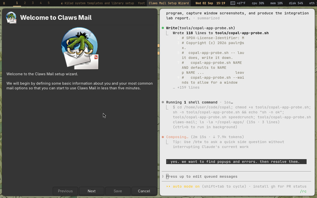 | 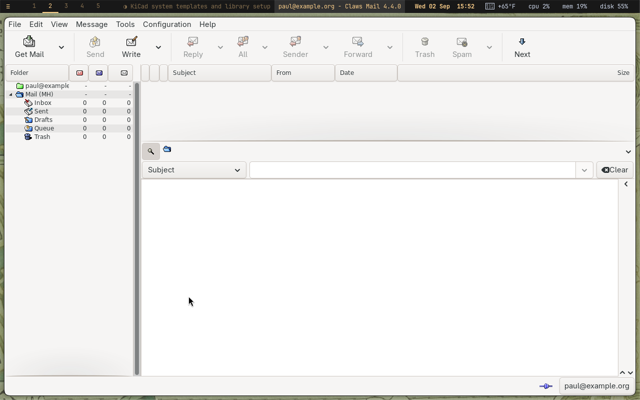 | `accountrc` + `folderlist.xml` from the mail answers: opens on the account, no Setup Wizard |
| Kate | 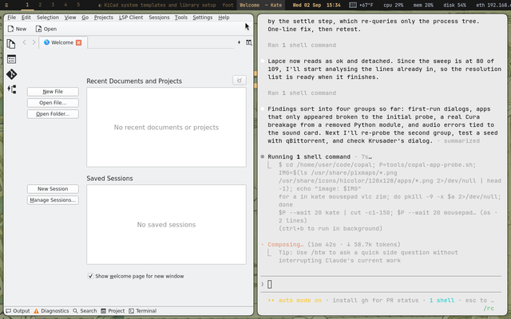 | 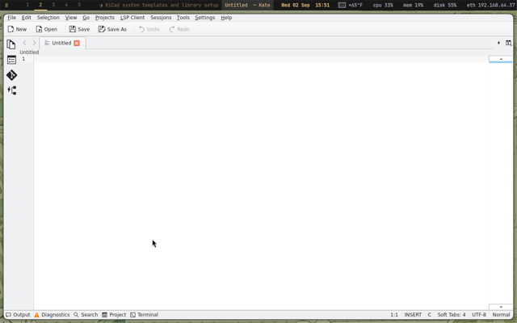 | `Show welcome view for new window=false` in katerc: an empty document instead of the welcome view |
| Zim | 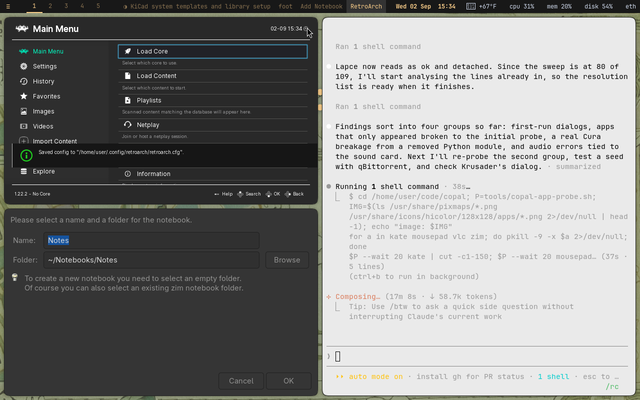 | 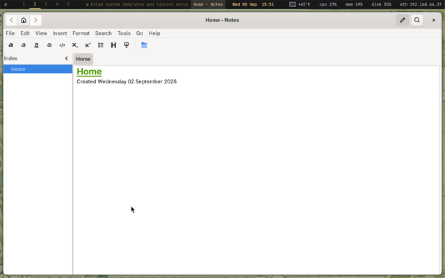 | a default notebook in `~/Notebooks/Notes`: "Home - Notes" instead of "Add Notebook" |
| qBittorrent | 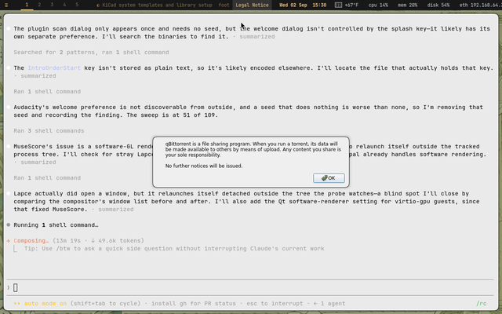 | 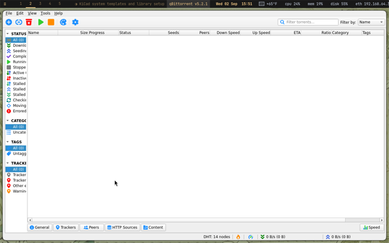 | legal notice accepted and tray behaviour off in `qBittorrent.conf` |
| MuseScore | *no window: SIGSEGV in the QML renderer* | 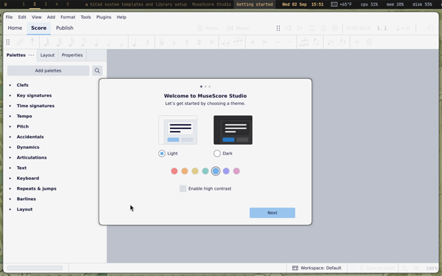 | `QT_QUICK_BACKEND=software`: starts, showing its own first-run theme chooser |
| welle.io | *no window: SIGSEGV* | 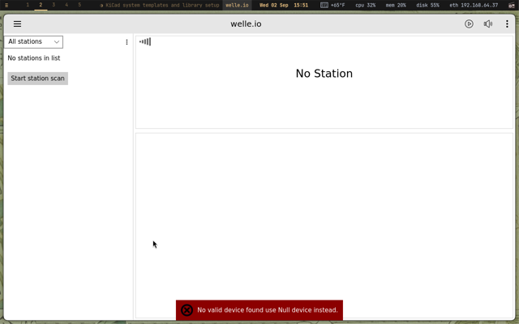 | the same setting |
| Lapce | *no window attributed: it re-launches itself detached* | 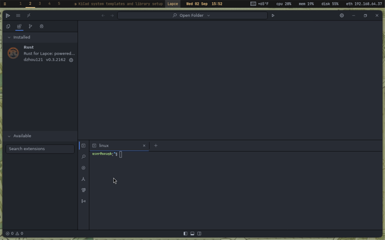 | the probe's detached-window detection; the program was fine |
| Notepad++ under Wine | *installer: STATUS_DLL_NOT_FOUND (x86 stub)* | 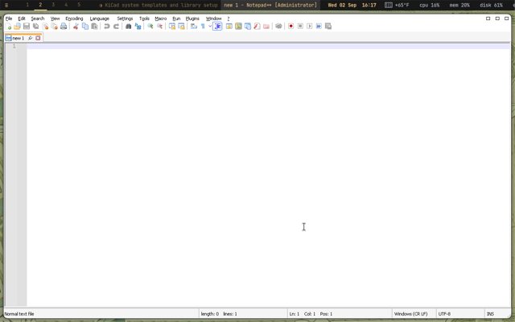 | the portable ARM64 build, checksum verified, in a Wine prefix |
| Notepad++ in a winebox | | 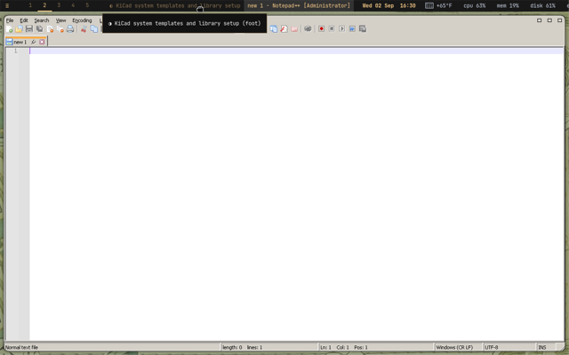 | the same, started by `winebox run` inside bubblewrap |
| winecfg | | 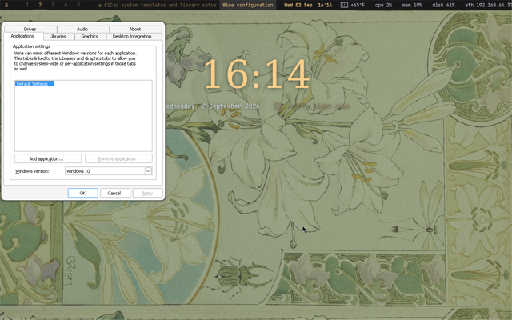 | Wine 11.0 from the relocated tree |
| Endless Sky | *not packaged* | 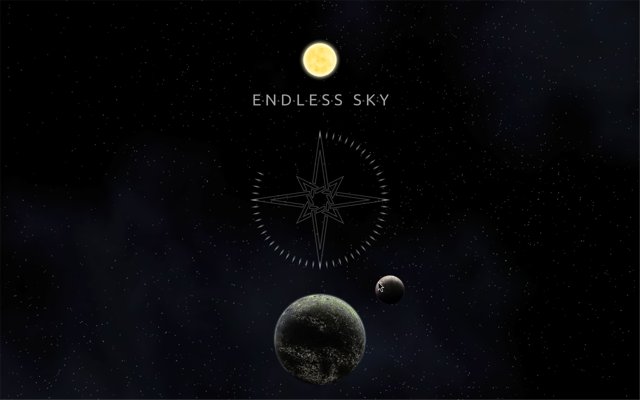 | built from source, title screen |
| GZDoom | *a 'Fatal error' box: no IWAD* | 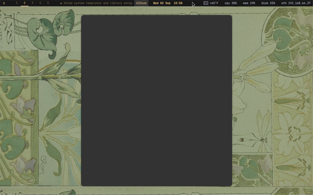 | Freedoom installed beside it (tested with DOOMWADDIR at Freedoom's WADs) |
| Audacity | 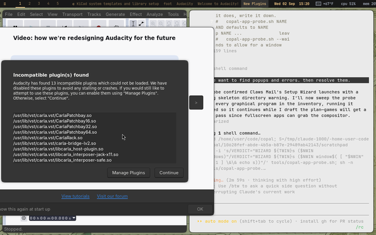 | *unchanged* | its welcome dialog has no discoverable preference; left as is |
| Firefox ESR | 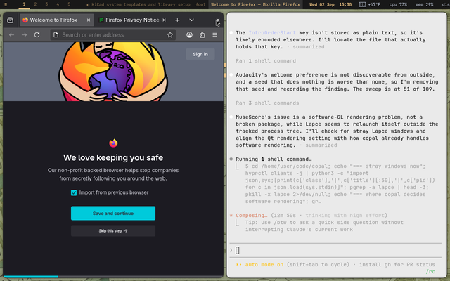 | *root needed here* | `policies.json` in the distribution directory; the clean install verifies it |

## VIII. Files touched

| File | Change |
|---|---|
| `copal-prep.sh` | `configure_9p_share` (autofs), `build_wxmaxima`, `install_ytq` (+ `ytq clip`), the audio-card check in stage 10, KMail row, the verify checklist, `seed_app_configs`, `workshop_windows` + `winebox`, `build_endless_sky`, `build_streamripper`; KiCad work per the other report |
| `utm/utm-vm.sh` | sound card `virtio-sound-pci`; share text |
| `tools/copal-app-probe.sh`, `tools/copal-app-plan.py` | new |
| `docs/app-integration-plan.md` | new, generated from the probe log |
| `docs/img/apps/` | before/after screenshots, half size |
| `docs/copal-handbook.md` | electronics, maths, mail, workshop rows; the sound server, the 6502 |
| `tools/copal-act`, `tools/copal-app-sweeplist.py`, `tools/copal-app-sweep.sh`, `tools/copal-app-gallery.py` | new: the first-action script, the sweep, the gallery page |
| `docs/app-gallery.md`, `docs/img/gallery/` | 192 pictures, one per program that opened a window |
| `docs/app-probe-guide.md` | new: the launch-and-picture method |
