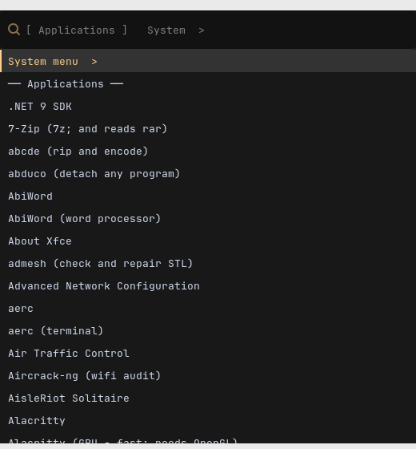
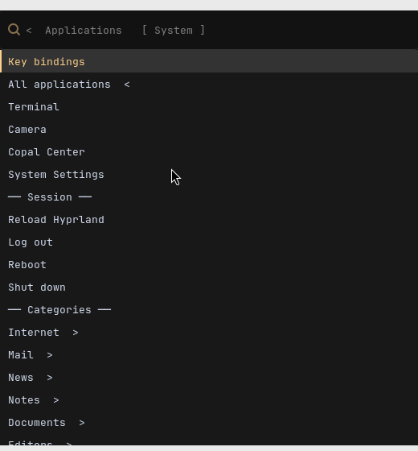

# The Menu That Took Five Seconds: a Lab Report

*Copal Linux, Antiquity desktop (Hyprland 0.54.3, wofi 1.5.3), Alpine 3.24
aarch64 guest under UTM on a Mac. 2 September 2026.*

## Abstract

Super+Space on the Antiquity desktop took several seconds to show a menu, and
when the menu came it had one pane rather than the two it was written to have:
Left and Right did nothing. Three separate faults were found, none of them the
one first suspected. The list was rebuilt from scratch on every press, at 4.3 s
on this guest; wofi's `--lines` option leaves the picker as a stretched, deaf
frame once the list passes about a hundred rows; and wofi 1.5's user-bound keys
never close the picker at all, so an arrow key cannot switch panes from inside
wofi. A fourth fault surfaced on the way: *Shut down* from the menu started an
i3 nag bar through Xwayland and hung. All four are fixed in `copal-prep.sh`
stage 16. The menu now opens in about 0.2 s from a cached list, the arrows work
by way of a Hyprland submap, and the session entries stand at the top level of
the right pane.

## Objective

Make the menu open fast (caching the list was allowed; a slightly stale list
was explicitly acceptable), and restore the design: a searchable, flat list of
applications on the left; on the right the applications by category, the
settings, and the session — log out, shut down — with Left and Right moving
between the two.

## Materials

| | |
|---|---|
| Guest | Alpine 3.24 aarch64, Hyprland 0.54.3, waybar, wofi 1.5.3, foot, llvmpipe (see `visual-debugging-lab-report.md`) |
| Display | 1280×800, scale 1 |
| Menu | `copal-menu` as written by stage 16 into `/usr/local/bin` (heredoc identical to `origin/antiquity-desktop`) |
| Instruments | `grim` for screenshots, `hyprctl layers` for wofi's PID and geometry, Hyprland's event socket (`.socket2.sock`) for submap and layer events, `wtype` 0.4 (unpacked from the apk, not installed) to inject keys, `magick` to measure whether a region had been painted |

## Method

1. Time the pieces separately: the list build (the script with its picker
   removed), wofi alone with a one-line list, wofi alone with the real 499-row
   applications list.
2. Film wofi with the real list — a screenshot every half second — and probe
   it with a key at fixed delays, reading the exit status.
3. Bisect the row count and the sizing flags until the stall was pinned to one
   option.
4. Read wofi 1.5.3's `wofi.c` and `wofi.5` for what `key_custom_n` does.
5. Try every candidate key from inside the search box; then try the compositor
   side.
6. Drive the finished menu with signals, with an event listener on Hyprland's
   socket, and screenshot each pane.

## Results

### A. Where the time went

| Step | Time |
|---|---|
| Building the list, old script | 4.27 s |
| wofi appearing, one-line list | 0.16 s |
| wofi painting the 499-row list (from a healthy start) | 0.9 s |
| Building the list, new script | 0.46 s |
| Opening from the cache, script part | 0.004 s |
| Super+Space to wofi on screen, new menu | 0.15–0.20 s |

The old build forked twice per catalogue row (`echo | tr`) and walked the
327-row catalogue about eight times: some five thousand forks. The new build
walks it once in shell built-ins into a table that carries the installed
answer, and every later question is one `awk`.

### B. wofi's `--lines` stall

With `--lines N` and more than roughly a hundred rows, wofi 1.5.3 shows a
stretched, empty frame — the search box drawn at twice its height, no rows —
and never recovers. Return, Escape and the custom keys are all ignored; only
`SIGTERM` ends it. The old menu ran `--lines 15` over 500 rows, so after its
four-second build it presented exactly this.

| Rows | `--lines 18` | no `--lines` | `--height 70%` | `--height 540` (px) |
|---|---|---|---|---|
| 60 | responsive | | | |
| 150 | **stuck** | | | |
| 499 | **stuck** | responsive | responsive | responsive |

`--lines 15` and `--height 560 --lines 18` were also stuck; `--normal-window`
was not. The fix is a fixed pixel height and no `--lines`.

### C. wofi's custom keys do not exit

`wofi.5`, on `key_custom_n`: *"This will not cause wofi to exit, it will only
set its exit code for when it does."* `wofi.c` confirms it — `do_custom_key()`
stores `custom_key_num + 10` and returns. From the search box, every candidate
tried (Left, Right, Ctrl/Alt/Shift-arrows, Tab, Shift-Tab, Ctrl-Tab, F2,
Page_Down, Ctrl-l) produced no exit; Down then Right produced status 11 only
because the arrow, once focus is in the list, activated the row. So the old
menu's `--define key_custom_0=Left` could never have switched panes; the "two
panes" existed on paper, and the first row of each pane (`System menu >`,
`All applications <`) was the only way across.

### D. The compositor answers the arrows

Hyprland's submaps intercept only the keys bound in them and pass the rest
through. `copal-menu` enters `submap = menu` while its picker is up, in which
Left and Right run `pkill -USR1 -x wofi` and `pkill -USR2 -x wofi`; the shell
reports the picker's death as 138 and 140, which the walker reads as a pane
switch. Escape in the submap kills the picker and resets the submap, so a menu
that dies cannot keep the arrows.

Driven with the signals directly, every step behaved (`sh -x` trace):

| Signal sent | Status seen | Result |
|---|---|---|
| `USR2` on the applications pane | 140 | system pane opened |
| `USR1` on the system pane | 138 | applications pane opened |
| `TERM` | 143 | menu exited, `submap reset` sent |

Hyprland's event socket showed `submap>>menu` 0.3 s before `openlayer>>wofi`
and `submap>>` (reset) after the last picker closed.

**A caveat on the instrument.** `wtype` cannot test this path. Every key it
sends arrives from a new virtual keyboard with a fresh keymap, and Hyprland
answers each with `activelayout>>hl-virtual-keyboard-wtype` followed at once by
`submap>>` — the submap is reset before the key lands. That is why the
scripted walkthroughs kept "losing" the submap while the signal test did not.
A physical keyboard does not change keymaps mid-session. The arrows have been
verified by the mechanism, not yet by a finger; that is the one result in this
report the author has to supply.

### E. Shut down did nothing

`copal-halt` asks before it acts. It chose its asker by `DISPLAY`, which
Hyprland sets for Xwayland, so on the Antiquity desktop it ran `i3-nagbar`,
which came up through Xwayland unable to find an output and stayed there:

```
[libi3] ../i3-nagbar/main.c Failed to received window geometry.
[libi3] ../i3-nagbar/main.c Could not position on focused output ...
```

Meanwhile `sudo shutdown now` at a terminal was logged and did nothing, because
`shutdown` is not a command on Alpine — busybox provides `poweroff`, `halt` and
`reboot` only. Nothing needs installing: `doas poweroff`, or `copal-halt`.

### F. What the panes look like now

| Applications (Super+Space) | System (Super+Z, or Right) |
|---|---|
|  |  |

The search box names the pane and the way to the other. Headings are rows
(`── Session ──`) that do nothing when chosen; typing filters straight past
them.

## Discussion

The report is really about the order in which the faults hid one another. The
four-second build was the visible complaint, but fixing it alone would have
exposed the `--lines` stall on every open rather than after a wait; fixing that
would have shown a working single pane whose arrows still did nothing; and the
first person to reach *Shut down* on the right pane would have found it dead.
Each fix was necessary and none was sufficient.

**Caching.** The list lives in `~/.cache/copal/menu-<session>.csv`, one per
session type because the terminal and the session entries differ between
Hyprland and i3. It is stale when anything it was built from is newer than it —
a `stat` each on the PATH directories, the `.desktop` directories, the
catalogue, the projects file, the guides and the script — or once a day. A
stale cache is shown at once and rebuilt in the background at `nice 10`, under
a `mkdir` lock, into a temp file moved into place; the walker re-reads the file
on every pane change, so a rebuild that finishes while the menu is open is
already visible on the next arrow. `copal-install` rebuilds both lists for the
user who asked (`DOAS_USER`) after every install, so the promise on its last
line still holds.

**Why a submap and not fuzzel.** `fuzzel` 1.14 is in Alpine, draws with pixman
rather than GTK, and its `custom-N` bindings exit at once with 10+N. It would
also need installing on every machine, a second theme file for `copal-theme`,
and `cursor-left=none` to free the arrows. The submap is fifteen lines of
config against a picker that is already installed and themed. Should wofi
ever grow a key that exits, the walker already accepts 10–29 as a switch.

**The cost, unchanged.** Left and Right do not move the cursor in the search
box. Typing, Backspace and Ctrl-W still edit it.

**Open.** (1) The arrows under a physical keyboard, per §D. (2) Whether the
`hyprland/submap` module's `menu` label while the menu is open is wanted or
should be hidden. (3) On a Raspberry Pi with no power button, "safe to unplug"
is the console going quiet after the kernel's `reboot: Power down` line;
Copal prints nothing of its own, and a one-line notice from the shutdown
runlevel would be a small addition.

## Where the fixes are

| Place | Change |
|---|---|
| `copal-prep.sh`, `copal-menu` heredoc | rewritten: cache, fork-free build, headings, session at top level, submap enter/leave, `--height` |
| `copal-prep.sh`, `hyprland.conf` heredoc | `submap = menu` block after the Super+Z binding |
| `copal-prep.sh`, `copal-halt` heredoc | asks with wofi on Wayland, logs out with `hyprctl`, detaches under `WAYLAND_DISPLAY` too |
| `copal-prep.sh`, `copal-install` heredoc | `copal-menu --rebuild-all` as `DOAS_USER` after a successful install |
| On this guest, live | `~/.local/bin/copal-menu` and `~/.local/bin/copal-halt` shadow `/usr/local/bin` until stage 16 re-runs; the submap block is in `~/.config/hypr/hyprland.conf` |
