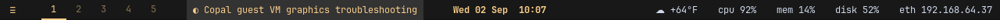
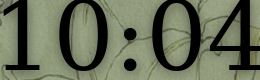
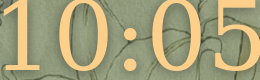
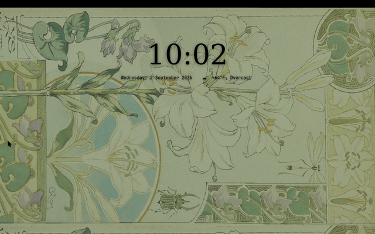
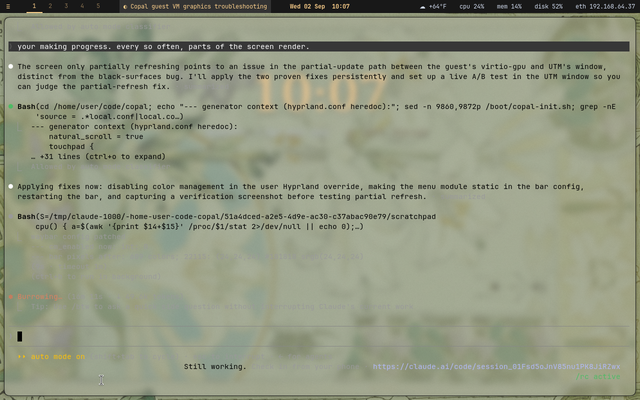
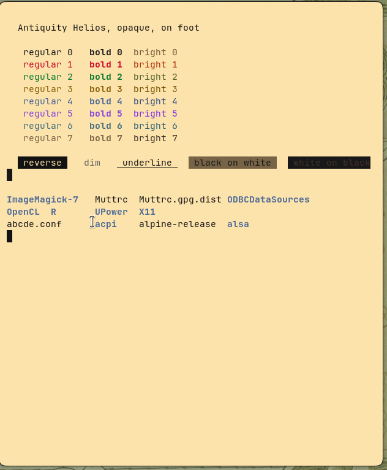
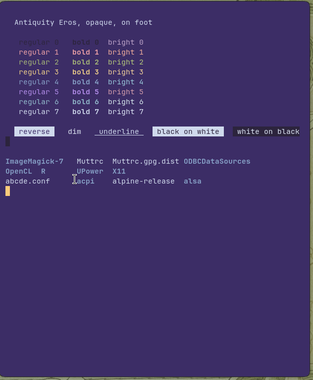

# Debugging the Copal Guest Desktop Visually: Black Surfaces, a Spinning Bar, and a Display That Only Half Refreshes Under UTM on Apple Silicon

*Lab Report — IEEE Format*

<!-- SPDX-License-Identifier: MIT -->
Copyright (c) 2026 paulr@sdf.org. MIT licensed — see `LICENSE`. Copal Linux is
an aggregation of Alpine Linux, not a derivative work of it; Alpine and its
packages remain under their own licences.

---

## Abstract

A Copal aarch64 guest (Alpine 3.24.1, Hyprland 0.54.3, Mesa 26.1.6) running
under UTM on an Apple Silicon Mac presented three visual faults at first
desktop login: large black rectangles where the top bar and other overlays
should be, a bar process pinned at 100 % of one CPU, and a UTM window that
refreshed only in patches. This report records how each fault was located from
*inside* the guest — by asking the compositor for screenshots and measuring the
pixels, rather than by looking at the host window — and what was found. Two
faults were reproduced, root-caused, and fixed without a restart: Hyprland's
colour-management render pass draws every alpha-carrying layer-shell surface
black when the renderer is Mesa's llvmpipe, and waybar's `custom/menu` module
busy-loops when it combines `exec` with `"interval": "once"` alongside any
Hyprland IPC module. The underlying condition — that the guest renders in
software at all, although the host offers virgl 3D — is traced to Alpine's
Mesa package, which is built without the virgl driver on every architecture.
The third fault, partial refresh of the host window, is host-side and remains
under test; the experiments to settle it, and the confirmation procedure to run
after every restart, are given as procedures with a probe script.

## I. Objective

1. Capture what the guest's own compositor believes is on screen, so a person
   and an agent working over a text channel can *see* the desktop without
   trusting the host window.
2. Explain the black rectangles, and fix them.
3. Explain why the desktop costs two CPUs at idle, and reduce it.
4. Establish whether the emulated GPU can do better than software rendering,
   and what it would take.
5. Leave a repeatable confirmation procedure, because the fix loop involves
   restarting the guest and changing host settings, and memory does not survive
   that.

## II. Materials

| Item | Detail |
|---|---|
| Host | Apple Silicon Mac, UTM (QEMU backend), `Copal-aarch64` VM built by `utm/utm-vm.sh` |
| Display card (host side) | `virtio-gpu-pci` per the generated plist; the guest sees the VIRGL feature bit set, so UTM is running the GL-capable variant |
| Guest | Alpine Linux 3.24.1, kernel 6.18.48-0-virt, aarch64, 4 vCPU, 5.9 GB RAM |
| Compositor | Hyprland 0.54.3 (aquamarine 0.12), Wayland, one output `Virtual-1` 1280x800@75 |
| Renderer | Mesa 26.1.6, EGL on GBM, `llvmpipe (LLVM 22.1.3, 128 bits)` |
| Kernel driver | `virtio_gpu`, `/dev/dri/card0` + `renderD128`; atomic modesetting; no plane modifiers; explicit-sync timelines supported |
| Bar | waybar 0.15.0 (GTK 3, gtk-layer-shell), two instances: the top bar and the desktop widgets |
| Terminal | foot, theme alpha 0.2 with Hyprland blur behind it |
| Capture tools | `grim`, `slurp`, `hyprctl`, ImageMagick (`magick`), `copal-shot` (bound to Super+Shift+S) |
| Probe | `tools/copal-gfx-probe.sh` (this report, §VII) |

## III. Method

### A. Seeing the screen from inside

The agent cannot look at the UTM window. It can ask Hyprland for the frame it
composes, which is the same frame it scans out:

```sh
grim /tmp/shot.png                  # whole output
grim -g "0,0 1280x26" /tmp/bar.png  # a region: x,y WxH
hyprctl layers                      # every layer-shell surface and its geometry
hyprctl clients -j                  # every window, as JSON
```

A screenshot is then *measured*, not just viewed. ImageMagick's histogram
answers "is this region a flat block?" in one line:

```sh
magick /tmp/bar.png -format '%k colours\n' info:-           # 1 = flat
magick /tmp/bar.png -format '%c' histogram:info:- | sort -rn | head -3
```

Because the grim frame is what the guest sends to the host, anything wrong in
it is a guest-side fault; anything the host shows that grim does *not* show is
a host-side (scanout, virtio transfer, UTM renderer) fault. That division is
the whole method.

### B. Measuring cost without `top`

`top` in a VM samples badly. Reading `/proc/<pid>/stat` twice gives a clean
per-process CPU figure over any window:

```sh
cpu3() { a=$(awk '{print $14+$15}' /proc/$1/stat); sleep 3
         b=$(awk '{print $14+$15}' /proc/$1/stat); echo $(( (b-a)/3 ))%; }
cpu3 $(pgrep -x Hyprland); cpu3 $(pgrep -f '^waybar$')
```

### C. Toggling live, bisecting, then persisting

Every Hyprland option can be flipped at runtime and reverted, so each
hypothesis was tested in seconds:

```sh
hyprctl keyword render:cm_enabled 0        # test
grim -g "0,0 1280x26" /tmp/t.png && magick /tmp/t.png -format '%k\n' info:-
hyprctl keyword render:cm_enabled 1        # revert
```

waybar was bisected by generating one-module and two-module configs from the
real one and measuring each for three seconds. Only once a cause was isolated
was anything written to disk, and then only to the files Copal reserves for the
user: `~/.config/hypr/local.conf` (sourced last, never rewritten by stage 16)
and `~/.config/waybar/config`.

## IV. Results

### A. The renderer is software, and why

`eglinfo -B` on the GBM platform reports:

```
virtio_gpu: driver missing
libEGL warning: egl: failed to create dri2 screen
OpenGL core profile renderer: llvmpipe (LLVM 22.1.3, 128 bits)
```

The virtio device (`/sys/bus/virtio/devices/virtio1`, device id `0x0010`)
advertises feature bits:

| bit | feature | offered |
|---|---|---|
| 0 | VIRGL — 3D over OpenGL | **yes** |
| 1 | EDID | yes |
| 3 | RESOURCE_BLOB | no |
| 4 | CONTEXT_INIT | no |

So the host is offering virgl, and the guest declines it. The reason is in
Alpine's `main/mesa/APKBUILD` (3.24-stable):

```
_gallium_drivers="r300,r600,radeonsi,nouveau,llvmpipe,zink"
aarch64) _gallium_drivers="$_gallium_drivers,vc4,v3d,freedreno,lima,panfrost,etnaviv,tegra,asahi,svga"
```

`virgl` is in no architecture's list. The `virtio_gpu_dri.so` symlink is
installed, but the gallium library behind it contains only the stub that
prints `driver missing`. Alpine does build `mesa-vulkan-virtio` (Venus), but
Venus needs RESOURCE_BLOB and CONTEXT_INIT, which UTM does not offer. Hence:
every frame of this desktop is rasterised on the CPU by llvmpipe, and Hyprland
appears as `llvmpipe-1..3` threads in `/proc`.

Consequence measured: with the terminal running Claude Code (whose spinner
redraws and retitles the window several times a second), Hyprland sat at
100–130 % CPU. Moving that one window to another workspace dropped Hyprland to
**3 %**. The compositor is not broken; it is paying llvmpipe's price for every
damaged pixel.

### B. Black rectangles: Hyprland colour management on llvmpipe

The first screenshot showed the terminal intact and the wallpaper intact, but
the 1280x26 strip at the top — the waybar layer — was 100 % `#000000`. The
desktop clock, a second waybar on the *bottom* layer with a transparent
background, rendered its digits **black** although its CSS colours them gold
`#fccf8a`. A mako notification's background came out `#030303` instead of its
`#191919`. A normal toplevel (nemo) kept every colour.

Live toggles, bar strip measured each time:

| state | colours in bar strip | dominant pixel |
|---|---|---|
| baseline (`cm_enabled 1`, blur on) | 1 | `#000000` |
| blur off, cm on | 1 | `#000000` |
| **cm off**, blur on | **610** | `#181818` (the bar's CSS background) |
| cm off, blur off | 607 | `#181818` |

And the clock crop with `cm_enabled 0`: dominant pixel `#fccf8a`, the gold the
theme asked for.

| before | after |
|---|---|
|  |  |
|  |  |
|  |  |

Interpretation: Hyprland 0.54 enables its colour-management pass by default
(`render:cm_enabled = 1`). On llvmpipe, that pass returns zero RGB for surfaces
that carry an alpha channel and sit on the layer-shell path (bar, widgets,
notifications, launcher), while leaving opaque toplevels alone. Nothing in the
Hyprland log warns about it. Whether the fault is in the shader, in llvmpipe's
handling of the intermediate format the pass uses, or in their combination is
not established here; disabling the pass is a complete workaround, and on a
virtual display with no HDR or wide-gamut path there is nothing to lose.

A side effect worth knowing: with the pass on, foot's window had been rendered
as an opaque dark terminal with light text. That was never the theme: foot.ini
asks for `background=eaeaea`, `foreground=000000`, `alpha=0.2` — a pale
terminal, black text, mostly wallpaper. With the pass off that is what
appears, and black text over a pale, blurred wallpaper is hard to read. The fix
is `alpha=1.0` in `~/.config/foot/foot.ini` (applied), which gives a solid
`#eaeaea` terminal — verified by opening a new window and sampling it: 337,811
of its pixels are `#eaeaea`. It applies to *new* foot windows only; foot does
not reload its config. Hyprland cannot repair a running window either, and the
attempts are instructive: `opacity 1.0 override` leaves per-pixel alpha alone
(sampled: unchanged), and `force_rgbx on` displays the *premultiplied* buffer,
in which `#eaeaea` at 0.2 is stored as `#2e2e2e` — black text on dark grey,
worse than before. Both rules were reverted.

### C. The bar at 100 % CPU: `custom/menu`

The main waybar consumed 98–100 % of a CPU continuously (37 CPU-minutes in 37
minutes of uptime). The desktop-widget waybar, same binary, sat at 0 %.

Bisection, each configuration measured for three seconds:

| modules in the bar | waybar CPU |
|---|---|
| every module of `modules-right`, one at a time | 0 % each |
| `hyprland/workspaces` + `wlr/taskbar` | 0 % |
| `hyprland/submap` + `wlr/taskbar` | 0 % |
| `custom/menu` + `wlr/taskbar` | **100 %** |
| `custom/menu` + `hyprland/workspaces` | **100 %** |
| full config, with the default stylesheet | 100 % |

Then variants of `custom/menu` alone in the full config:

| `custom/menu` definition | waybar CPU |
|---|---|
| `"exec": "echo ≡", "interval": "once"` (as shipped) | 100 % |
| same, `"tooltip": false` | 100 % |
| `"exec": "echo ≡", "interval": 3600` | 0 % |
| static `"format": "≡"`, no `exec` | **0 %** |

A custom module with `exec` and `"interval": "once"` re-arms itself on every
Hyprland IPC event the bar receives — and a terminal whose title changes several
times a second supplies those events without pause. The static format is the
right definition anyway: the glyph never changes.

The fix does not by itself cure the black bar — a non-spinning bar with
`cm_enabled 1` is still one colour — but the two together give a bar that
draws and idles.

### D. Partial refresh of the host window — open

The user reports that the UTM window updates only in patches, every so often.
Every grim capture taken during this session was complete and coherent, which
places the fault after the compositor: in the virtio-gpu transfer of damaged
rectangles to the host, or in UTM's presentation of them. Two facts bear on it:

- Hyprland's default `debug:damage_tracking = 2` sends the host only the
  rectangles that changed. Setting it to `0` forces whole frames; measured cost
  on llvmpipe was Hyprland at **198 %** CPU against 53 % — usable as a
  diagnostic, not as a fix.
- The host is running the GL-capable card while the guest uses it as a 2D
  framebuffer. A card with no GL path (`virtio-ramfb`) removes virglrenderer
  and UTM's GL texture path from the loop entirely, which is the cheapest
  possible experiment on the host side.

Procedure §VI.B settles which.

### E. Costs, after the two fixes

| process | before | after |
|---|---|---|
| waybar (main bar) | 100 % | 0 % |
| Hyprland, terminal busy | 100–130 % | ~55 % |
| Hyprland, terminal off-screen | 3 % | — |
| blur on vs off (cm off) | 53 % vs 69 % — within noise | — |

## V. Discussion

Two separate bugs produced one symptom, and the method that separated them was
measuring pixels rather than describing them. "Black blocks" was a true
description of the bar, of the notifications, and of the launcher, and it was
caused by the compositor; "parts of the screen render every so often" is a true
description of the host window, and grim proves the compositor is not the
cause. Had the two been treated as one fault, the first fix would have looked
like a failure.

The root condition — no virgl driver — is not something the guest can change
with a setting. Three routes exist:

1. **Live with llvmpipe** (the current state). Correct, after the two fixes,
   at 1280x800; the compositor's cost tracks how much of the screen changes per
   frame. Higher resolutions or dynamic-resolution scaling raise it linearly.
2. **Build Mesa with `virgl`**, install it under `~/opt/mesa-virgl`, and start
   Hyprland with `LD_LIBRARY_PATH` and `LIBGL_DRIVERS_PATH` pointing at it. No
   system package is replaced, so reverting is unsetting two variables. The
   guest has gcc, clang, meson, ninja, python3-mako, libdrm-dev and the Wayland
   and X11 headers; it lacks `bison` and `flex`, which Mesa's build needs and
   which are one `apk add` away. Open risk: UTM's virgl host is ANGLE over
   Metal, whose OpenGL ES level is 3.0; Hyprland asks for ES 3.2 and may refuse
   the context. That is a fifteen-minute build to find out, and the outcome
   either way belongs in this report.
3. **Ask UTM for a display card the guest can drive natively.** There is none
   for aarch64 Linux beyond virtio-gpu; the choice is only GL or not-GL.

The upstream fix for both guest-side bugs belongs in `copal-prep.sh`'s
stage-16 heredocs. In the generated `/boot/copal-init.sh` on this guest they
are the `custom/menu` block near line 8549 (replace `"format": "{}"`, `exec`
and `interval` with `"format": "≡"`) and the Hyprland `cursor { }` block
near line 9869, beside which a `render { cm_enabled = false }` block should be
emitted whenever the DRM driver is `virtio_gpu`. The guest's checkout of the
repository predates the installer that built it, so those edits are made on the
Mac.

## VI. Procedures

### A. Debugging visually — the loop

1. **Capture**: `grim ~/shot.png`, or a region with `grim -g "x,y WxH"`.
   `hyprctl layers` gives every overlay's geometry; `hyprctl clients -j` every
   window's.
2. **Look**: open the PNG (an agent reads it directly; a person uses any image
   viewer, or `imv`). A screenshot that shows the fault is a *guest* fault.
   A screenshot that does not, while the host window does, is a *host* fault.
3. **Measure**: `magick region.png -format '%k' info:-` — one colour is a
   block; `histogram:info:-` names the colour. Compare against the CSS or
   theme value you expected.
4. **Toggle**: `hyprctl keyword <option> <value>`; recapture; measure; revert.
   For a client, generate a reduced config and run it beside the real one.
5. **Persist** only what the measurement proved, and only in
   `~/.config/hypr/local.conf` or the client's own config — never in
   `hyprland.conf`, which stage 16 rewrites.
6. **Record**: run the probe (§VII) with a label, and paste its summary line
   into the restart log (§VIII).

### B. Settling the partial-refresh fault

Run in order; stop at the first step that changes the host window's behaviour.
Each step names who does it.

| step | who | action | judge by |
|---|---|---|---|
| 1 | guest | `hyprctl keyword debug:damage_tracking 0` | does the UTM window now refresh whole? then `hyprctl keyword debug:damage_tracking 2` to revert |
| 2 | Mac | UTM → the VM → Edit → Display → Emulated Display Card → **virtio-ramfb**; restart the guest | probe §VII should report `virgl=0`; watch for patchy refresh over five minutes of terminal use |
| 3 | Mac | same menu → **virtio-gpu-gl-pci** explicitly (if step 2 fixed it, this confirms GL is the variable) | as above; probe should report `virgl=1` |
| 4 | Mac | Display → turn off **Dynamic Resolution**, keep the card that won | rules out the resize path |
| 5 | guest | in `local.conf`: `monitor = , 1280x800@60, auto, 1` | a 60 Hz mode gives llvmpipe 16.7 ms per frame instead of 13.3 |

If step 1 fixes it and steps 2–3 do not, the fault is in the damage
rectangles the kernel sends and a kernel or Hyprland bug report is the next
move; `debug:damage_tracking 1` (monitor-level damage, cheaper than 0) is the
interim setting.

### C. Integration test — confirming a restart

After every guest restart or host settings change:

```sh
sh ~/code/copal/tools/copal-gfx-probe.sh "what changed"
```

The probe prints and saves a report under `~/copal-gfx/`, takes a screenshot
and a bar strip, and appends one summary line to `~/copal-gfx/log.txt`. Its
exit status is the number of failed checks. The checks, and what a pass means:

| check | pass condition | why |
|---|---|---|
| renderer | `virgl` (hardware) — or `llvmpipe`, reported as WARN, not FAIL | §IV.A |
| colour management | `render:cm_enabled = 0` | §IV.B |
| software cursor | `cursor:no_hardware_cursors = 1` | virtio-gpu's cursor plane |
| waybar idle | main bar under 50 % CPU over 3 s | §IV.C |
| bar strip | more than two colours in the waybar layer's pixels | §IV.B, the objective test for "black block" |
| screenshot | grim succeeded | the capture path itself works |

A human check remains: open the UTM window, type in the terminal for a minute,
and confirm the window refreshes whole. The probe cannot see the host.

## VII. The probe

`tools/copal-gfx-probe.sh` — read-only, POSIX sh, runs as the desktop user
inside a Hyprland session. Sample output from this guest, after the fixes:

```
copal-gfx-probe  20260902-101500  [after cm-off + menu fix]
== virtio-gpu
  kernel driver: virtio_gpu
  features: virgl=1 blob=0 context_init=0
  host offers VIRGL 3D
== renderer (EGL on GBM, the path Hyprland takes)
  renderer: llvmpipe (LLVM 22.1.3, 128 bits)
  mesa loader: 'virtio_gpu: driver missing' x4 (virgl not compiled into this Mesa)
  WARN  software rendering (llvmpipe): every frame is drawn on the CPU
== hyprland settings
  render:cm_enabled=0  decoration:blur:enabled=1  debug:damage_tracking=2  cursor:no_hardware_cursors=1
  PASS  colour management off
  PASS  software cursor
== cpu over 3 s
  Hyprland: 5x%   waybar (main bar): 0%
  PASS  waybar idle
== screenshot
  bar strip 0,0 1280x26 : 6xx colours, dominant #181818
  PASS  bar has content
== verdict: 0 failed check(s)
```

## VIII. Restart log

One line per probe run, copied from `~/copal-gfx/log.txt`, with what was
changed before it. Newest last.

| when | change before this run | probe summary | host window (human) |
|---|---|---|---|
| 2026-09-02 09:52 | none — first login after deploy | renderer=llvmpipe virgl=1 cm=1 waybar=100% bar=1col | black bar; patchy refresh |
| 2026-09-02 10:08 | `render { cm_enabled = false }` in local.conf; `custom/menu` made static; bar restarted | renderer=llvmpipe virgl=1 cm=0 hypr≈55% waybar=0% bar=609col fails=0 | *to be confirmed by the user* |
| 2026-09-02 10:14 | probe fixed (driver name, bar geometry); foot `alpha=1.0` | `20260902-101441 renderer=llvmpipe virgl=1 cm=0 blur=1 dmg=2 hypr=66% waybar=0% bar=632col fails=0` | *to be confirmed by the user* |

## IX. Clipboard with the host

Copy on the Mac, paste in the guest, and back. Copal already binds Super+C,
Super+X and Super+V (and Ctrl+Alt+C/X/V as the fallback when the host keeps
the Cmd key) to `copal-clip`, which sends the right chord to the focused
window. What was missing was the host half. UTM shares the clipboard over
SPICE, and the guest needs two programs for that: `spice-vdagentd`, the root
daemon on the virtio port (running, OpenRC), and `spice-vdagent`, the
per-session client — which was not running, and which is X11-only.

Measured: with the client running against Xwayland, neither selection crossed
between X and Wayland on its own. Xwayland bridges them only while an X window
has keyboard focus, which on this desktop is never (`xclip -o` after `wl-copy`
gave `target STRING not available`; `wl-paste` after `xclip -i` was
unchanged).

`tools/copal-vmclip.sh` — installed as `~/.local/bin/copal-vmclip`, started
from `local.conf` by `exec-once` — starts `spice-vdagent -x` against `:0` and
relays text between the Wayland and X clipboards every 0.3 s, in both
directions, remembering what it last placed on each side so a change never
echoes back. On a machine with no SPICE port it exits at once. Verified in
the guest: `wl-copy` → `xclip -o` in under a second, and `xclip -i` →
`wl-paste` likewise. The host leg is confirmed by pasting on the Mac.

To check it after a restart: `pgrep -a spice-vdagent copal-vmclip`, then
`wl-copy hello` and paste on the Mac.

## X. Files touched in this session

| file | change |
|---|---|
| `~/.config/hypr/local.conf` | appended `render { cm_enabled = false }` with the reason |
| `~/.config/waybar/config` | `custom/menu`: static `"format": "≡"`, `exec` and `interval` removed |
| `~/.config/foot/foot.ini` | `alpha=0.2` → `alpha=1.0`; new terminals are solid `#eaeaea` |
| `tools/copal-gfx-probe.sh` | new |
| `tools/copal-vmclip.sh`, `~/.local/bin/copal-vmclip` | new: host clipboard over SPICE, started by `exec-once` in local.conf |
| `docs/img/gfx-*.png` | before/after evidence for §IV.B |
| `docs/visual-debugging-lab-report.md` | this report |

All three config files are the user-owned copies; stage 16 will regenerate
`~/.config/waybar/config` and `~/.config/foot/foot.ini` from the installer
until the same changes are made in `copal-prep.sh` (§V). `local.conf`
survives stage 16 by design.

## XI. The terminal in the desktop's theme, opaque (2 Sep 2026, evening)

**Question.** §IV found foot drawn as glass: `alpha=0.2` from the theme's
kitty file, Hyprland blurring the wallpaper behind it, black text over a pale
collage. The stop-gap was `alpha=1.0` on a `#eaeaea` ground, then Copal Sand
(one light palette). Both threw the theme away. Could the terminal keep the
Linux Antiquity look, per theme, without the blur?

**What the theme actually specifies.** Each of the five themes (helios, eris,
priapus, eros, hades) is one *glass tint* (`glassTintColor` in
`quickshell/Config.qml`, the kitty `background`) at 20 % opacity, plus one
neon palette shared by all five: `color0 #9400ff`, `color7 #ff00ee`,
`color2 #00ff5d`. Opaque, that palette is what §IV's purple text was. Measured
on this wallpaper (`georges_riom_collage.png`, mean `#889170`), the glass as
seen is 20 % tint over 80 % wallpaper: `#9fa17c` for helios, `#797d6e` for
eros, a muddy olive for all five. So the *tint* is the theme's stated colour,
and the blend is an accident of the wallpaper.

**Method.** `tools/copal-terminal-palettes.py` takes each theme's tokens
(text, accent, danger, warning, the humours and elements) as hue seeds and
moves each along its own hue, lightness only, until it reads at 4.5:1 on the
opaque tint; brights go one step further and 10 % more saturated. Colour 0 on
the one dark ground (eros) is left at the theme's highlight shade because TUI
programs paint panels with it; bright black, the dim-text colour, meets 4.5:1.
The tables are pasted into `tools/copal-terminal-theme`, which now takes a
theme name and, with none, follows `currentTheme` in
`~/.config/quickshell/settings.json` (helios until the Themes menu writes it).

**Cost.** Everything the script writes is opaque (`alpha=1.0`,
`background_opacity 1.0`, `Opacity=1`) and nothing blinks (`[cursor] blink=no`
in foot, `cursor_blink_interval 0` in kitty, and the equivalents in the rest):
no blur pass for the terminal, no half-second redraws in an idle window. The
bar's own blur rules (§V) are unchanged and remain the bar's cost.

**Result.** Two new foot windows, photographed with `grim` from inside each:

| | |
|---|---|
|  |  |
| `copal-terminal-theme helios`: gold ground, every colour and bright legible, black-on-white and white-on-black both readable | `copal-terminal-theme eros`: the dark one, colour 0 a panel shade, gold cursor from the theme's accent |

Applied to the bench with the default (helios). Backups:
`~/.config/foot/foot.ini.sand-bak`, `~/.Xresources.sand-bak`; the hades
originals from §IV are still beside them.

**Open.** Switching a theme in Antiquity's Themes menu writes `settings.json`
but does not re-run the script; `onCurrentThemeChanged` in `Config.qml` is
where a one-line `Process` would do it, on the antiquity-desktop branch, where
stage 16 also still writes the hades foot.ini and should call
`copal-terminal-theme` instead.
